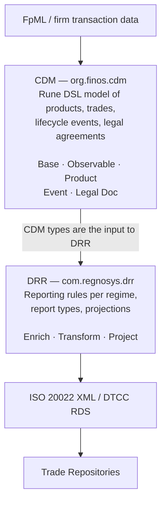

# Project ISDA — Workspace Overview

**Root:** `/Users/emirbh/Projects/ISDA`
**Analysed:** 2026-08-13

This workspace holds two model repositories that are the focus of the project, plus
three read-only demo repositories that show how the generated artefacts are consumed.

## Repository inventory

| Directory | Role | Size | Git HEAD | Last commit |
|---|---|---|---|---|
| `common-domain-model/` | **Focus.** FINOS Common Domain Model (CDM) — the base domain model | 255 MB | `master` @ `8.0.0-dev.3-1-g2c05b193` | 2026-08-11 |
| `drr/` | **Focus.** ISDA Digital Regulatory Reporting (DRR) — reporting rules built on CDM | 201 MB | `main` @ `6c99e479f` | 2025-11-20 |
| `cdm-5-demo-trade-java/` | Demo — CDM 5.24.0, Java 11, trade & lifecycle events | 1.7 MB | — | — |
| `cdm-7-demo-legaldocumentation-java/` | Demo — CDM 7.0.0-dev.52, Java 21, legal agreements | 2.4 MB | — | — |
| `drr-5-demo-trade-java/` | Demo — DRR 5.20.1, Java 11, enrich → transform → project | 69 MB | — | — |

Both focus repos have clean working trees.

## How the pieces relate



Both repos are written in the **Rune DSL** (formerly Rosetta DSL, `.rosetta` files) and
compiled by the `rune-maven-plugin` into Java (and, for CDM, Python / TypeScript /
JSON-Schema / Excel). Consumers depend on the *generated* artefacts, never on the
`.rosetta` sources — which is what the three demo repos illustrate.

## Scale at a glance

| Metric | CDM | DRR |
|---|---|---|
| `.rosetta` model files | 145 | 266 |
| Model lines | ~43,700 | ~88,000 |
| Data types | 760 | 176 |
| Enums | 279 | 102 |
| Functions | 1,304 | 1,386 |
| Reporting rules | 0 | 2,018 |
| Eligibility rules | 0 | 51 |
| Report definitions | 0 | 28 |
| Validation conditions | 666 | — |

## The one thing to know before writing code

**The local CDM checkout and the local DRR checkout are not on the same CDM line.**

- `common-domain-model/` is on `master`, heading toward **CDM 8.0.0-dev**.
- `drr/pom.xml` declares `<finos.cdm.version>5.29.0</finos.cdm.version>` — DRR builds
  against a *published* CDM 5.29.0 artefact from the registry, not against the sibling
  checkout.

They are also on different Rune DSL lines (CDM `10.3.0`, DRR `9.68.0`) and different
Rosetta bundle lines (CDM `12.6.1`, DRR `11.89.3`).

Practical consequence: a change made in `common-domain-model/` is **not** picked up by
`drr/` until CDM is released and DRR's `finos.cdm.version` is bumped — and that bump is
a major-version migration (5 → 8), not a routine one. See
[`CDM-DRR-integration-notes.md`](CDM-DRR-integration-notes.md) for the specific
breaking changes involved.

## Document set

| Document | Contents |
|---|---|
| [`CDM-summary.md`](CDM-summary.md) | What is in `common-domain-model/`, layer by layer |
| [`CDM-design.md`](CDM-design.md) | CDM architecture, conventions, and how to extend it |
| [`DRR-summary.md`](DRR-summary.md) | What is in `drr/`, layer by layer |
| [`DRR-design.md`](DRR-design.md) | DRR architecture, conventions, and how to extend it |
| [`CDM-DRR-integration-notes.md`](CDM-DRR-integration-notes.md) | Version skew, coupling points, upgrade risk |

## Build commands

CDM and DRR are both Maven multi-module builds requiring **JDK 21** (enforced:
`[21,22)`), targeting bytecode release 11.

```bash
cd /Users/emirbh/Projects/ISDA/common-domain-model && mvn clean install -DskipTests
```

```bash
cd /Users/emirbh/Projects/ISDA/drr && mvn clean install -DskipTests
```

Both resolve Rosetta/Rune artefacts from a Regnosys artifact registry; `settings.xml`
in each repo root carries the repository definitions. Expect a first build to be long
(code generation over 40k–88k lines of model source).
