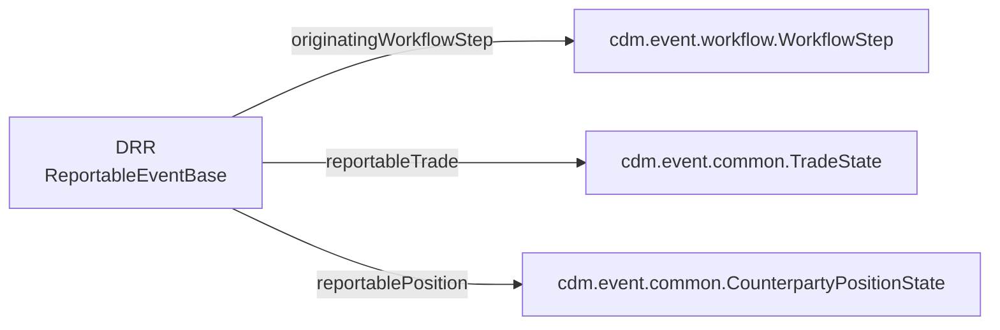

# CDM ↔ DRR Integration Notes

Findings that only surface when you look at both repositories together. Read this before
planning work that spans them.

---

## 1. The two checkouts are not compatible

| | `common-domain-model/` | `drr/` |
|---|---|---|
| Version | `master` → **CDM 8.0.0-dev.3** | builds against **CDM 5.29.0** (from registry) |
| Last commit | 2026-08-11 | 2025-11-20 |
| DSL | Rune DSL **10.3.0** (`org.finos.rune`) | Rosetta DSL **9.68.0** (`com.regnosys.rosetta`) |
| Bundle / codegen | **12.6.1** | **11.89.3** |
| JDK | 21 | 21 |

`drr/pom.xml` declares:

```xml
<finos.cdm.version>5.29.0</finos.cdm.version>
<rosetta.parent.common-domain-model.groupId>org.finos.cdm</rosetta.parent.common-domain-model.groupId>
```

So DRR resolves CDM from the artifact registry. **Editing `common-domain-model/` has no
effect on `drr/`.** They only meet if CDM is released and DRR's pin is bumped — and
5 → 8 is three major versions.

The DSL itself was renamed between these lines (`com.regnosys.rosetta` →
`org.finos.rune`), so this is a toolchain migration as well as a model migration.

---

## 2. Coupling surface

DRR imports 25 CDM namespaces:

```
cdm.base  cdm.base.datetime  cdm.base.datetime.daycount  cdm.base.math
cdm.base.staticdata  cdm.base.staticdata.asset.common  cdm.base.staticdata.asset.rates
cdm.base.staticdata.identifier  cdm.base.staticdata.party
cdm.event.common  cdm.event.position  cdm.event.qualification  cdm.event.workflow
cdm.legaldocumentation.common  cdm.legaldocumentation.master
cdm.mapping.fpml.confirmation.workflowstep
cdm.observable.asset  cdm.observable.event
cdm.product  cdm.product.asset  cdm.product.collateral
cdm.product.common.schedule  cdm.product.common.settlement
cdm.product.qualification  cdm.product.template
```

24 of 25 still exist in CDM 8. The one that does not — `cdm.mapping.fpml.confirmation.workflowstep`
— is the translate layer's foundation.

The primary data coupling is:



All three types still exist in CDM 8 under the same names and namespaces.

---

## 3. Concrete breaking changes for a CDM 5 → 8 migration

These were verified against the two checkouts, not inferred from release notes.

### 3.1 `cdm.mapping.*` was replaced by `cdm.ingest.*`

CDM `master` has migrated FpML translation from declarative **synonym sources** to
**mapping functions**. `cdm.mapping` no longer exists; `cdm.ingest.fpml.confirmation.*`
(817 functions, 44 files, ~20,000 lines) replaces it. Only 3 files in all of CDM still
contain the `synonym` keyword.

DRR's translate layer is built directly on the old mechanism:

```
// drr/rosetta-source/src/main/rosetta/mapping-fpml-recordkeeping-reportableevent-synonym.rosetta
import cdm.mapping.fpml.confirmation.workflowstep.*

synonym source FpML_5_RecordKeeping_To_ReportableEvent extends FpML_5_Confirmation_To_WorkflowStep
{
    ReportableEvent:
        + reportableInformation
            [value "tradeHeader" path "trade"]
    ...
}
```

416 lines of synonym extensions, plus `resources/ingestions/drr-ingestions.json` which
names `synonymSources` explicitly. **This layer must be rewritten as functions**, not
ported. It is the single largest migration item.

### 3.2 `Trade` now extends `TradableProduct`

In CDM 8:

```
type Trade extends TradableProduct:
```

The attributes previously reached via `Trade -> tradableProduct -> …` are inlined onto
`Trade`. DRR uses the `tradableProduct` path **195 times across 29 files** — heavily
concentrated in `regulation-common-trade-quantity-func.rosetta` (20),
`regulation-common-trade-quantity-rule.rosetta` (15) and `enrichment-upi-func.rosetta`
(18).

### 3.3 `ContractualProduct` is gone

CDM 8 has no `ContractualProduct` type. `TradableProduct -> product` is a
`NonTransferableProduct` directly:

```
type TradableProduct:
    product NonTransferableProduct (1..1)
    tradeLot TradeLot (1..*)
    counterparty Counterparty (2..2)
    ...
```

DRR references `contractualProduct` **269 times**, including in load-bearing eligibility
logic:

```
eligibility rule HasContract from TransactionReportInstruction:
    extract TradeForEvent
    then extract tradableProduct -> product -> contractualProduct exists
```

Under CDM 8 this path does not resolve, and the rule that decides *whether a trade is
reportable at all under EMIR* has no direct equivalent — the "is it a contract"
distinction now has to be expressed differently.

### 3.4 Rough migration shape

| Item | Scale |
|---|---|
| Rewrite translate layer (synonym → function) | 416 lines + ingestion config; full redesign |
| Repath `tradableProduct` | 195 sites / 29 files; mostly mechanical |
| Rework `contractualProduct` | 269 sites; **not** mechanical — semantics changed |
| DSL migration 9.68 → 10.3 (`com.regnosys.rosetta` → `org.finos.rune`) | build + any DSL syntax changes |
| Regenerate 2,264 expected outputs | automated via `DrrTestPackCreator`; the diff review is the real work |
| Re-validate every regime against its regulatory spec | working-group scale |

This is a programme, not a task.

---

## 4. Practical guidance for new work

### 4.1 Pick one side per change

Work that extends **CDM** (new product, new payout, new lifecycle event) and work that
extends **DRR** (new regime, new field, new rule) are separate efforts on separate
version lines. A single change touching both is only realistic if DRR is first migrated
to the CDM line you are working on.

### 4.2 If the work is DRR-side

Stay on CDM 5.29.0. Follow
`drr/documentation/Development Guidelines/Best_Practice_for_Adding_New_Jurisdictions.md`
and use **ESMA EMIR** as the reference implementation — it is explicitly named as the
benchmark. See [`DRR-design.md` §5](DRR-design.md).

### 4.3 If the work is CDM-side

Note that `master` is a *development* line (CDM 8, per `SCHEDULE26.md`). If the output
needs to be consumable by DRR any time soon, target the CDM line DRR actually uses
(the `5.x.x` branch exists in the remote) rather than `master`.

### 4.4 If the work needs both

Sequence it: migrate DRR to a modern CDM first, as its own project, with §3 as the scope
baseline. Do not attempt to develop new regulatory functionality on top of an in-flight
migration.

### 4.5 Extend, don't fork

The demo repos show the intended consumption model: depend on published artefacts
(`org.finos.cdm:cdm-java`, `com.regnosys:drr`) and write against the generated Java.
`cdm-5-demo-trade-java` (CDM 5.24.0), `cdm-7-demo-legaldocumentation-java` (CDM
7.0.0-dev.52) and `drr-5-demo-trade-java` (DRR 5.20.1) each pin a version and consume
it — none of them patch the model.

If new functionality can live in a *new* Rune model that imports CDM (the way DRR does),
that is strictly preferable to editing either repo in place.

---

## 5. Quick reference — where things live

| I need to… | Go to |
|---|---|
| Add a product or payout | `common-domain-model/rosetta-source/src/main/rosetta/product-*.rosetta` |
| Add a lifecycle event | `…/event-common-{type,func}.rosetta` + instruction types |
| Change FpML translation (CDM) | `…/ingest-fpml-confirmation-*-func.rosetta` |
| Change FpML translation (DRR) | `drr/…/mapping-fpml-recordkeeping-reportableevent-synonym.rosetta` |
| Add a reportable field | `drr/…/regulation-<auth>-*-type.rosetta` (+ `-rule.rosetta`) |
| Add a shared rule | `drr/…/regulation-common-*.rosetta` |
| Change ISO 20022 output | `drr/…/projection-iso20022-*-func.rosetta` |
| Add reference-data lookup | `drr/…/enrichment-*-func.rosetta` + Java impl |
| Add test data (CDM) | `common-domain-model/rosetta-source/src/main/resources/ingest/` |
| Add test data (DRR) | `drr/rosetta-source/src/main/resources/regulatory-reporting/` |
