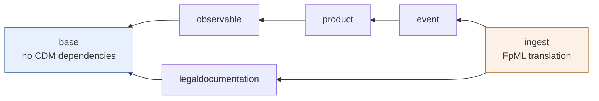
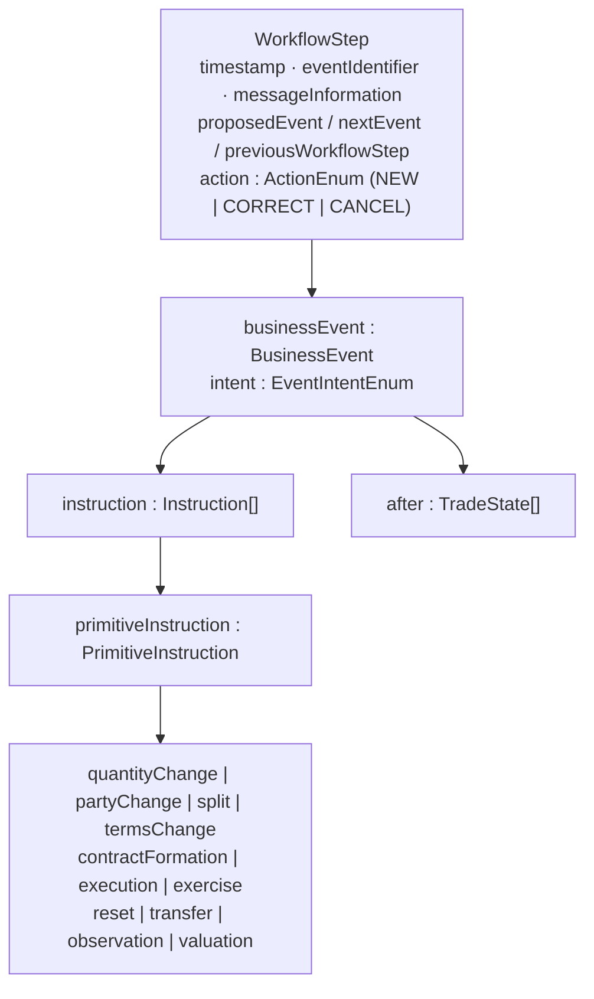
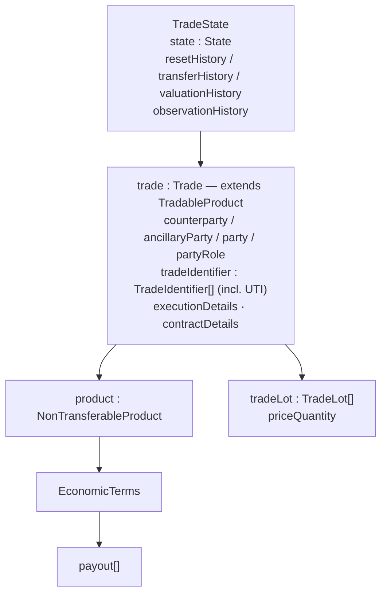
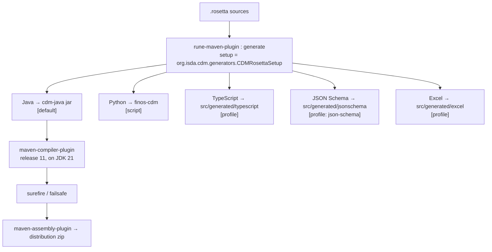

# CDM — Design Document

Companion to [`CDM-summary.md`](CDM-summary.md). This document covers the architecture,
the conventions you must follow when adding to the model, and the mechanics of getting a
change from a `.rosetta` file into a consumable artefact.

---

## 1. Design principles

These are stated in `docs/design-principles.md` and are enforced in review. A
contribution that violates them will be rejected regardless of correctness.

### 1.1 Normalisation

Identify logical components that fulfil the same function across products and asset
classes, and model them once. *Quantity*, *price* and *party* are the canonical example:
notional, principal, number of shares and barrels are all `Quantity`; an FX rate, an
interest rate and a strike are all `Price`; both are a `Measure` (amount + unit).

**Rule:** before adding a type, search for an existing component that already covers the
concept. Specialising the model per use case is the failure mode this principle exists
to prevent.

### 1.2 Composability

Objects are built bottom-up from building blocks, and their *identity is inferred*, not
declared.

- Products: one `OptionPayout` serves swaptions, equity options and FX options.
- Events: a partial novation = `QuantityChangeInstruction` + `ContractFormationInstruction`.
- Legal agreements: shared election components with reusable functional logic.

Classification then comes from **qualification functions** applied to the populated
object (80 `[qualification Product]`, 35 `[qualification BusinessEvent]`). This is why
CDM does not depend on any single taxonomy and can carry several classifications for the
same trade — which is exactly what makes DRR possible.

### 1.3 Mapping

CDM coexists with existing formats rather than replacing them. Translation is part of
the model (`cdm.ingest.*`), not an implementation concern. JSON serialisation exists for
convenience of representation and is explicitly **not** a storage design.

### 1.4 Embedded logic

Validation conditions, state transitions and calculations are specified in the model and
generated into every target language. Prose specifications are the thing CDM is trying
to eliminate.

### 1.5 Modularisation

Namespaces form a hierarchy from inner to outer. Each layer imports outward and must be
usable without its inner layers. Placement of a new component in the hierarchy is a
first-class design decision.

---

## 2. Architecture

### 2.1 Layering

Arrows point from a layer to the layer it depends on. `base` is outermost (no CDM
dependencies); `ingest` is the outermost *consumer* — it depends on everything and
nothing depends on it.



- **`base`** — no CDM dependencies. datetime (incl. day count), math, staticdata
  (party, asset, identifier, code lists).
- **`observable`** — market data, FROs, calculated rates, observation events.
- **`product`** — asset, template (economic terms, payouts, provisions), common
  (schedule, settlement), collateral, qualification.
- **`event`** — common (trade state, business events, instructions), workflow,
  qualification, position, instructioncomposition.
- **`legaldocumentation`** — common, master (isda/isla/icma), csa, transaction.
- **`margin`** — schedule.
- **`ingest`** — FpML translation. Outermost consumer; nothing depends on it.

### 2.2 The trade / event object graph





The key architectural move: **`BusinessEvent` is a fold over primitive instructions.**
Each primitive has a function that transforms a `TradeState` into a new `TradeState`.
Complex events are compositions, so the state-transition logic is written once per
primitive rather than once per event type.

### 2.3 Ingestion architecture (changed on this branch)

CDM `master` has moved FpML translation from **synonym-based mapping** (declarative
`synonym source … { }` blocks in `cdm.mapping.*`) to **function-based ingestion**
(`cdm.ingest.fpml.confirmation.*`, 817 functions across 44 files).

Only 3 files in the entire model still contain the `synonym` keyword. The `cdm.mapping`
namespace no longer exists on this branch.

This is the single largest structural difference between this checkout and the CDM 5.x
line that DRR builds against. See
[`CDM-DRR-integration-notes.md`](CDM-DRR-integration-notes.md).

---

## 3. Conventions

### 3.1 File naming

`<namespace-path-with-dashes>-<kind>.rosetta`, where `<kind>` ∈
`type` | `enum` | `func` | `desc`.

```
product-template-type.rosetta        → namespace cdm.product.template, data types
product-template-enum.rosetta        → namespace cdm.product.template, enums
product-template-func.rosetta        → namespace cdm.product.template, functions
product-desc.rosetta                 → namespace cdm.product, namespace description only
base-staticdata-asset-rates-enum.rosetta → cdm.base.staticdata.asset.rates
```

**All 145 files live flat in `rosetta-source/src/main/rosetta/`.** The directory is not
nested; the namespace hierarchy lives in the filename and the `namespace` declaration.

### 3.2 Splitting types / enums / functions

Types, enums and functions for the same namespace go in *separate files*. This is not
cosmetic — it lets consumers adopt a namespace's data model without pulling its
function bodies, and it keeps merge conflicts localised (function files are where churn
concentrates: `event-common-func.rosetta` is 125 KB).

### 3.3 Documentation strings

Every type, attribute, enum value and function carries a `<"...">` description. This is
mandatory — the docs website and the generated Javadoc are built from them.

```
type TradeLot: <"Specifies the price and quantity of a trade lot, where the same
    product could be traded multiple times with the same counterparty but in
    different lots.">
    priceQuantity PriceQuantity (0..*) <"Specifies the price, quantity ...">
```

### 3.4 Conditions

Validation lives with the type it constrains:

```
type ReportableInformation:
    condition MandatorilyClearableConditionESMA: <"...">
        partyInformation -> regimeInformation
            then filter supervisoryBody = SupervisoryBodyEnum -> ESMA
            then if mandatorilyClearable exists
                then mandatorilyClearable distinct count = 1
```

### 3.5 Native / hand-written functions

A function declared in `.rosetta` without a body is generated as an abstract class and
implemented in `rosetta-source/src/main/java/`. Use this only for things the DSL cannot
express (I/O, external lookups, complex numerics). Prefer DSL bodies — they generate to
every target language; Java implementations do not.

---

## 4. Build and code generation

### 4.1 Pipeline



### 4.2 Modules

| Module | Purpose |
|---|---|
| `rosetta-source` | The model. Generates and packages `cdm-java`. |
| `tests` | Cross-cutting tests: FpML ingestion regression, function input creation, scheme import, unused-model-element detection. |
| `examples` | Runnable illustrations — `InterestRatePayoutCreation`, `ValidateAndQualifySample`, `EnumSerialisation`, legal-agreement samples. |

### 4.3 Test data and pipelines

`rosetta-source/src/main/resources/ingest/` holds the translate pipeline definitions and
test packs:

```json
{
  "id": "pipeline-translate-fpml-confirmation-to-trade-state",
  "transform": {
    "type": "TRANSLATE",
    "function": "cdm.ingest.fpml.confirmation.message.functions.Ingest_FpmlConfirmationToTradeState",
    "inputType": "fpml.consolidated.doc.Document",
    "outputType": "cdm.event.common.TradeState"
  },
  "inputSerialisation": { "format": "XML", "configPath": "xml-config/..." }
}
```

52 test-pack files sit alongside, one per FpML product family (rates, credit, equity,
fx, commodity, inflation swaps, bond options, securities, loan, …), each listing input
samples and expected outputs. **Adding a product mapping means adding to a test pack.**

`resources/functions/` holds ~228 input/output JSON pairs plus `.md` narratives for
function-level regression (sec-lending, repo-and-bond, business-event, workflow-step).

### 4.4 Commands

```bash
mvn clean install -DskipTests
```

```bash
mvn -pl rosetta-source test
```

```bash
mvn clean install -P json-schema
```

Requires JDK 21. Artefacts resolve from a Regnosys registry configured in `settings.xml`.

---

## 5. How to add functionality

### 5.1 Decision sequence

1. **Does an existing component already cover it?** Normalisation first. Search
   `rosetta-source/src/main/rosetta/` for the concept under every name the market uses
   for it.
2. **Which layer does it belong in?** Placement determines what it may import. A type
   that needs `cdm.event` cannot live in `cdm.base`. If placement feels wrong, the
   design is probably wrong.
3. **Can it be composed from existing building blocks?** A new payout type is a strong
   signal that the design should be reworked into an existing payout with new features.
4. **What logic ships with it?** Conditions, qualification, state transition.

### 5.2 Mechanics

```
1. Edit / add  <namespace>-type.rosetta      (+ -enum, + -func as needed)
2. Add conditions to the type
3. Add or extend a qualification function if the object needs classifying
4. Add ingestion mapping in ingest-fpml-confirmation-*-func.rosetta if it must
   round-trip from FpML
5. Add test-pack samples under resources/ingest/ or resources/functions/
6. Add documentation to docs/  (mandatory — see docs/dev-guidelines.md)
7. Write a release note
8. mvn clean install
```

### 5.3 Governance reality

This repo is a FINOS open standard, not a private codebase. Model changes go through:
raise a GitHub Issue → Working Group review → PR (via GitHub or via Rosetta Design,
which opens the PR for you) → Contribution Review WG → Steering WG for DRAFT releases.
Contributors need an executed ICLA/CCLA — EasyCLA blocks commits otherwise.

**For local project work this matters in one way:** treat `common-domain-model/` as
upstream. Prefer building on top of it (a separate model that imports CDM, the way DRR
does) over patching it in place, unless the intent is genuinely to contribute upstream.

### 5.4 Extension pattern

The `drr/` repo is the reference for extending CDM without forking it:

- Declare CDM as a Maven dependency (`org.finos.cdm:cdm-java`) and as a Rosetta parent
  model (`rosetta.parent.common-domain-model.*` properties).
- Declare your own namespace root (`drr.*`).
- `import cdm.event.common.*` etc. in your `.rosetta` files.
- `extend` CDM types where you need extra attributes; write functions that take CDM
  types as input.

Do this rather than editing CDM sources.

---

## 6. Risks and constraints

| Item | Note |
|---|---|
| Pre-release branch | `8.0.0-dev` — Development state per `SCHEDULE26.md`. The model will still change. Pin to a released tag for anything that must be stable. |
| Ingest churn | The synonym → function ingestion migration is recent and is 46% of the model by line count. Highest-churn area. |
| Python generator | Types only in practice; function generation is 2026 roadmap work. Do not plan Python-side execution of CDM functions yet. |
| Java bytecode 11 on JDK 21 | Source may not use post-11 language features. |
| Licence | Community Specification License 1.0, not a standard OSS code licence. Check before redistributing model source. |
| Namespace placement | Effectively irreversible once released — moving a type across namespaces is a breaking change for every consumer. |
