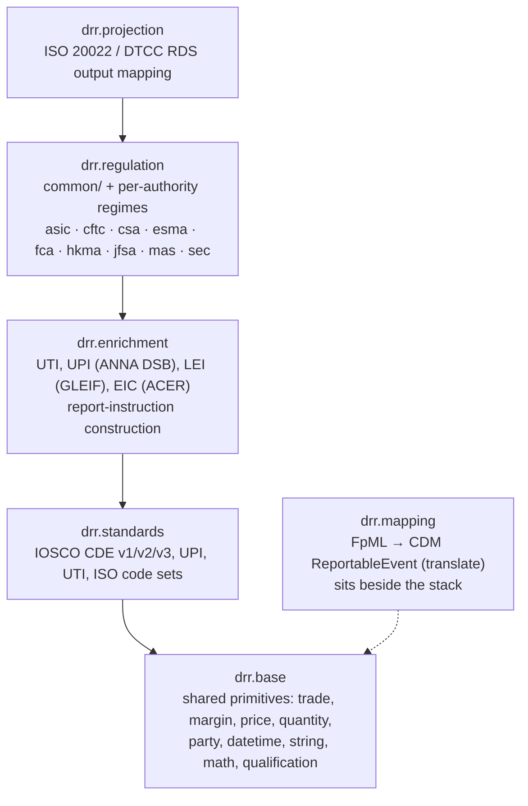
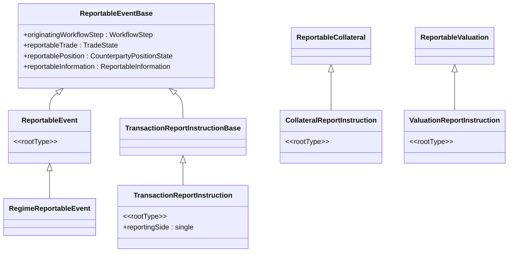
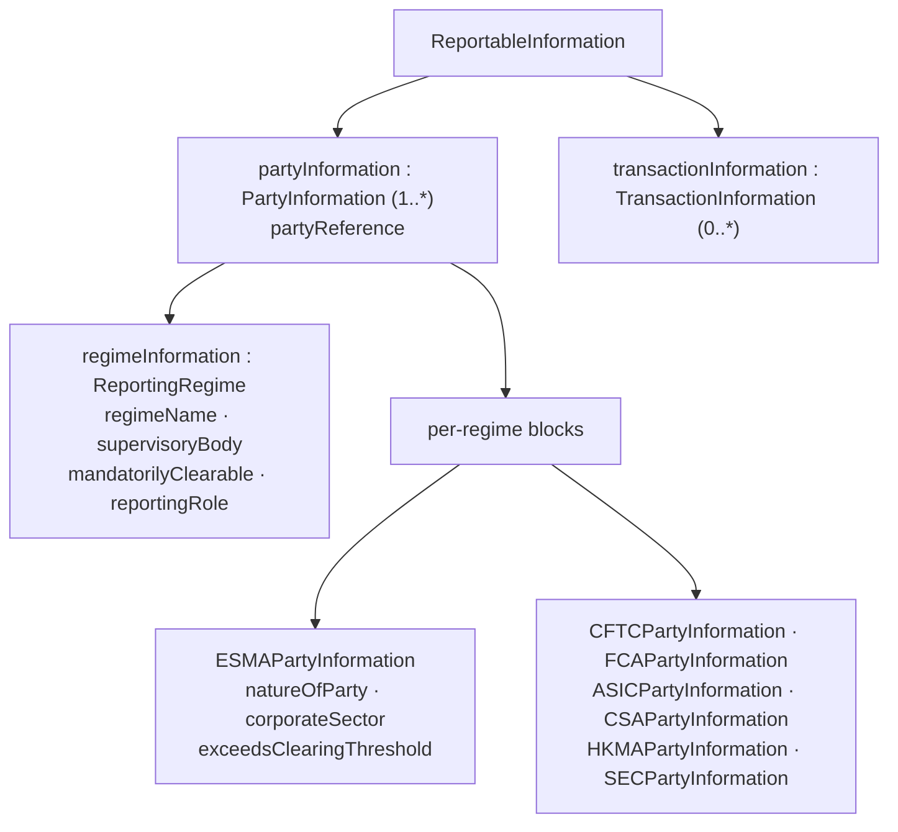
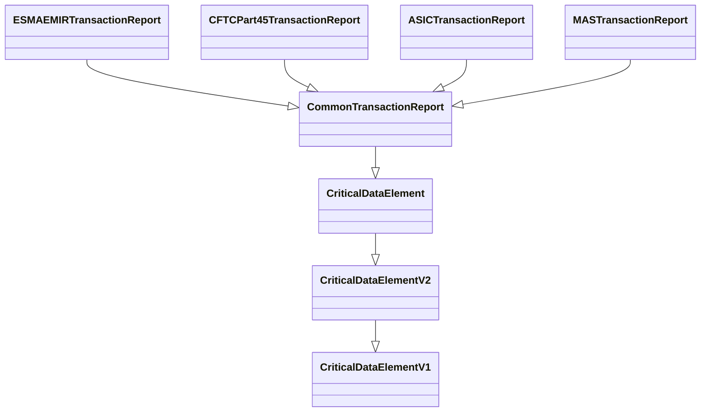
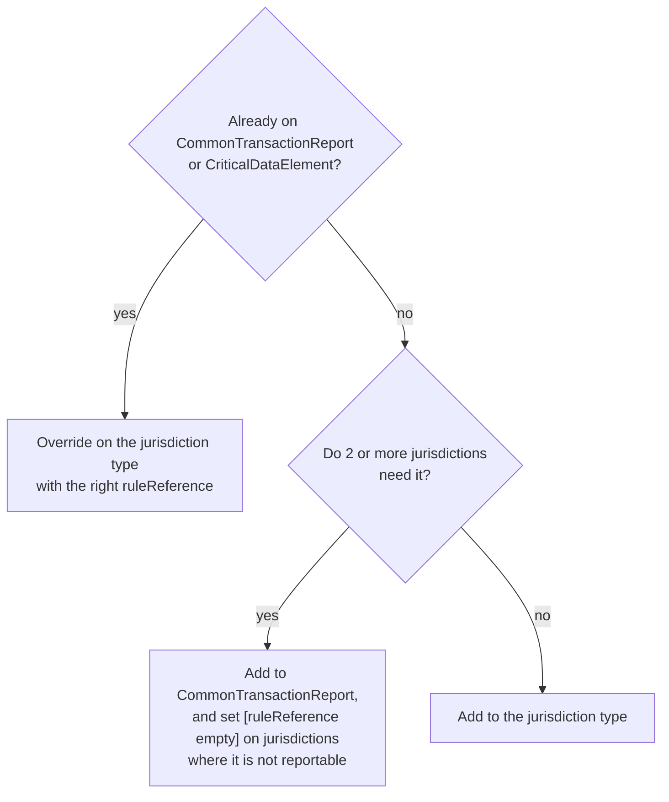

# DRR — Design Document

Companion to [`DRR-summary.md`](DRR-summary.md). Architecture, conventions, and how to
add a regime, a field or a rule.

---

## 1. Design principles

From `documentation/source/modelling-guide.rst`:

| Principle | Meaning |
|---|---|
| **Functional** | Rules are pure functions of the input object. No side effects, no hidden state. |
| **Composable and reusable** | Small rules combined into bigger ones; shared logic lifted into `common`. |
| **Auditable** | Every field traces to a regulation, paragraph and working group via `regulatoryReference`. |
| **Test-driven** | Every rule is backed by input/expected-output samples in a test pack. |

DRR also inherits CDM's principles wholesale — it uses CDM data types for input and
CDM's data-plus-function idiom for everything it adds.

---

## 2. Architecture

### 2.1 Namespace layering

Arrows point from a namespace to what it builds on.



### 2.2 The input type hierarchy

This is the spine of the model. Everything reportable descends from it.



`ReportableEventBase` lives in `drr.base.trade` and holds the CDM coupling.
`RegimeReportableEvent` carries a reporting side per regime; the three
`*ReportInstruction` root types each carry exactly one, and drive the Trade, Margin and
Valuation reports respectively.

The `Regime*` → `*ReportInstruction` step is the fan-out: a single event that is
reportable under several regimes becomes one report instruction *per regime*, each
carrying exactly one `reportingSide`.

### 2.3 `ReportableInformation` — the enrichment carrier

CDM describes the trade. It does not know that counterparty 1 is a financial
counterparty above the clearing threshold in the EU. That regime-specific, firm-specific
knowledge is carried in `ReportableInformation`:



with cross-party consistency enforced in-model:

```
condition MandatorilyClearableConditionESMA:
    partyInformation -> regimeInformation
        then filter supervisoryBody = SupervisoryBodyEnum -> ESMA
                and regimeName = RegimeNameEnum -> EMIR
        then if mandatorilyClearable exists
            then mandatorilyClearable distinct count = 1
```

Populating `ReportableInformation` correctly is the main integration burden on an
implementing firm. `PreEnrich` / `PostEnrich` are declared as extension points precisely
for this — they are expected to be implemented against internal reference data.

### 2.4 The 2025 common-report refactoring

This is the most important structural fact about the current model. Report types are
built as an inheritance chain that maximises shared definition:



| Type | Namespace | Lines |
|---|---|---:|
| `CriticalDataElementV1` | `drr.standards.iosco.cde.version1` | 237 |
| `CriticalDataElementV2` | `drr.standards.iosco.cde.version2` | 250 |
| `CriticalDataElement` | `drr.standards.iosco.cde.version3` | 274 |
| `CommonTransactionReport` | `drr.regulation.common.trade` | 161 |
| `ESMAEMIRTransactionReport` | `drr.regulation.esma.emir.refit.trade` | 4,151 — the reference implementation |

Parallel chains exist for valuation (`CriticalDataElement` → `CommonValuationReport`)
and collateral (`CommonCollateralReport`).

A jurisdiction report therefore contains three kinds of attribute:

1. **Inherited and used as-is** — nothing to write.
2. **Inherited but re-pointed** — `override attr Type (1..1) [ruleReference JurisdictionRule]`.
3. **Inherited but not reportable here** — `override attr Type (0..1) [ruleReference empty]`.
4. **Genuinely unique** — declared new on the jurisdiction type.

`documentation/Development Guidelines/Best_Practice_for_Adding_New_Jurisdictions.md` is
the normative guide, and it names **ESMA EMIR as the reference implementation**.

### 2.5 Rule kinds

| Kind | Syntax | Purpose |
|---|---|---|
| **Report definition** | `report ESMA EMIR Trade in T+1 from TransactionReportInstruction when ReportableProduct with type ESMAEMIRTransactionReport` | Binds input type, eligibility filter and output type |
| **Eligibility rule** | `eligibility rule ReportableProduct from TransactionReportInstruction:` | Is this event reportable at all under this regime? (51 total) |
| **Reporting rule** | `reporting rule NatureOfCounterparty1 from TransactionReportInstruction:` | Derive one reportable field value (2,018 total) |
| **Function** | `func ExtractRegimeInformation:` | Shared logic called by rules (1,386 total) |
| **Condition** | `condition X:` on a report type | Post-transform data validation |
| **Projection function** | `func Project_EsmaEmirTradeReportToIso20022: [projection XML]` | Report object → wire format |

Rule bodies are pipelines of `extract` / `filter` / `then` / `only-element` /
`distinct` over the input graph:

```
reporting rule ClearingThresholdOfCounterparty1 from TransactionReportInstruction:
    filter IsAllowableAction
    then extract
        common.party.ExtractRegimeInformation(item, item -> reportingSide -> reportingParty)
    then filter
        ([NatureOfPartyEnum -> Financial, NatureOfPartyEnum -> NonFinancial]
             any = esmaPartyInformation -> natureOfParty)
    then extract esmaPartyInformation -> exceedsClearingThreshold
    then only-element
```

### 2.6 Projection

Projection is a separate, purely structural mapping from the DRR report object to a wire
format. It carries no regulatory interpretation — all interpretation happened in the
transform stage.

```
func Project_EsmaEmirTradeReportToIso20022:
    [projection XML]
    inputs:  drrReport   ESMAEMIRTransactionReport (1..1)
    output:  iso20022Report Document (1..1)
    set iso20022Report -> derivsTradRpt -> rptHdr: Create_TradeReportHeader
    set iso20022Report -> derivsTradRpt -> tradData -> rpt: Create_TradeReport32Choice__1(drrReport)
```

Two target families:
- **ISO 20022** (`org.iso20022:rosetta-source` 1.32.0) — ESMA, FCA, ASIC, MAS, JFSA, HKMA
- **DTCC RDS harmonized** — CFTC, CSA

Note the `actionType` switch (`NEWT` / `MODI` / `CORR` / …) producing different ISO
message variants — lifecycle action drives the output shape.

---

## 3. Conventions

### 3.1 File naming

`<namespace-path-with-dashes>-<kind>.rosetta`, `<kind>` ∈
`type` | `enum` | `func` | `rule` | `synonym`. All 266 files flat in
`rosetta-source/src/main/rosetta/`.

| Example filename | Holds |
|---|---|
| `regulation-esma-emir-refit-trade-type.rosetta` | Report type + field metadata |
| `regulation-esma-emir-refit-trade-rule.rosetta` | Reporting + eligibility rules |
| `regulation-common-trade-party-func.rosetta` | Shared extraction functions |
| `projection-iso20022-esma-emir-refit-trade-func.rosetta` | ISO 20022 projection |
| `standards-iosco-cde-version3-price-rule.rosetta` | CDE v3 price rules |

Note the split: **types carry the regulatory metadata; rules carry the logic.** In the
ESMA reference implementation the type file is 4,151 lines and the rule file 245 — most
of the "content" of a regime is field declarations with references, not rule bodies,
because the rule bodies are reused from `common`.

### 3.2 Attribute metadata order

Mandated by the best-practice guide, in this order: **1.** `label`, **2.**
`regulatoryReference`, **3.** `ruleReference`.

```
override attribute boolean (0..1)
    [label "1.7 Clearing Threshold of Counterparty 1"]
    [regulatoryReference ESMA EMIR RTS table "1" dataElement "7"
        field "Clearing Threshold of Counterparty 1"
        provision "Information whether the counterparty 1 is above ..."]
    [ruleReference ClearingThresholdOfCounterparty1]
```

For nested attributes use the `for` form:

```
override attribute ComplexType (0..1)
    [label for nestedAttribute "Test Label"]
    [regulatoryReference for nestedAttribute Jurisdiction table "2" dataElement "55" …]
    [ruleReference for nestedAttribute NestedAttributeRule]
```

### 3.3 Explicit do-nots

From the best-practice guide:

- ❌ Do **not** use empty `ruleReference` to carry a `regulatoryReference` — set empty
  overrides on the type instead.
- ❌ Do **not** rely on *rule source* — it is being deprecated.
- ❌ Do **not** duplicate logic that already exists in `CommonTransactionReport`.
- ❌ Do **not** write a rule from scratch when a common rule exists — express the
  divergence instead:

```
reporting rule JurisdictionSpecificRule from TransactionReportInstruction:
    filter IsAllowableAction
    then extract
        if common.CommonRule = value
        then extract jurisdiction
        else common.CommonRule
```

- ❌ Do **not** write a validation from scratch when a common one exists — lift shared
  validation into a `func` and call it from `condition`.

### 3.4 Pipeline and test-pack configuration

Every transform is declared in JSON, and every pipeline has test packs bound to it.

```json
// regulatory-reporting/config/pipeline-report-esma-emir-trade.json
{ "id": "pipeline-report-esma-emir-trade",
  "name": "ESMA / EMIR Trade",
  "transform": { "type": "REPORT",
    "function":   "drr.regulation.esma.emir.refit.trade.reports.ESMAEMIRTradeReportFunction",
    "inputType":  "drr.regulation.common.TransactionReportInstruction",
    "outputType": "drr.regulation.esma.emir.refit.trade.ESMAEMIRTransactionReport" } }
```

```json
// regulatory-reporting/config/test-pack-report-asic-margin-collateral.json
{ "id": "test-pack-report-asic-margin-collateral",
  "pipelineId": "pipeline-report-asic-margin",
  "samples": [ { "id": "collateral-ex01",
      "inputPath":  "regulatory-reporting/input/collateral/Collateral-ex01.json",
      "outputPath": "regulatory-reporting/output/asic-margin/collateral/Collateral-ex01.json",
      "assertions": { "modelValidationFailures": 1, "runtimeError": false } } ] }
```

The `assertions` block records *expected* validation failures. Changing a rule that
alters a failure count requires updating the assertion — which is the mechanism that
makes regressions visible in review.

---

## 4. Build

```bash
cd /Users/emirbh/Projects/ISDA/drr && mvn clean install -DskipTests
```

Modules build in order: `distribution`, `examples`, `rosetta-source`, `tests`.

| Module | Purpose |
|---|---|
| `rosetta-source` | The model + all test data. Generates Java. |
| `tests` | Report tests per regime, projection tests, FpML 5-10/5-13 ingestion tests, data-quality harness, validation analytics |
| `examples` | Per-regime runnable examples, GLEIF validation, performance tests |
| `distribution` | Zip: model source, translate samples, test packs, jars, ISDA licence |

Regenerating expected outputs is done through `DrrTestPackCreator`
(`tests/src/test/java/com/regnosys/drr/testpack/`) rather than by hand — 2,264 output
files are not maintainable manually.

---

## 5. How to add functionality

### 5.1 Adding a field to an existing regime

Start by placing the field:



Then, in order:

1. Add `label` + `regulatoryReference` + `ruleReference` (in that order).
2. Reuse an existing common reporting rule if one applies; otherwise write one in the
   regime's `-rule.rosetta`, expressing divergence from the common rule.
3. Add or extend a `condition` if the regulation imposes a validation.
4. Update the projection function if the field reaches the wire format.
5. Regenerate expected outputs and review the diff across all affected test packs.

### 5.2 Adding a new jurisdiction

The best-practice guide's five-step analysis, before any code:

1. **Analyse reportable attributes** — enumerate every field in the new
   `NewTransactionReport`.
2. **Classify each field** — already common / common-but-not-required-here (needs
   `[ruleReference empty]`) / unique / shared-with-≥1-other-jurisdiction (promote to
   `CommonTransactionReport`).
3. **Document common attributes** — tracked in the DRR Unique Fields Airtable.
4. **Compare rule references** — how do this jurisdiction's mappings diverge from
   existing common rules? Adjust common rules where the divergence is really a
   generalisation.
5. **Compare validations** — lift shared validation into common `func`s.

Then, mechanically:

| File to create | Purpose |
|---|---|
| `rosetta-source/src/main/rosetta/regulation-<auth>-rule.rosetta` | `body Authority`, corpus declarations |
| `…/regulation-<auth>-<regime>-trade-type.rosetta` | `NewTransactionReport extends common.CommonTransactionReport` |
| `…/regulation-<auth>-<regime>-trade-rule.rosetta` | Report definition, eligibility, divergent rules |
| `…/regulation-<auth>-<regime>-valuation-*.rosetta` | Valuation report equivalents |
| `…/regulation-<auth>-<regime>-margin-*.rosetta` | Margin report equivalents |
| `…/projection-<target>-<auth>-<regime>-trade-func.rosetta` | Wire-format projection |
| `rosetta-source/src/main/resources/regulatory-reporting/config/pipeline-report-<auth>-<regime>.json` | Pipeline definition |
| `…/regulatory-reporting/config/test-pack-report-<auth>-<regime>-<category>.json` | Test packs — ×8 categories: rates, credit, equity, fx, commodity, etd, events, custom-scenarios |
| `…/regulatory-reporting/output/<auth>-<regime>/` | Expected outputs |
| `…/projection/config/pipeline-projection-<auth>-<regime>-report-to-<target>.json` | Projection pipeline |
| `tests/src/test/java/com/regnosys/drr/report/<auth>/` | Report tests |
| `tests/src/test/java/com/regnosys/drr/projection/<auth>/` | Projection tests |

Budget realistically: an established regime is 100–250 reporting rules plus a
1,500–4,000-line type file, and the test-data footprint dominates the effort.

### 5.3 Where new logic belongs

| Kind of logic | Location |
|---|---|
| Reusable extraction from CDM | `drr.base.trade.*` or `drr.regulation.common.trade.*` |
| Rule shared by ≥2 regimes | `drr.regulation.common.*` |
| Regime-specific derivation | `drr.regulation.<auth>.*` |
| Global standard (CDE / UPI / UTI / ISO) | `drr.standards.*` |
| External reference-data lookup | `drr.enrichment.*` (native Java implementation) |
| Wire-format shaping | `drr.projection.*` — never regulatory logic |

---

## 6. Risks and constraints

| Item | Note |
|---|---|
| **CDM 5.29.0 pin** | DRR builds against a released CDM 5, not the sibling CDM 8 checkout. See [`CDM-DRR-integration-notes.md`](CDM-DRR-integration-notes.md). |
| **Synonym-based translate** | `drr.mapping.*` extends `cdm.mapping.fpml.confirmation.workflowstep` — a namespace that no longer exists in CDM 8. This layer must be rewritten to reach a modern CDM. |
| **Test-data volume** | 2,264 expected outputs. A change to a common rule ripples across every regime's packs. Always regenerate via `DrrTestPackCreator` and review the diff. |
| **Rule source deprecation** | Do not add new rule-source-based definitions. |
| **External API dependencies** | UPI enrichment calls ANNA DSB; LEI calls GLEIF; MIC calls ISO 10383. Tests use cached fixtures (`test-pack-gleif-data.json`) — keep new work offline-testable. |
| **Regulatory correctness ≠ model correctness** | A rule can compile, validate and still be wrong. Field changes need working-group-level review against the cited provision, not just a green build. |
| **Licence** | ISDA DRR License, distributed as PDF. Not an OSI licence — check terms before redistribution. |
| **Repo age** | Last commit 2025-11-20, roughly nine months behind the CDM checkout. Regulatory specs have almost certainly moved since. |
