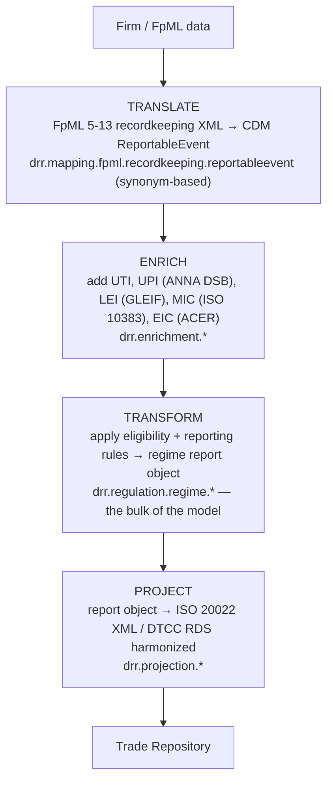

# DRR — Summary

**Repository:** `/Users/emirbh/Projects/ISDA/drr`
**Branch:** `main` @ `6c99e479f` (last commit 2025-11-20)
**Group / artifact:** `com.regnosys : drr`
**Depends on:** `org.finos.cdm:cdm-java` **5.29.0**, `org.iso20022:rosetta-source` 1.32.0
**License:** ISDA DRR License (PDF in `distribution/src/main/resources/distribution/`)

## What it is

**Digital Regulatory Reporting** is a cross-industry expression of derivatives trade
reporting rules as machine-executable code. Instead of each firm reading a regulator's
PDF technical specification and coding its own interpretation, DRR encodes the rules
once, in the open, against a common input model.

It is an **extension of CDM**, not a fork: CDM types carry the transaction data, and DRR
adds regulatory types, rules and projections on top.

## Repository layout

| Path | Contents |
|---|---|
| `rosetta-source/src/main/rosetta/` | **The model.** 266 `.rosetta` files, ~88,000 lines, flat (no nesting) |
| `rosetta-source/src/main/resources/regulatory-reporting/config/` | 28 pipeline definitions + 105 test-pack definitions |
| `rosetta-source/src/main/resources/regulatory-reporting/input/` | 238 input samples |
| `rosetta-source/src/main/resources/regulatory-reporting/output/` | 2,264 expected outputs |
| `rosetta-source/src/main/resources/regulatory-reporting/lookup/` | GLEIF data, EIC codes, lookup descriptors |
| `rosetta-source/src/main/resources/projection/` | 27 projection pipelines + test packs |
| `rosetta-source/src/main/resources/cdm-sample-files/` | 220 FpML samples (5-10, 5-13) |
| `rosetta-source/src/main/resources/schemas/` | FpML 5-10/5-13 recordkeeping + transparency, ISO 10383 |
| `rosetta-source/src/main/resources/ingestions/` | `drr-ingestions.json` |
| `rosetta-source/src/main/resources/mapping-analytics/` | Mapping failure CSV reports |
| `tests/` | Report / projection / ingestion tests, data-quality harness |
| `examples/` | Per-regime runnable examples + performance tests |
| `distribution/` | Zip assembly — model, test packs, licence, libs |
| `documentation/` | Sphinx docs — overview, modelling guide, implementation |

## The four-stage pipeline

DRR's whole architecture is one pipeline, stated in `documentation/source/overview.rst`:



## The model, layer by layer

| Layer | Namespace | Lines | Contents |
|---|---|---:|---|
| Base | `drr.base.*` | 2,358 | shared trade/margin/price/quantity/party/datetime helpers, qualification |
| Enrichment | `drr.enrichment.*` | 2,573 | UTI, UPI (ANNA DSB), LEI (GLEIF), EIC, report-instruction construction |
| Mapping | `drr.mapping.*` | 416 | FpML 5 recordkeeping → `ReportableEvent`, **synonym-based** |
| Standards | `drr.standards.*` | 9,635 | IOSCO CDE v1/v2/v3, UPI, UTI, ISO |
| Regulation | `drr.regulation.*` | 53,534 | per-regime report types, eligibility rules, reporting rules |
| Projection | `drr.projection.*` | 19,516 | ISO 20022 and DTCC RDS output mapping |

**Regulation is 61% of the model.** Projection is another 22%.

## Regimes covered

28 report definitions across 9 authorities:

| Authority | Reports | Reporting rules | Projection target |
|---|---|---:|---|
| **CFTC** (US) | Part43, Part45, Valuation, Margin | 246 | DTCC RDS harmonized |
| **CSA** (Canada) | Trade, PPD, Valuation, Margin | 219 | DTCC RDS harmonized |
| **HKMA** (Hong Kong) | Trade, Valuation, Margin | 196 | ISO 20022 (DTCC + TR variants) |
| **ESMA** (EU, EMIR REFIT) | Trade, Valuation, Margin | 175 | ISO 20022 |
| **SEC** (US) | Trade | 135 | — |
| **JFSA** (Japan) | Trade, Valuation, Margin | 132 | ISO 20022 |
| **ASIC** (Australia) | Trade, Valuation, Margin | 129 | ISO 20022 |
| **MAS** (Singapore) | Trade, Valuation, Margin | 124 | ISO 20022 |
| **FCA** (UK EMIR REFIT) | Trade, Valuation, Margin | 56 | ISO 20022 |
| **CPMI_IOSCO** | CDE | — | — |
| common / shared | — | 271 | — |
| standards (CDE, UPI, UTI) | — | 324 | — |

Also modelled but less developed: ESMA MiFIR (RTS 22), ESMA EMIR Article 9.

Regulatory bodies are declared as first-class model elements (`body Authority ESMA <"...">`)
alongside trade repositories (`body TradeRepository DTCC`, `CME`, `ICE`, `KOR`) and
standard setters (`BIS`, `CPMI`, `IOSCO`, `ISO`, `FIA`).

## Three report shapes

Every regime is modelled in up to three parallel flavours, each with its own root input:

| Report | Input type | Question answered |
|---|---|---|
| **Trade** | `TransactionReportInstruction` | What was traded, and by whom? |
| **Valuation** | `ValuationReportInstruction` | What is it worth today? |
| **Margin / Collateral** | `CollateralReportInstruction` | What collateral is posted? |

## Traceability

Every reportable field carries its regulatory provenance in the model:

```
override natureOfCounterparty1 common.party.NatureOfCounterpartyEnum (1..1)
    [label "1.5 Nature of the Counterparty 1"]
    [regulatoryReference ESMA EMIR RTS table "1" dataElement "5"
        field "Nature of the Counterparty 1"
        provision "Indicate if the counterparty 1 is a CCP, a financial or a
                   non-financial counterparty ..."]
    [ruleReference NatureOfCounterparty1]
```

The `corpus` declarations bind these to actual legal instruments — CFTC 17 CFR Parts 43
and 45 (versions 3.0, 3.1, 3.2), EMIR RTS, MiFIR / RTS 22, CSA Derivatives Data
Technical Manual 2024, ESMA Q&A, and the cross-association EMIR Reporting Best
Practices — plus the ISDA working groups that ratified each interpretation.

This is what makes the output auditable: from a value in a submitted report you can walk
back to the rule, the field, the regulation, the paragraph, and the working group.

## Test infrastructure

DRR is test-data-heavy by design:

- **238 input samples** across categories: rates, credit, equity, fx, commodity, etd,
  collateral, events, cftc-event-scenarios, custom-scenarios, delegated-reporting
- **2,264 expected report outputs** — one per (regime × report × sample)
- **105 test-pack definitions** + 28 report pipelines + 27 projection pipelines
- **146 test Java files**, including a data-quality harness that mutates test packs
  (`TestPackModifier` with ~17 modifiers: LEI, UTI, timestamps, party classification,
  master agreement, package identifier, …) to exercise rule branches
- **Mapping analytics** — CSV reports of failed FpML mappings, tracked in-repo

Test packs carry explicit assertions, including tolerated validation failures:

```json
{ "id": "collateral-ex01",
  "inputPath":  "regulatory-reporting/input/collateral/Collateral-ex01.json",
  "outputPath": "regulatory-reporting/output/asic-margin/collateral/Collateral-ex01.json",
  "assertions": { "modelValidationFailures": 1, "runtimeError": false } }
```

## Toolchain

| Component | Version |
|---|---|
| JDK | 21 required (`[21,22)`), bytecode release 11 |
| FINOS CDM | **5.29.0** |
| ISO 20022 model | 1.32.0 |
| Rosetta DSL | 9.68.0 |
| Rosetta bundle | 11.89.3 |
| Xtext | 2.38.0 |
| Jackson | 2.17.1 |
| Kotlin stdlib | 1.9.24 |
| JUnit | 5.9.1 |

CI on Codefresh. Distribution ships as a zip containing the model source, translate
samples, test packs, dependency jars and the ISDA DRR licence.
