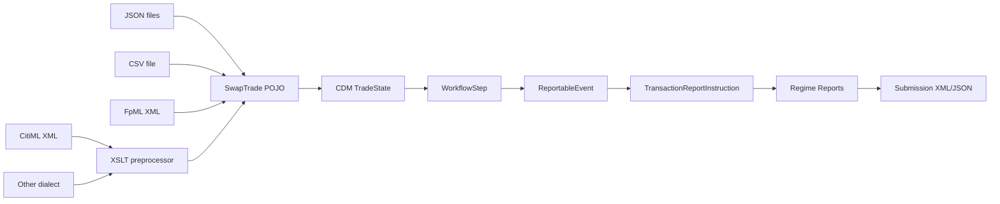

# CDM/DRR Swap Trade Mapper — Build and Run Guide

## Overview

This project takes internal swap trade data (JSON files, CSV, FpML XML, or CitiML XML), models it using the FINOS Common Domain Model (CDM 6.23.0), and generates regulatory reports via ISDA's Digital Regulatory Reporting (DRR 7.7.0) for multiple regimes, then projects those reports to submission formats (ISO 20022 Auth.030 XML for ESMA/FCA, DTCC RDS Harmonized for CFTC). CitiML — FpML extended with proprietary Citi tags — has its own input mode, and other dialects are supported via XSLT preprocessors.



> **See also:** [`pipeline-walkthrough.md`](pipeline-walkthrough.md) traces one
> trade through all seven phases with the real artifacts and measured sizes.

---

## Phase Summary

| Phase | Goal | Input | Output | Key Class |
|-------|------|-------|--------|-----------|
| 1 | Define input format | — | JSON schema + samples + CSV + FpML + CitiML | `data/schema/swap-trade.json` |
| 2 | Map to CDM TradeState | `SwapTrade` JSON | CDM `TradeState` JSON | `TradeStateMapper` |
| 3 | Wrap in WorkflowStep | `TradeState` + metadata | CDM `WorkflowStep` JSON | `WorkflowStepMapper` |
| 4 | Create ReportableEvent | `WorkflowStep` + reporting info | DRR `ReportableEvent` JSON | `ReportableEventMapper` |
| 5 | Create report instruction | `ReportableEvent` | DRR `TransactionReportInstruction` JSON | `ReportInstructionMapper` |
| 6 | Generate regime reports | `TransactionReportInstruction` | Per-regime report JSON | `ReportGenerator` |
| 7 | Project to submission format | Regime reports | ISO 20022 XML / DTCC RDS JSON | `ProjectionMapper` |

---

## Phase Details

### Phase 1 — Input Data Model

**Goal**: Define a JSON schema that captures all internal swap trade fields and create sample input files covering the key product types and lifecycle events. Support JSON files, bulk CSV input, standard FpML XML confirmations, and CitiML (FpML extended with proprietary Citi tags).

**Process**: The schema defines 23 product types, 6 action types (NEWT, MODI, CORR, EROR, TERM, REVI), and 5 event types (TRAD, NOVA, ETRM, ALOC, COMP). Each trade carries party information (LEI + name), notional, rate, frequency, dates, and optional sections for FX, options, cap/floor, inflation, and novation.

Five input modes are supported — JSON (one file per trade, for development and testing), CSV (one row per trade, for bulk processing), FpML XML (standard FpML 5.x confirmations), CitiML XML (FpML plus Citi extension tags), and FpML with a named XSLT preprocessor (any other dialect). All produce the same `SwapTrade` POJO; all downstream phases are format-agnostic.

**Files produced**:

| File | Description |
|------|-------------|
| `data/schema/swap-trade.json` | JSON Schema for the internal format |
| `data/schema/field-mapping.md` | Field-by-field mapping to CDM paths |
| `data/input/vanilla-swap-new.json` | NEWT/TRAD — USD 50M, 3.25% vs SOFR 3M |
| `data/input/vanilla-swap-modi.json` | MODI/TRAD — notional amended to 75M |
| `data/input/vanilla-swap-novation.json` | NEWT/NOVA — stepping in Zeta Partners |
| `data/input/vanilla-swap-etrm.json` | NEWT/ETRM — early termination |
| `data/input/ois-new.json` | NEWT/TRAD — USD 100M, 4.10% vs SOFR 1D |
| `data/input/fra-new.json` | NEWT/TRAD — EUR 25M, 2.85% vs EURIBOR 6M |
| `data/input/swaption-new.json` | NEWT/TRAD — USD 30M, European swaption |
| `data/input/fx-swap-new.json` | NEWT/TRAD — EUR/USD near/far |
| `data/input/cap-floor-new.json` | NEWT/TRAD — USD 20M, 5.00% cap on SOFR 3M |
| `data/input/sample-trades.csv` | All 9 trades above in a single CSV file |
| `data/input/fpml/vanilla-swap.xml` | FpML 5.13 confirmation — USD 50M vanilla swap |
| `data/input/citiml/citi-fx-ndf.xml` | Real CitiML — USD/CLP non-deliverable forward |
| `data/reference/citiml/citi-fx-ndf.xml` | Reference copy of the same file |

### Phase 2 — CDM TradeState Mapping

**Goal**: Parse internal JSON into a `SwapTrade` POJO, then build a CDM 6.23.0 `TradeState` with the correct product structure.

**Process**:
1. `SwapTradeReader` deserialises the input JSON using Jackson (with `JavaTimeModule`).
2. `TradeStateMapper.map()` dispatches on `productType` to a product-specific mapper (currently `VanillaSwapMapper` for all types as a baseline).
3. The mapper builds:
   - `NonTransferableProduct` with ISDA taxonomy and `EconomicTerms` holding the fixed and floating `InterestRatePayout` legs as two `Payout` entries.
   - `TradeLot` with `PriceQuantity` for the notional, set directly on `Trade`.
   - `Counterparty` list (PARTY_1, PARTY_2), set directly on `Trade`.
   - `Trade` with `tradeIdentifier` (UTI), `tradeDate`, `executionDetails`, `contractDetails`.
   - Wrapping `TradeState` with the `Trade`.

**Key CDM 6 path**: `tradeState.trade.product.economicTerms.payout[].interestRatePayout`

CDM 6 dissolved `TradableProduct` — product, trade lots and counterparties now sit directly on `Trade`, `ContractualProduct` became `NonTransferableProduct`, and each `Payout` holds a single payout rather than a list.

**Input**: `SwapTrade` (in-memory POJO from Phase 1 — JSON, CSV row, or FpML/CitiML parse)

**Output**: `data/output/tradestate/{name}_TradeState.json`

### Phase 3 — WorkflowStep

**Goal**: Wrap the `TradeState` in a CDM `WorkflowStep` that carries the correct `ActionEnum`, `EventIntentEnum`, and lifecycle `PrimitiveInstruction`.

**Process**:
1. `actionType` → `ActionEnum`: NEWT→New, MODI/CORR/REVI→Correct, EROR→Cancel, TERM→New
2. `eventType` → `EventIntentEnum`: TRAD→ContractFormation, NOVA→Novation, ETRM→EarlyTerminationProvision, ALOC→Allocation, COMP→Compression
3. `buildInstruction()` creates the appropriate `PrimitiveInstruction`:
   - ContractFormation: `ContractFormationInstruction` + `execution` (an `ExecutionInstruction` built from the trade's product, lots, counterparties and parties)
   - Novation: `SplitInstruction` with quantity-to-zero + party change
   - Early Termination / Compression: `QuantityChangeInstruction` with REPLACE to zero
   - Allocation: `SplitInstruction` with ContractFormation breakdown

**Input**: `SwapTrade` + `TradeState`

**Output**: `data/output/workflowstep/{name}_WorkflowStep.json`

### Phase 4 — ReportableEvent

**Goal**: Create a DRR `ReportableEvent` that enriches the `WorkflowStep` with reporting-specific metadata that CDM does not carry.

**Process**:
1. Sets `originatingWorkflowStep`, `reportableTrade`, and `reportableInformation`.
2. `ReportableInformation` includes:
   - `confirmationMethod` (ELECTRONIC / NON_ELECTRONIC)
   - `globalPartyInformation` — one entry per party
   - `jurisdictionInformation` — a `ReportableJurisdictionInformation` carrying the regime name (DODD_FRANK_ACT), supervisory body (CFTC), a `TransactionInformation` with execution venue and large-size flag, and per-party `JurisdictionPartyInformation` (Party1 as REPORTING_PARTY, Party2 as COUNTERPARTY) with mandatorily-clearable status

DRR 7 inverted this shape: jurisdictions are now top level with parties nested inside, rather than parties each carrying a list of regimes.

**Input**: `SwapTrade` + `WorkflowStep` + `TradeState`

**Output**: `data/output/reportableevent/{name}_ReportableEvent.json`

### Phase 5 — TransactionReportInstruction

**Goal**: Use DRR's `Create_TransactionReportInstruction` function to enrich the report instruction with regulatory static data (UPI, UTI lookup, LEI validation).

**Process**:
1. `ReportInstructionMapper` is Guice-injected with DRR's `Create_TransactionReportInstruction` and `ExtractTradeCounterparty` functions.
2. Builds a `ReportingSide` (Party1 = reporting party, Party2 = counterparty).
3. Calls `createInstruction.evaluate(reportableEvent, reportingSide)` — the DRR engine applies its translate + enrich steps.

**Input**: `ReportableEvent`

**Output**: `data/output/instruction/{name}_TransactionReportInstruction.json`

### Phase 6 — Regime Report Generation

**Goal**: Run DRR report functions for each regulatory regime against the enriched instruction.

**Process**: `ReportGenerator` obtains these Guice-injected report functions and calls `evaluate()` on each:

| Regime | Report Function | Output Type |
|--------|----------------|-------------|
| CFTC Part 45 | `CFTCPart45ReportFunction` | `CFTCPart45TransactionReport` |
| CFTC Part 43 | `CFTCPart43ReportFunction` | `CFTCPart43TransactionReport` |
| ESMA EMIR | `ESMAEMIRTradeReportFunction` | `ESMAEMIRTransactionReport` |
| FCA UK EMIR | `FCAUKEMIRTradeReportFunction` | `FCAUKEMIRTransactionReport` |

Each report is serialised to JSON using `RosettaObjectMapper`.

**Input**: `TransactionReportInstruction`

**Output**: `data/output/reports/{name}_{regime}_Report.json`

### Phase 7 — Projection to Submission Format

**Goal**: Project regime reports to the format expected by trade repositories — ISO 20022 Auth.030 XML for European regimes, DTCC RDS Harmonized for US.

**Process**: `ProjectionMapper` calls DRR projection functions:

| Regime | Projection Function | Output Format |
|--------|---------------------|---------------|
| ESMA EMIR | `Project_EsmaEmirTradeReportToIso20022` | ISO 20022 Auth030 XML |
| FCA UK EMIR | `Project_FcaUkEmirTradeReportToIso20022` | ISO 20022 Auth030 XML |
| CFTC Part 45 | `Project_CftcPart45TradeReportToDtccRdsHarmonized` | DTCC RDS JSON |
| CFTC Part 43 | `Project_CftcPart43TradeReportToDtccRdsHarmonized` | DTCC RDS JSON |

ISO 20022 output uses `RosettaObjectMapperCreator.forXML()` with the regime-specific Auth030 model config.

**Input**: Map of regime → report object

**Output**: `data/output/projections/{name}_{regime}_Projection.xml` (or `.json`)

---

## Prerequisites

### System Requirements

| Requirement | Version | Notes |
|-------------|---------|-------|
| JDK | 21+ | Required by DRR runtime; bytecode targets Java 11 |
| Apache Maven | 3.8+ | Build tool |
| Google Cloud CLI (`gcloud`) | latest | For ISDA artifact registry authentication |
| Git | 2.x | For submodule management |

### Install JDK 21

```bash
brew install openjdk@21
export JAVA_HOME=$(/usr/libexec/java_home -v 21)
```

Verify:

```bash
java -version
```

### Install Maven

```bash
brew install maven
```

### Install Google Cloud CLI

```bash
brew install google-cloud-sdk
```

### Authenticate with ISDA Artifact Registry

DRR artifacts are hosted on Google Artifact Registry. You need credentials to resolve Maven dependencies.

```bash
gcloud auth application-default login
```

This stores Application Default Credentials (ADC) that the `artifactregistry-maven-wagon` extension reads automatically.

If you have a service account key instead:

```bash
export GOOGLE_APPLICATION_CREDENTIALS=/path/to/service-account-key.json
```

---

## Project Structure

| Path | Description |
|------|-------------|
| `data/schema/swap-trade.json` | JSON Schema for internal trade format |
| `data/schema/field-mapping.md` | Field mapping table (internal → CDM) |
| `data/input/*.json` | Sample input trade files (one per trade) |
| `data/input/sample-trades.csv` | Sample CSV with all trades in one file |
| `data/input/fpml/*.xml` | Sample FpML 5.x confirmation files |
| `data/input/citiml/*.xml` | Sample CitiML files (for `--citiml`) |
| `data/reference/citiml/*.xml` | Reference CitiML samples |
| `data/output/` | All generated output (created at runtime) |
| `isda-cdm-trade-mapper/pom.xml` | Maven project descriptor |
| `isda-cdm-trade-mapper/src/main/java/org/isda/mapper/` | All mapper source code |
| `isda-cdm-trade-mapper/src/main/java/org/isda/mapper/fpml/` | FpML parsing and preprocessing |

### Source Files

| File | Phase | Purpose |
|------|-------|---------|
| `SwapTrade.java` | 1 | Internal trade POJO |
| `SwapTradeReader.java` | 1 | JSON deserialiser |
| `CsvSwapTradeReader.java` | 1 | Streaming CSV reader (one row at a time) |
| `fpml/FpmlSwapTradeReader.java` | 1 | Parses FpML 5.x confirmation XML into SwapTrade POJOs |
| `fpml/CitimlTradeReader.java` | 1 | Parses CitiML envelope + FpML recordkeeping payload |
| `fpml/FpmlPreprocessor.java` | 1 | Preprocessor interface for XML normalisation |
| `fpml/IdentityPreprocessor.java` | 1 | Pass-through for standard FpML (no transform) |
| `fpml/XsltPreprocessor.java` | 1 | Applies XSLT stylesheet for proprietary dialects |
| `TradeStateMapper.java` | 2 | Dispatches to product mappers, builds CDM TradeState |
| `product/VanillaSwapMapper.java` | 2 | Builds CDM product for IRS |
| `product/FxNdfMapper.java` | 2 | Builds CDM SettlementPayout for FX non-deliverable forwards |
| `util/CdmBuilderUtil.java` | 2 | Shared CDM builder helpers |
| `WorkflowStepMapper.java` | 3 | Creates WorkflowStep with action/intent/instruction |
| `ReportableEventMapper.java` | 4 | Adds DRR reporting metadata |
| `ReportInstructionMapper.java` | 5 | DRR enrichment via Guice-injected functions |
| `ReportGenerator.java` | 6 | Runs regime-specific report functions |
| `ProjectionMapper.java` | 7 | Projects reports to ISO 20022 Auth.030 XML / DTCC RDS JSON |
| `MapperMain.java` | all | CLI entry point — `--json`, `--csv`, `--fpml`, `--citiml`, `--preprocessor` |

---

## Build

All commands in this guide are run from the repository root.

```bash
mvn -f isda-cdm-trade-mapper/pom.xml clean compile
```

This will:
1. Download DRR 7.7.0 and its transitive dependency CDM 6.23.0 from ISDA's Artifact Registry.
2. Download the ISO 20022 model JAR (`org.iso20022:rosetta-source`).
3. Compile all mapper source files.

If you see authentication errors, ensure `gcloud auth application-default login` has been run.

### Package

```bash
mvn -f isda-cdm-trade-mapper/pom.xml clean package -DskipTests
```

This creates `isda-cdm-trade-mapper/target/isda-cdm-trade-mapper-1.0-SNAPSHOT.jar`.

---

## Run

The pipeline supports four input modes. All produce the same output.

**Run from the repository root**, not from `isda-cdm-trade-mapper/`. `MapperMain` resolves `data/input/`, `data/output/`, and `config/` relative to the working directory, and all three live at the repo root. Point Maven at the module POM with `-f`:

```bash
mvn -f isda-cdm-trade-mapper/pom.xml exec:java -Dexec.mainClass=org.isda.mapper.MapperMain
```

The mode examples below assume this. Substitute the `-Dexec.args` value to switch modes.

### Mode 1 — JSON directory (default)

Reads all `*.json` files from `data/input/` and processes each as a separate trade.

```bash
mvn -f isda-cdm-trade-mapper/pom.xml exec:java -Dexec.mainClass=org.isda.mapper.MapperMain
```

### Mode 2 — CSV file (bulk)

Streams a CSV file row by row. Suitable for large datasets (millions of rows). Only one row is held in memory at a time.

```bash
mvn -f isda-cdm-trade-mapper/pom.xml exec:java -Dexec.mainClass=org.isda.mapper.MapperMain \
    -Dexec.args="--csv data/input/sample-trades.csv"
```

Progress is logged every 1,000 rows with elapsed time and throughput (rows/sec).

### Mode 3 — FpML XML directory

Reads all `*.xml` files from a directory, parses each as a standard FpML 5.x confirmation, and extracts trade data into `SwapTrade` POJOs. Supports swap, swaption, FRA, cap/floor, and FX swap product types.

```bash
mvn -f isda-cdm-trade-mapper/pom.xml exec:java -Dexec.mainClass=org.isda.mapper.MapperMain \
    -Dexec.args="--fpml data/input/fpml/"
```

Default values for FpML confirmations: `tradeVersion=1`, `actionType=NEWT`, `eventType=TRAD`.

### Mode 4 — CitiML XML directory

CitiML wraps an FpML **recordkeeping** payload (`http://www.fpml.org/FpML-5/recordkeeping`, elements explicitly `fpml:`-prefixed) inside a Citi envelope rooted at `citiml:citimlTradeNotification`, spanning 15 proprietary namespaces under `tradecapturesys.cmb.citigroup.net`.

`--citiml` uses a dedicated `CitimlTradeReader` rather than an XSLT normalisation. The envelope is read natively because it carries data standard FpML cannot express — lifecycle action and event type, trade version, clearing status, execution venue — which a transform to FpML would necessarily discard.

```bash
mvn -f isda-cdm-trade-mapper/pom.xml exec:java -Dexec.mainClass=org.isda.mapper.MapperMain \
    -Dexec.args="--citiml data/input/citiml/"
```

Lifecycle data **is** consumed: `citiml:citimlAction` maps to the action code, `citiml:citimlEventType` to the event type, and `fpml:versionedTradeId/version` to the trade version — so a CitiML amendment reports as an amendment rather than defaulting to a new trade, which is what the plain FpML path has to do.

### Mode 5 — Any other dialect via named preprocessor

For other proprietary FpML variants, pass the stylesheet name explicitly. The XSLT is resolved by convention: `config/{name}-to-fpml.xslt`.

```bash
mvn -f isda-cdm-trade-mapper/pom.xml exec:java -Dexec.mainClass=org.isda.mapper.MapperMain \
    -Dexec.args="--fpml data/input/citiml/ --preprocessor citiml"
```

To add a new dialect, create `config/{name}-to-fpml.xslt` — no Java changes needed. (`--citiml` is exactly this form with the name pre-wired.)

### From JAR

```bash
java -cp "isda-cdm-trade-mapper/target/isda-cdm-trade-mapper-1.0-SNAPSHOT.jar:isda-cdm-trade-mapper/target/dependency/*" \
     org.isda.mapper.MapperMain

# or with CSV:
java -cp "isda-cdm-trade-mapper/target/isda-cdm-trade-mapper-1.0-SNAPSHOT.jar:isda-cdm-trade-mapper/target/dependency/*" \
     org.isda.mapper.MapperMain --csv data/input/sample-trades.csv

# or with FpML:
java -cp "isda-cdm-trade-mapper/target/isda-cdm-trade-mapper-1.0-SNAPSHOT.jar:isda-cdm-trade-mapper/target/dependency/*" \
     org.isda.mapper.MapperMain --fpml data/input/fpml/

# or with CitiML:
java -cp "isda-cdm-trade-mapper/target/isda-cdm-trade-mapper-1.0-SNAPSHOT.jar:isda-cdm-trade-mapper/target/dependency/*" \
     org.isda.mapper.MapperMain --citiml data/input/citiml/
```

To include all dependencies in the classpath, first run:

```bash
mvn -f isda-cdm-trade-mapper/pom.xml dependency:copy-dependencies -DoutputDirectory=target/dependency
```

---

## Viewing Results

After a successful run, output is organised under `data/output/`:

```
data/output/
├── tradestate/          # Phase 2 — CDM TradeState JSON
├── workflowstep/        # Phase 3 — CDM WorkflowStep JSON
├── reportableevent/     # Phase 4 — DRR ReportableEvent JSON
├── instruction/         # Phase 5 — TransactionReportInstruction JSON
├── reports/             # Phase 6 — Regime-specific report JSON
└── projections/         # Phase 7 — ISO 20022 Auth.030 XML / DTCC RDS JSON
```

### Example output for `vanilla-swap-new.json`

| File | Format | Contents |
|------|--------|----------|
| `tradestate/vanilla-swap-new_TradeState.json` | JSON | CDM TradeState with fixed/float payout, parties, identifiers |
| `workflowstep/vanilla-swap-new_WorkflowStep.json` | JSON | WorkflowStep with ACTION=NEW, INTENT=CONTRACT_FORMATION |
| `reportableevent/vanilla-swap-new_ReportableEvent.json` | JSON | ReportableEvent with CFTC regime, party roles |
| `instruction/vanilla-swap-new_TransactionReportInstruction.json` | JSON | Enriched instruction with UPI, validated LEIs |
| `reports/vanilla-swap-new_CFTCPart45_Report.json` | JSON | CFTC Part 45 transaction report fields |
| `reports/vanilla-swap-new_ESMA_EMIR_Report.json` | JSON | ESMA EMIR REFIT report fields |
| `projections/vanilla-swap-new_ESMA_EMIR_Projection.xml` | XML | ISO 20022 Auth.030 submission-ready XML |
| `projections/vanilla-swap-new_FCA_UKEMIR_Projection.xml` | XML | ISO 20022 Auth.030 submission-ready XML |

### Inspecting JSON output

All JSON output uses the Rosetta serialisation format (CDM-canonical). Open with any JSON viewer or use `jq`:

```bash
jq '.trade.tradableProduct.product.contractualProduct.economicTerms.payout' \
   data/output/tradestate/vanilla-swap-new_TradeState.json
```

### Inspecting XML output

ISO 20022 projections are standard Auth.030 XML. Open in any XML editor or browser:

```bash
xmllint --format data/output/projections/vanilla-swap-new_ESMA_EMIR_Projection.xml
```

---

## Adding New Trades

### JSON mode

1. Create a new JSON file in `data/input/` following the schema in `data/schema/swap-trade.json`.
2. Re-run the pipeline — the new file is picked up automatically.

### CSV mode

1. Add rows to your CSV file (or create a new one). The header row defines the column mapping.
2. Run with `--csv path/to/file.csv`.

### FpML mode

1. Place standard FpML 5.x confirmation XML files in a directory (e.g. `data/input/fpml/`).
2. Run with `--fpml path/to/dir`.

The FpML parser extracts trade data from `<swap>`, `<swaption>`, `<fra>`, `<capFloor>`, and `<fxSwap>` elements. Party LEIs are read from `<partyId>` elements with the `iso17442` scheme. See `data/input/fpml/vanilla-swap.xml` for a working example.

### CitiML mode

1. Place CitiML XML files in a directory (e.g. `data/input/citiml/`).
2. Run with `--citiml path/to/dir`.

The reader resolves namespaces by URI, never by prefix — prefixes such as `ns6` are assigned by whatever generated the document and are not stable between files.

### Adding another proprietary dialect

1. Create an XSLT stylesheet at `config/{name}-to-fpml.xslt` that normalises the proprietary XML to standard FpML 5.x.
2. Place the proprietary XML files in a directory.
3. Run with `--fpml path/to/dir --preprocessor {name}`.

Use this for dialects that are genuinely standard FpML with cosmetic differences. A dialect that wraps FpML in its own envelope, as CitiML does, needs a dedicated reader instead — see `CitimlTradeReader`.

### CSV column format

The CSV uses flat columns. Nested JSON objects are flattened and list fields use pipe (`|`) delimiters:

| JSON field | CSV column(s) |
|------------|---------------|
| `party1.lei` | `party1Lei` |
| `party1.name` | `party1Name` |
| `party2.lei` | `party2Lei` |
| `party2.name` | `party2Name` |
| `novationNewParty.lei` | `novationNewPartyLei` |
| `novationNewParty.name` | `novationNewPartyName` |
| `businessCenters: ["USNY","GBLO"]` | `businessCenters: USNY\|GBLO` |

Empty columns are treated as null. See `data/input/sample-trades.csv` for a working example.

### Required fields (both formats)

`tradeId`, `tradeVersion`, `actionType`, `eventType`, `productType`, `tradeDate`, `effectiveDate`, `terminationDate`, `notionalAmount`, `notionalCurrency`, `party1Lei`, `party1Name`, `party2Lei`, `party2Name`.

---

## Extending

### New product types

1. Create a new mapper in `src/main/java/org/isda/mapper/product/` (e.g., `SwaptionMapper.java`).
2. Update the `switch` in `TradeStateMapper.mapProduct()` to route the product type.

### New regimes

1. Add the report function to `ReportGenerator` (inject + evaluate).
2. Add the projection function to `ProjectionMapper`.

### Multi-regime ReportableEvent

Currently `ReportableEventMapper` hardcodes `SupervisoryBodyEnum.CFTC`. To support multiple regimes per trade, parameterise `buildRegimeInfo()` to accept a list of supervisory bodies.

---

## Dependencies

| Artifact | Version | Source |
|----------|---------|--------|
| `com.regnosys.drr:rosetta-source` | 7.7.0 | ISDA Artifact Registry |
| CDM (transitive) | 6.23.0 | via DRR |
| `org.iso20022:rosetta-source` (transitive) | 1.42.0 | via DRR |
| Jackson Databind | 2.17.1 | Maven Central |
| Jackson JSR310 | 2.17.1 | Maven Central |
| Jackson CSV | 2.17.1 | Maven Central |
| Jackson XML | 2.17.1 | Maven Central |
| Google Guice (transitive) | via DRR | — |
| JUnit Jupiter | 5.9.1 | Maven Central (test only) |

---

## Troubleshooting

| Problem | Fix |
|---------|-----|
| `401 Unauthorized` on Maven build | Run `gcloud auth application-default login` |
| `ClassNotFoundException: DrrRuntimeModule` | Ensure `rosetta-source:7.7.0` resolved; check `mvn dependency:tree` |
| `NoSuchMethodError` at runtime | Verify JDK 21+; DRR bytecode requires it |
| Empty `data/output/` directories | Ensure `data/input/` has `.json` files and you run from the project root |
| Regime report `evaluate()` throws | Check that `ReportableEvent` has correct `reportableInformation` (party roles, supervisory body) |
| `FpML parse failed` for a file | Ensure the XML uses namespace `http://www.fpml.org/FpML-5/confirmation` and has a `<trade>` element |
| `XSLT not found` error | Create the stylesheet at `config/{name}-to-fpml.xslt` matching the `--preprocessor` name |
| `XSLT transform failed` | Check the XSLT stylesheet syntax; test it standalone with `xsltproc` first |
