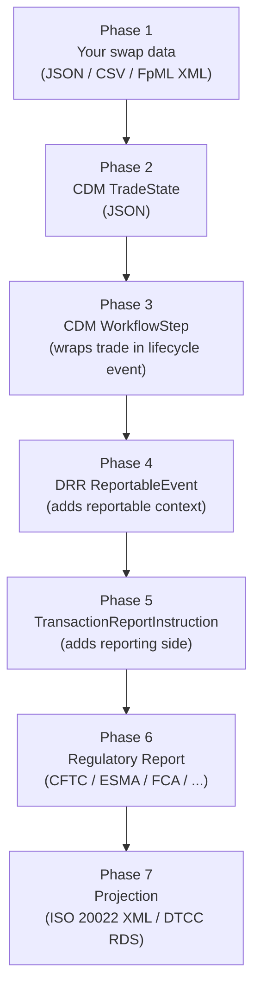

# Implementation Phases — From Swap Data to Regulatory Report

End-to-end plan for taking your swap trade data (with your product types, action codes,
event types, trade IDs and versions) and producing a DRR regulatory report.

Prerequisites: [`swap-cdm-mapping.md`](swap-cdm-mapping.md) for type mappings,
[`trading-terminology.md`](trading-terminology.md) for glossary.

---

## Overview



---

## Phase 1 — Define your input data model

**Goal:** Formalise what you have today as a structured schema.

**What to do:**

1. Define a schema for your swap data with the fields you described:

   | Field | Type | Example values |
   |---|---|---|
   | product type | string | `vanilla_swap`, `ois`, `fra`, `swaption`, `fx_swap`, ... |
   | action type | string (4-char) | `NEWT`, `MODI`, `CORR`, `EROR`, `TERM`, `REVI` |
   | event type | string (4-char) | `TRAD`, `NOVA`, `ETRM`, `ALOC`, `COMP` |
   | trade ID | alphanumeric | `TRD20260818ABC` |
   | trade version | integer >= 1 | `1`, `2`, `3` |
   | + economic terms | varies | notional, rate, dates, currency, counterparties, ... |

2. Create sample data files — one per swap type, covering the main product/action/event
   combinations. Start with the products you trade most.

3. Identify gaps: which fields does DRR need that your data doesn't carry? Common gaps:
   LEI (counterparty identifiers), UTI (if you only have internal IDs), execution venue,
   confirmation method, master agreement type/vintage.

**Output:** Sample files in a `data/input/` directory (JSON — one file per trade for
development, CSV — one row per trade for bulk processing, or FpML XML — standard
confirmations or proprietary dialects), plus a field mapping spreadsheet showing
source field → CDM target field. All formats produce the same `SwapTrade` POJO;
all downstream phases are format-agnostic.

**CSV format notes:** Nested objects are flattened into separate columns (`party1Lei`,
`party1Name` instead of a nested `party1` object). List fields use pipe delimiters
(`USNY|GBLO`). The `CsvSwapTradeReader` streams one row at a time, so memory usage
stays constant regardless of file size.

**FpML format notes:** `FpmlSwapTradeReader` parses FpML 5.x confirmation XML using
DOM, extracting trade economics from `<swap>`, `<swaption>`, `<fra>`, `<capFloor>`,
and `<fxSwap>` elements. Party LEIs come from `<partyId>` with the `iso17442` scheme.
For proprietary FpML dialects (e.g. CitiML), an XSLT preprocessor normalises the
XML to standard FpML before parsing — see `config/citiml-to-fpml.xslt` for an
example. New dialects require only a new XSLT stylesheet at
`config/{name}-to-fpml.xslt`; no Java changes needed.

---

## Phase 2 — Build the CDM TradeState

**Goal:** Transform each swap record into a valid CDM `TradeState` JSON.

**What to do:**

1. **Set up the project.** Create a Java project that depends on the CDM and DRR
   published artefacts (the way `drr-5-demo-trade-java` does):

   ```xml
   <dependency>
     <groupId>org.finos.cdm</groupId>
     <artifactId>cdm-java</artifactId>
     <version>5.19.0</version>  <!-- pulled transitively by DRR 5.20.1 -->
   </dependency>
   <dependency>
     <groupId>com.regnosys</groupId>
     <artifactId>drr</artifactId>
     <version>5.20.1</version>  <!-- or latest compatible -->
   </dependency>
   ```

   **Critical:** use CDM **5.x**, not 8.x. Note the published DRR 5.20.1 artifact
   resolves CDM **5.19.0**, even though the `drr` source checkout (master) declares
   `<finos.cdm.version>5.29.0</finos.cdm.version>`. Let DRR pull CDM transitively
   rather than pinning it yourself — see
   [`CDM-DRR-integration-notes.md`](CDM-DRR-integration-notes.md).

2. **Write a mapper** from your internal format to CDM builder objects. The mapping
   table in [`swap-cdm-mapping.md`](swap-cdm-mapping.md) tells you which CDM types
   correspond to each of your product types. For example, a vanilla swap:

   ```java
   TradeState.builder()
     .setTrade(Trade.builder()
       .setTradableProduct(TradableProduct.builder()
         .setProduct(ContractualProduct.builder()  // CDM 5 still has this
           .setEconomicTerms(EconomicTerms.builder()
             .addPayout(InterestRatePayout.builder()  // fixed leg
               .setPayerReceiver(...)
               .setRateSpecification(FixedRateSpecification.builder()...)
               .setDayCountFraction(...)
               .setCalculationPeriodDates(...))
             .addPayout(InterestRatePayout.builder()  // float leg
               ...)))
       .addTradeLot(TradeLot.builder()
         .addPriceQuantity(...)))
     .addTradeIdentifier(TradeIdentifier.builder()
       .setIdentifierType(TradeIdentifierTypeEnum.UNIQUE_TRANSACTION_IDENTIFIER)
       .addAssignedIdentifier(AssignedIdentifier.builder()
         .setIdentifierValue("TRD20260818ABC")
         .setVersion(1)))
     .setTradeDate(...))
   ```

3. **Validate.** Run CDM validation on the built object — 666 conditions will check
   structural correctness:

   ```java
   RosettaTypeValidator validator = injector.getInstance(RosettaTypeValidator.class);
   ValidationReport report = validator.runProcessStep(TradeState.class, tradeState);
   ```

4. **Qualify.** Run product qualification to confirm CDM classifies your trade the way
   you expect:

   ```java
   // After post-processing, check:
   tradeState.getTrade().getTradableProduct().getProduct()
     .getMeta().getQualifiedType()
   // → "InterestRate_IRSwap_FixedFloat"
   ```

**Output:** Java mapper classes, one per product family. Each takes your internal record
and produces a validated, qualified `TradeState`. Serialisable to JSON via
`RosettaObjectMapper`.

**Reference:** `drr-5-demo-trade-java` and `cdm-5-demo-trade-java` in the workspace
are working examples of exactly this.

---

## Phase 3 — Wrap in a WorkflowStep

**Goal:** Place the `TradeState` inside a CDM `WorkflowStep` that captures the
lifecycle context — *what happened* (event) and *what is being done about it* (action).

**What to do:**

1. **Map your action type** to CDM `ActionEnum`:

   | Your code | CDM |
   |---|---|
   | NEWT | `ActionEnum.NEW` |
   | MODI, CORR, REVI | `ActionEnum.CORRECT` |
   | EROR | `ActionEnum.CANCEL` |
   | TERM | `ActionEnum.NEW` (it is a new lifecycle event) |

2. **Map your event type** to CDM `EventIntentEnum` and compose the right primitive
   instructions:

   | Your code | CDM intent | Primitive instructions |
   |---|---|---|
   | TRAD | `ContractFormation` | `ContractFormationInstruction` |
   | NOVA | `Novation` | `SplitInstruction` (party change + quantity zeroing) |
   | ETRM | `EarlyTerminationProvision` | `QuantityChangeInstruction` (to zero) |
   | ALOC | `Allocation` | `SplitInstruction` |
   | COMP | `Compression` | `QuantityChangeInstruction` (multiple trades) |

3. **Build the WorkflowStep** using CDM's `Create_AcceptedWorkflowStepFromInstruction`
   function:

   ```java
   WorkflowStep proposedStep = WorkflowStep.builder()
     .setProposedEvent(EventInstruction.builder()
       .addInstruction(Instruction.builder()
         .setBeforeValue(tradeState)          // from Phase 2
         .setPrimitiveInstruction(PrimitiveInstruction.builder()
           .setContractFormation(ContractFormationInstruction.builder()
             .addLegalAgreement(...))))
       .setIntent(EventIntentEnum.CONTRACT_FORMATION)
       .setEventDate(Date.of(2026, 8, 18)))
     .addTimestamp(EventTimestamp.builder()
       .setDateTime(ZonedDateTime.now())
       .setQualification(EventTimestampQualificationEnum.EVENT_CREATION_DATE_TIME))
     .addEventIdentifier(Identifier.builder()
       .addAssignedIdentifier(AssignedIdentifier.builder()
         .setIdentifierValue("TRD20260818ABC")
         .setVersion(1)))
     .setAction(ActionEnum.NEW)
     .build();

   // Execute the function to get the accepted WorkflowStep with BusinessEvent
   WorkflowStep acceptedStep = postProcess(
     createWorkflowStep.evaluate(proposedStep));
   ```

4. **Set the trade version** on the event identifier:
   - Version 1 + `ActionEnum.NEW` = original trade
   - Version 2+ + `ActionEnum.CORRECT` = amendment/correction

**Output:** A `WorkflowStep` containing a `BusinessEvent` with populated `after`
`TradeState`(s).

---

## Phase 4 — Create the DRR ReportableEvent

**Goal:** Convert the CDM `WorkflowStep` into a DRR `ReportableEvent` — the input
format that DRR's reporting functions expect.

**What to do:**

1. **Use DRR's `Create_ReportableEvents` function:**

   ```java
   Create_ReportableEvents createReportableEvents =
     injector.getInstance(Create_ReportableEvents.class);

   List<? extends ReportableEvent> reportableEvents =
     createReportableEvents.evaluate(workflowStep);
   ```

   For a simple new trade (TRAD/NEWT), this produces one `ReportableEvent`.
   For a novation (NOVA), it produces two — one for the old trade (terminated) and
   one for the new trade (stepped-in party).

2. **Add `ReportableInformation`** — metadata that DRR needs but CDM doesn't carry:

   ```java
   ReportableInformation info = ReportableInformation.builder()
     .setConfirmationMethod(ConfirmationMethodEnum.ELECTRONIC)
     .setExecutionVenueType(ExecutionVenueTypeEnum.OFF_FACILITY)
     .setLargeSizeTrade(false)
     .addPartyInformation(PartyInformation.builder()
       .setPartyReferenceValue(reportingParty)
       .addRegimeInformation(ReportingRegime.builder()
         .setSupervisoryBodyValue(SupervisoryBodyEnum.ESMA)  // or CFTC, FCA, etc.
         .setReportingRole(ReportingRoleEnum.REPORTING_PARTY)
         .setMandatorilyClearable(MandatorilyClearableEnum.NOT_MANDATORY)))
     .build();

   ReportableEvent enrichedEvent = reportableEvent.toBuilder()
     .setReportableInformation(info)
     .build();
   ```

   This is where you specify:
   - Which **regulatory authority** the report is for (CFTC, ESMA, FCA, ...)
   - Which **party is reporting** and which is the counterparty
   - Whether the trade is **mandatorily clearable**
   - **Confirmation method** and **execution venue type**

**Output:** `ReportableEvent` objects ready for report generation.

---

## Phase 5 — Create the TransactionReportInstruction

**Goal:** Wrap the `ReportableEvent` with reporting-side information to produce the
input for the report function.

**What to do:**

```java
ReportingSide reportingSide = ReportingSide.builder()
  .setReportingParty(getCounterpartyRef(reportableEvent, CounterpartyRoleEnum.PARTY_1))
  .setReportingCounterparty(getCounterpartyRef(reportableEvent, CounterpartyRoleEnum.PARTY_2))
  .build();

Create_TransactionReportInstruction createInstruction =
  injector.getInstance(Create_TransactionReportInstruction.class);

TransactionReportInstruction reportInstruction =
  createInstruction.evaluate(reportableEvent, reportingSide);
```

**Output:** `TransactionReportInstruction` — the direct input to any regime-specific
report function.

---

## Phase 6 — Generate the regulatory report

**Goal:** Run the DRR report function for the target regime.

**What to do:**

Choose the report function for your target regime:

| Regime | Report function | Output type |
|---|---|---|
| CFTC Part 45 | `CFTCPart45ReportFunction` | `CFTCPart45TransactionReport` |
| CFTC Part 43 | `CFTCPart43ReportFunction` | `CFTCPart43TransactionReport` |
| ESMA EMIR REFIT | `ESMAEMIRTradeReportFunction` | `ESMAEMIRTransactionReport` |
| FCA UK EMIR | `FCAUKEMIRTradeReportFunction` | `FCAUKEMIRTransactionReport` |
| HKMA | `HKMATradeReportFunction` | `HKMATransactionReport` |
| JFSA | `JFSATradeReportFunction` | `JFSATransactionReport` |
| MAS | `MASTradeReportFunction` | `MASTransactionReport` |
| ASIC | `ASICTradeReportFunction` | `ASICTransactionReport` |
| CSA | `CSATradeReportFunction` | `CSATransactionReport` |

Example for ESMA EMIR:

```java
ESMAEMIRTradeReportFunction reportFunc =
  injector.getInstance(ESMAEMIRTradeReportFunction.class);

ESMAEMIRTransactionReport report =
  reportFunc.evaluate(reportInstruction);

// Serialise to JSON
String json = RosettaObjectMapper.getNewRosettaObjectMapper()
  .writerWithDefaultPrettyPrinter()
  .writeValueAsString(report);
```

**Validate** the report:

```java
ValidationReport validation = reportValidator.validate(
  ESMAEMIRTransactionReport.class, report);
// Check validation.getValidationResults() for failures
```

**Output:** A regime-specific report object with all regulatory fields populated by
DRR's 2,000+ reporting rules.

---

## Phase 7 — Project to submission format

**Goal:** Convert the report object into the format the trade repository accepts —
ISO 20022 XML or DTCC RDS harmonised.

**What to do:**

> **Verified against DRR 5.20.1:** the published artifact contains
> `Project_*ToIso20022` functions for **ESMA, FCA, ASIC, JFSA and MAS only**.
> There is no CFTC projection function and no DTCC RDS Harmonized projection in
> that release, so CFTC Part 43/45 stop at the Phase 6 report. The table below
> describes DRR's projection design generally; check which functions your
> pinned version actually ships before wiring one up.

DRR has projection pipelines for each regime:

| Regime | Projection target | Pipeline config |
|---|---|---|
| ESMA EMIR | ISO 20022 XML | `projection/pipeline-projection-esma-emir-trade-iso20022.json` |
| FCA UK EMIR | ISO 20022 XML | `projection/pipeline-projection-fca-ukemir-trade-iso20022.json` |
| CFTC | DTCC RDS harmonised | `projection/pipeline-projection-cftc-part45-dtcc-rds.json` |
| HKMA | ISO 20022 XML (DTCC + TR variants) | multiple configs |
| JFSA, MAS, ASIC | ISO 20022 XML | respective configs |

```java
// Example: project ESMA report to ISO 20022
ESMAEMIRProjectionFunction projectionFunc =
  injector.getInstance(ESMAEMIRProjectionFunction.class);

// Output is ISO 20022 XML structure
Object iso20022Output = projectionFunc.evaluate(report);
```

**Output:** XML or structured data ready for submission to the trade repository
(DTCC, CME, ICE, etc.).

---

## Phase summary

| Phase | Input | Output | Key class/function |
|---|---|---|---|
| 1. Define input | — | Your data schema + samples (JSON, CSV, or FpML) | `SwapTradeReader` / `CsvSwapTradeReader` / `FpmlSwapTradeReader` |
| 2. Build TradeState | Your swap record | CDM `TradeState` (validated, qualified) | CDM builder API + `RosettaTypeValidator` |
| 3. Wrap in WorkflowStep | `TradeState` + action + event | CDM `WorkflowStep` with `BusinessEvent` | `Create_AcceptedWorkflowStepFromInstruction` |
| 4. Create ReportableEvent | `WorkflowStep` | DRR `ReportableEvent` + `ReportableInformation` | `Create_ReportableEvents` |
| 5. Create report instruction | `ReportableEvent` + reporting side | `TransactionReportInstruction` | `Create_TransactionReportInstruction` |
| 6. Generate report | `TransactionReportInstruction` | Regime-specific report (e.g. `ESMAEMIRTransactionReport`) | `ESMAEMIRTradeReportFunction` (etc.) |
| 7. Project to XML | Report object | ISO 20022 XML / DTCC RDS | Regime-specific projection function |

---

## What to start with

1. **Pick one swap type** — vanilla swap is the simplest and has the most existing
   samples to compare against.
2. **Pick one regime** — CFTC Part 45 has the most complete DRR examples
   (`CFTCPart45ExampleReport.java`, `CreateReportableEventAndRunReportExample.java`).
3. **Get a single trade through all 7 phases** end-to-end before expanding to other
   product types or regimes.
4. **Compare your output** against DRR's existing expected outputs in
   `drr/rosetta-source/src/main/resources/regulatory-reporting/output/` to verify
   correctness.

The DRR demo project `drr-5-demo-trade-java` is the closest starting point — it
already has the Maven setup, dependency versions, and Guice wiring done.
