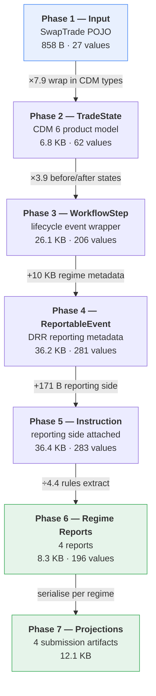
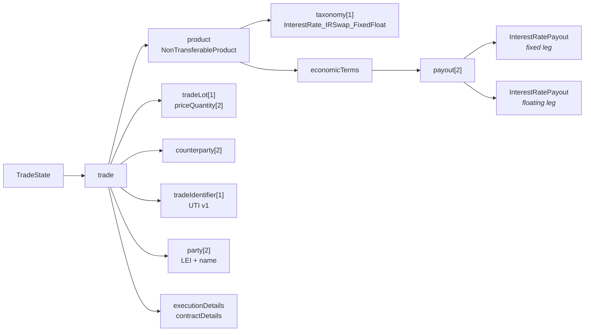
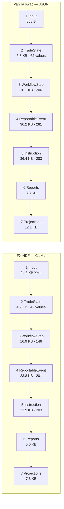
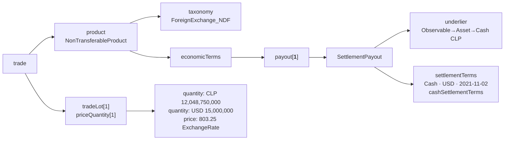

# Pipeline Walkthrough — Two Trades Through Seven Phases

A phase-by-phase trace of a single trade, showing what each phase receives, what
it emits, and what it actually contributes. Every figure here was measured from a
real run, not estimated.

Two trades are traced: a vanilla interest-rate swap from JSON, then a real
CitiML FX non-deliverable forward, to show the same phases handling a different
asset class and input format.

**Companion docs:** [`build-and-run-guide.md`](build-and-run-guide.md) for how to
build and run; [`implementation-phases.md`](implementation-phases.md) for the
design rationale behind each phase.

---

## The trade

`data/input/vanilla-swap-new.json` — a plain fixed/float interest rate swap,
chosen because it exercises both legs without triggering any product-specific
special casing.

| Attribute | Value |
|---|---|
| Trade ID / version | `TRD20260818A01` v1 |
| Action / event | `NEWT` / `TRAD` — new trade, contract formation |
| Product | `vanilla_swap` |
| Notional | 50,000,000 USD |
| Term | 2026-08-20 → 2031-08-20 (5Y), traded 2026-08-18 |
| Fixed leg | 3.25%, 30/360, pays 6M |
| Floating leg | USD-SOFR 3M, ACT/360, resets 3M |
| Parties | Alpha Bank ↔ Beta Capital |
| Reporting | XXXX venue, electronic confirm, ISDA Master, uncleared |

Reproduce with:

```bash
mvn -q -f isda-cdm-trade-mapper/pom.xml exec:java -Dexec.mainClass=org.isda.mapper.MapperMain
```

---

## Flow



The shape worth noticing: the payload **grows for five phases, then collapses**.
Phases 2–5 are structural — they wrap your data in the containers CDM and DRR
require, adding no regulatory meaning. Phase 6 is where DRR's rules run and
discard everything the regulator did not ask for.

---

## Phase summary

| # | Phase | In | Out | Size | Δ | Contributes |
|---|---|---|---|---|---|---|
| 1 | Input | JSON/CSV/FpML/CitiML | `SwapTrade` POJO | 858 B | — | parse only |
| 2 | TradeState | `SwapTrade` | CDM `TradeState` | 6.8 KB | ×7.9 | CDM product model |
| 3 | WorkflowStep | + `TradeState` | CDM `WorkflowStep` | 26.1 KB | ×3.9 | lifecycle action/intent |
| 4 | ReportableEvent | + `WorkflowStep` | DRR `ReportableEvent` | 36.2 KB | ×1.4 | regime + party roles |
| 5 | Instruction | `ReportableEvent` | `TransactionReportInstruction` | 36.4 KB | +171 B | reporting side |
| 6 | Reports | Instruction | 4 regime reports | 8.3 KB | ÷4.4 | **regulatory rules** |
| 7 | Projections | 4 reports | 4 submission files | 12.1 KB | ×1.5 | wire format |

Artifacts by phase:

| Phase | Path |
|---|---|
| 2 | `data/output/tradestate/{name}_TradeState.json` |
| 3 | `data/output/workflowstep/{name}_WorkflowStep.json` |
| 4 | `data/output/reportableevent/{name}_ReportableEvent.json` |
| 5 | `data/output/instruction/{name}_TransactionReportInstruction.json` |
| 6 | `data/output/reports/{name}_{regime}_Report.json` |
| 7 | `data/output/projections/{name}_{regime}_Projection.{xml,json}` |

---

## Phase 1 — Input Data Model

**In:** a file · **Out:** `SwapTrade` POJO in memory · **Class:** `SwapTradeReader`

Deserialises your internal format into a plain Java object. No CDM, no DRR —
nothing regulatory has happened yet.

Four input modes converge on the same POJO, which is what keeps every later phase
format-agnostic:

| Mode | Reader | Notes |
|---|---|---|
| `--json` | `SwapTradeReader` | one file per trade |
| `--csv` | `CsvSwapTradeReader` | streams row by row, constant memory |
| `--fpml` | `FpmlSwapTradeReader` | standard FpML 5.x |
| `--citiml` | `CitimlTradeReader` | Citi envelope + FpML recordkeeping payload |

**Synthesis.** The cheapest phase and the one that buys the most: because
`SwapTrade` is a POJO rather than a CDM builder, adding an input format costs one
reader and zero changes to phases 2–7. Four of the 27 input values
(`executionVenue`, `confirmationMethod`, `masterAgreementType`, `clearingStatus`)
carry no CDM meaning at all and sit dormant until Phase 4 — they exist purely
because DRR needs them and neither FpML nor CDM carries them.

---

## Phase 2 — CDM TradeState

**In:** `SwapTrade` · **Out:** 6,756 B / 259 lines / 62 values
**Classes:** `TradeStateMapper` → `VanillaSwapMapper` → `CdmBuilderUtil`

27 input values become 62 CDM values across 6.8 KB. The expansion *is* the phase:
every scalar gets wrapped in the type structure CDM requires.



| | Fixed leg `payout[0]` | Floating leg `payout[1]` |
|---|---|---|
| payer → receiver | Party1 → Party2 | Party2 → Party1 |
| notional | 50,000,000 USD | 50,000,000 USD |
| rate | `FixedRateSpecification` 0.0325 | `FloatingRateSpecification` → USD-SOFR, 3M |
| day count | 30/360 | ACT/360 |
| frequency | 6M | 3M, resets at period start |

**Synthesis.** Pure translation — no value is added, dropped, or invented; the
trade is simply restated in CDM's vocabulary. Three CDM 6 traits are visible in
the output and differ from CDM 5: `product` is a `NonTransferableProduct` sitting
directly on `trade` (no `tradableProduct` wrapper), `payout` is a list of two
entries each holding one payout, and the floating rate nests one level deeper via
`rateOption.value.FloatingRateIndex`. Capitalised JSON keys such as
`InterestRatePayout` are Rosetta's marker for a chosen variant of a type choice.

**Caveat.** `businessDayConvention` and `businessCenters` are read from the input
but never attached as a `BusinessDayAdjustments` node. Dates are written as
`adjustedDate`, asserting they are already rolled. Harmless for reporting, but CDM
cannot recompute a roll from this object.

---

## Phase 3 — WorkflowStep

**In:** `SwapTrade` + `TradeState` · **Out:** 26,142 B / 841 lines / 206 values
**Class:** `WorkflowStepMapper`

Wraps the static trade in a lifecycle event. The trade now appears **three times**
— as `before`, as `after`, and inside the execution instruction — which accounts
for most of the 4× growth.

Two mappings drive the whole phase:

| Input | CDM | Field |
|---|---|---|
| `actionType: NEWT` | `ActionEnum.NEW` | `action` |
| `eventType: TRAD` | `EventIntentEnum.CONTRACT_FORMATION` | `businessEvent.intent` |

The event type also selects the `PrimitiveInstruction`:

| Event | Primitive instruction |
|---|---|
| TRAD | `ContractFormationInstruction` + `ExecutionInstruction` |
| NOVA | `SplitInstruction` — party change + quantity zeroing |
| ETRM | `QuantityChangeInstruction` — REPLACE to zero |
| ALOC | `SplitInstruction` |
| COMP | `QuantityChangeInstruction` |

**Synthesis.** This is what turns a trade into an *event*. The before/after pair
looks redundant for a new trade — the two states are near-identical — but it is
the mechanism that lets an amendment or termination express what changed. The
redundancy is the model working as designed, not waste. Two identifiers now
coexist: `tradeIdentifier` (the UTI, identifying the trade) and `eventIdentifier`
(identifying this event); they diverge on a v2 amendment, which is how DRR
distinguishes a correction from a new trade.

**Caveats — two values are invented here, not derived from input.**

| Value | Set to | Why it matters |
|---|---|---|
| Event timestamp | trade date at **08:00 UTC** | input carries no execution time; CFTC Part 43 deadlines are measured from it |
| ISDA Master vintage | **2002** | wrong for 1992 or 2002-with-2018-IBOR-supplement agreements |

---

## Phase 4 — DRR ReportableEvent

**In:** `SwapTrade` + `WorkflowStep` + `TradeState` · **Out:** 36,188 B / 1,142 lines / 281 values
**Class:** `ReportableEventMapper`

The first phase using DRR types. Only three top-level keys — two are carried
forward verbatim, and the third is the entire contribution:

| Key | Content |
|---|---|
| `originatingWorkflowStep` | Phase 3 output, unchanged |
| `reportableTrade` | Phase 2 output, unchanged |
| `reportableInformation` | **new** — roughly 40 lines |

The four dormant Phase 1 fields finally activate:

| Phase 1 input | Becomes |
|---|---|
| `confirmationMethod: ELECTRONIC` | `confirmationMethod: "Electronic"` |
| `executionVenue: XXXX` | `reportableExecutionVenue.executionVenueType: "OffFacility"` |
| `clearingStatus: UNCLEARED` | `mandatorilyClearable: "ProductNotMandatory"` |
| `masterAgreementType` | *(already consumed in Phase 3)* |

**Synthesis.** Supplies what CDM structurally cannot: who reports, to whom, under
which regime. Party roles are deliberately asymmetric — Party1 is
`ReportingParty`, Party2 is `Counterparty` — so the same trade data reported from
the other side produces a different report.

This is the **DRR 7 shape, inverted from DRR 5**: jurisdiction is now top level
with parties nested inside it, rather than parties each carrying a list of
regimes. The new arrangement is the better one, since execution venue and
large-size are per-jurisdiction facts.

**Caveats.**

| Item | Current behaviour |
|---|---|
| Jurisdictions | only CFTC / DoddFrankAct is declared; `ReportableEventMapper` hardcodes it |
| `largeSizeTrade` | hardcoded `false`; should be computed against CFTC block thresholds |

Phase 6 still emits ESMA and FCA reports from this CFTC-only instruction, because
the report functions read trade economics regardless of declared supervision.

---

## Phase 5 — TransactionReportInstruction

**In:** `ReportableEvent` · **Out:** 36,359 B / 1,150 lines / 283 values
**Class:** `ReportInstructionMapper`

**+171 bytes, 8 lines** — the smallest delta in the pipeline. One key is added:

```
reportingSide.reportingParty        → Party1
reportingSide.reportingCounterparty → Party2
```

The three carried-forward branches are byte-identical to Phase 4 after key
sorting.

This is the first phase that *executes* DRR rather than assembling objects:

| DRR function | Role |
|---|---|
| `ExtractTradeCounterparty` | resolves PARTY_1 / PARTY_2 out of the event |
| `Create_TransactionReportInstruction` | `(event, reportingSide)` → instruction |

**Synthesis.** Structurally trivial, semantically necessary: it fixes the report
to one side. `reportingRole` in Phase 4 says the same thing per jurisdiction;
`reportingSide` states it once for the instruction as a whole. Reporting both
sides of a trade means building two instructions.

**Caveat — this phase does less than its name suggests.** It is often described
as enriching the instruction with regulatory static data (UPI, UTI lookup, LEI
validation). On this trade none of that is observable: no UPI appears, no LEI is
validated, nothing is rewritten. UPI request assembly actually happens inside the
Phase 6 report functions. Nothing here validates that `549300EXAMPLE0LEI001` is a
real LEI — it is structurally valid and passes straight through.

---

## Phase 6 — Regime Reports

**In:** instruction (36.4 KB) · **Out:** 4 reports, 8,323 B / 196 values
**Class:** `ReportGenerator`

| Report | Size | Values |
|---|---|---|
| CFTC Part 45 | 2,895 B | 66 |
| CFTC Part 43 | 2,304 B | 52 |
| ESMA EMIR | 1,562 B | 39 |
| FCA UK EMIR | 1,562 B | 39 |

**The pipeline reverses direction here.** This is where the regulatory logic
lives; everything before was structural.

| Input | Derived | Rule |
|---|---|---|
| `30/360` | `A001` | ISO 20022 day-count code |
| `ACT/360` | `A004` | ISO 20022 day-count code |
| `6M` | `MNTH` × 6 | period decomposition |
| `USD-SOFR` | `SOFR`, `INTR` | index → ESMA indicator + asset class |
| `UNCLEARED` | `cleared: "N"` | clearing flag |
| fixed + floating | `SWAP`, `Fixed_Float` | product qualification |
| `ISDAMaster` | `ISDA` | agreement code |

**The regimes genuinely differ** — this is not one report emitted four times:

| | CFTC | ESMA |
|---|---|---|
| Fixed rate | `0.0325` (decimal) | `3.25` (percent) |
| Unique fields | `payerIdentifierFormat`, `preUpiData`, `dtccAdditionalFields` | `confirmed`, `level`, `direction2`, `assetClass`, `uniqueTransactionIdentifierProprietary` |

The ×100 difference in fixed rate is required by the respective rulebooks;
getting it backwards is a classic misreporting error.

Part 43 is a strict subset of Part 45 here — 8 fields fewer, none unique — which
matches their purposes: 43 is public price transparency, 45 is full regulatory
detail. ESMA and FCA are identical in size because UK EMIR is a near-copy of EU
EMIR post-Brexit.

**Synthesis.** DRR's rule engine earns its place in this one phase. The
`preUpiData` block in Part 45 is a fully assembled ANNA-DSB UPI *request*
(`InstrumentType: Swap`, `UseCase: Fixed_Float`, `UnderlierID: USD-SOFR`) — note
it is a request payload, not a resolved UPI; obtaining the identifier still
requires calling DSB.

**Caveat.** `eventTimestamp: 2026-08-18T08:00:00Z` — the synthetic timestamp from
Phase 3 has now reached a regulatory field.

---

## Phase 7 — Projection to Submission Format

**In:** 4 reports · **Out:** 4 submission artifacts, 12,133 B
**Class:** `ProjectionMapper`

| Regime | Format | Size |
|---|---|---|
| ESMA EMIR | ISO 20022 Auth.030 XML | 3,988 B |
| FCA UK EMIR | ISO 20022 Auth.030 XML | 3,988 B |
| CFTC Part 45 | DTCC RDS Harmonized JSON | 2,282 B |
| CFTC Part 43 | DTCC RDS Harmonized JSON | 1,875 B |

These are the files you would actually transmit to a trade repository.

- **ESMA/FCA** — namespace `urn:iso:std:iso:20022:tech:xsd:auth.030.001.03`, with
  ISO 20022 tag abbreviations (`CtrctTp`, `NtnlAmt`, `FctvDt`, `PmtFrqcy`).
  Serialised through `RosettaObjectMapperCreator.forXML()` with the regime's
  `Auth030{Esma|Fca}ModelConfig`.
- **CFTC** — `submission.header` / `core` / `harmonizedData`, `version: CORE1.0`,
  with `cde`-prefixed fields (CPMI-IOSCO Critical Data Elements).

**Synthesis.** Serialisation only — no new regulatory decisions. Both CFTC files
exist solely because of the DRR 7 upgrade: `Project_Cftc*ToDtccRdsHarmonized` did
not exist in DRR 5.20.1, where this phase produced two artifacts instead of four.

---

## A second trade: CitiML FX NDF

The seven phases are product- and format-agnostic, which is easiest to see by
running something structurally unlike a swap through the same pipeline. This
section traces `data/input/citiml/citi-fx-ndf.xml` — a **real CitiML
document**, transcribed from a production trade notification — carrying a
USD/CLP non-deliverable forward.

An NDF is an FX derivative: the two currency amounts are agreed up front, but
the reference currency is never delivered. At maturity the trade settles as a
single net payment in the settlement currency, sized by an observed fixing rate.

| Attribute | Value |
|---|---|
| Trade ID / version | `100021193EC` v1, traded 2021-09-29 |
| Product | FX non-deliverable forward (`fx_ndf`) |
| Leg 1 | PartyB pays **USD 15,000,000** → PartyA |
| Leg 2 | PartyA pays **CLP 12,048,750,000** → PartyB |
| Rate | 803.25 forward, 801 spot, `Currency2PerCurrency1` |
| Value date | 2021-11-02, NYBANK + SANTIAGO_BANK |
| Settlement | settles **USD**, references **CLP**, fixing T-2 business days, `CLP_USD_FIXT2` |
| Execution | Voice, OffFacility, uncleared, uncollateralized, ISDA 2006 |

```bash
mvn -q -f isda-cdm-trade-mapper/pom.xml exec:java \
    -Dexec.mainClass=org.isda.mapper.MapperMain \
    -Dexec.args="--citiml data/input/citiml/"
```

### Phase sizes, side by side



The NDF is consistently *smaller* in CDM despite a far larger input, because a
swap carries two full interest-rate payouts with schedules, day counts and reset
dates, while an NDF is one settlement payout and a rate. The 24.8 KB input is
CitiML envelope overhead — internal booking references, risk figures, audit
trail — most of which is not reportable and never reaches CDM.

### Phase 1 — Input

`CitimlTradeReader` rather than `FpmlSwapTradeReader`. CitiML wraps an FpML
**recordkeeping** payload (not the confirmation view) inside a
`citiml:citimlTradeNotification` envelope spanning 15 proprietary namespaces.

The envelope is read natively because it carries what FpML cannot express:

| CitiML element | → | Why it matters |
|---|---|---|
| `citiml:citimlAction` = New | `actionType NEWT` | plain FpML has to hardcode this |
| `citiml:citimlEventType` = NewTradeEvent | `eventType TRAD` | same |
| `fpml:versionedTradeId/version` = 1 | `tradeVersion 1` | distinguishes amendment from new trade |
| `citiml:citimlClearingStatus` = UNCLEARED | `clearingStatus` | |
| `citimlfx:citimlSettlementProvision` | settlement + reference currency, fixing, rate option | the NDF terms |

### Phase 2 — CDM TradeState

Product type resolves to `fx_ndf` from `productTypeScheme="FX.Taxonomy2"`, routing
to `FxNdfMapper` instead of `VanillaSwapMapper`. The resulting shape is dictated
by CDM's own qualification rule:



Three constraints come straight from `Qualify_ForeignExchange_NDF` in
`product-qualification-func.rosetta`: **exactly one** payout, and it must be a
`SettlementPayout`; it must carry `cashSettlementTerms`; and the underlier must
resolve to `Observable → Asset → Cash`, which is what
`Qualify_AssetClass_ForeignExchange` keys on.

Contrast with the swap, which puts **two** `InterestRatePayout` entries in the
payout list. Note also that CDM 6 has no `forwardPayout` — CDM 5 modelled the
same trade as `forwardPayout` with `underlier.foreignExchange`.

Qualification verified by invoking CDM's own functions against the built object:

| Function | NDF | IRS |
|---|---|---|
| `Qualify_AssetClass_ForeignExchange` | **true** | — |
| `Qualify_ForeignExchange_NDF` | **true** | false |
| `Qualify_InterestRate_IRSwap_FixedFloat` | — | true |

### Phase 3 — WorkflowStep

Identical mechanics to the swap — `action New`, `intent ContractFormation`,
before/after states, `ExecutionInstruction` — but the values come from the Citi
envelope rather than being defaulted. Event date 2021-09-29, event identifier
`100021193EC` v1.

### Phase 4 — ReportableEvent

Same DRR 7 jurisdiction shape as the swap. The inputs differ in origin: venue and
clearing status are read from the document rather than supplied as configuration.

| Field | Value | Source |
|---|---|---|
| `confirmationMethod` | NonElectronic | `fpml:verificationMethod` = Unverified |
| `executionVenueType` | OffFacility | `fpml:executionVenueType` |
| `regimeName` / `supervisoryBody` | DoddFrankAct / CFTC | hardcoded, as for all trades |
| `mandatorilyClearable` | ProductNotMandatory | `citiml:citimlClearingStatus` |

### Phase 5 — TransactionReportInstruction

Adds `reportingSide` only — **+171 bytes**, exactly as for the swap. Party roles
come from the FpML `relatedParty` blocks: PartyA is `ReportingParty`, PartyB is
`Counterparty`.

### Phase 6 — Regime Reports

Where the product difference becomes visible. The same four report functions run,
and DRR's rules classify the trade entirely differently:

| Field | FX NDF | Vanilla swap |
|---|---|---|
| `contractType` | **FORW** | SWAP |
| `assetClass` | **CURR** | INTR |
| `deliveryType` | **CASH** | PHYS |
| Rate field | `forwardExchangeRate` 803.25 | `fixedRate` 3.25 |
| `exchangeRateBasis` | **USD/CLP** | — |
| Leg detail | `settlementCurrency` USD | day counts, payment/reset frequencies |
| `venueOfExecution` | XXXX | XXXX |
| UTI | `100021193EC` | `TRD20260818A01` |

No mapping table in this project produces `FORW`, `CURR` or `CASH` — those come
from DRR's rules reading the CDM structure. Building the product correctly is
what makes the classification correct.

### Phase 7 — Projection

Same four submission artifacts. The ISO 20022 Auth.030 XML carries the FX shape:

| Element | Value |
|---|---|
| `CtrctTp` | FORW |
| `AsstClss` | CURR |
| `DlvryTp` | CASH |
| `FwdXchgRate` | 803.25 |
| `BaseCcy` / `QtdCcy` | USD / CLP |
| `XprtnDt` / `SttlmDt` | 2021-11-02 |
| `PltfmIdr` | XXXX |

and the DTCC RDS JSON reports `primaryAssetClass: ForeignExchange` with
`cdePlatformIdentifier: BILT` (bilateral).

### What this run demonstrates

Phases 3 through 7 required **no product-specific code**. Supporting a new asset
class meant one reader and one product mapper; the lifecycle wrapper, DRR
metadata, reporting side, rule execution and projection were untouched. That is
the payoff of the `SwapTrade` POJO seam in Phase 1 and the phase separation
throughout.

### Gaps specific to this path

| Item | Impact |
|---|---|
| Leg notional absent from reports | **High** — amounts are correct in CDM (`tradeLot`) but do not reach `leg1`/`leg2`. DRR's reference links payout to trade lot by Rosetta address references (`address` ↔ `meta.location`); this pipeline builds neither those references nor runs `WorkflowPostProcessor` to resolve them |
| No LEIs | **High** — CitiML identifies parties by internal codes (`FCLCCY`, `EDLDNEM`), so reports carry those where a regulator expects an LEI |
| Execution timestamp | Medium — CitiML carries the real `2021-09-29T19:11:45.805Z`, but Phase 3 still substitutes 08:00 UTC |

---

## Tracing one value end to end

`fixedDayCount` from input to wire:

| Phase | Representation |
|---|---|
| 1 | `"fixedDayCount": "30/360"` |
| 2 | `dayCountFraction: { value: "30/360" }` |
| 3–5 | carried unchanged |
| 6 | `fixedRateDayCountConventionLeg1: "A001"` |
| 7 ESMA | `<DayCnt><Cd>A001</Cd></DayCnt>` |
| 7 CFTC | `cdeFixedRateDayCountConventionLeg1: "A001"` |

The fixed rate keeps its per-regime units all the way to the wire:
`<Rate>3.25</Rate>` in ESMA XML versus `"leg1FixedRateInitial": 0.0325` in DTCC.

---

## Known gaps

Values that reach submission artifacts without being derived from input:

| Item | Current | Phase | Impact |
|---|---|---|---|
| Execution timestamp | hardcoded 08:00 UTC | 3 | **High** — CFTC deadlines measured from it |
| UTI in ESMA XML | absent | 7 | **High** — mandatory under EMIR; would be rejected |
| Validation | never invoked | all | **High** — `RosettaTypeValidator` and DRR report validators both available, neither called |
| `largeSizeTrade` | hardcoded `false` | 4 | Medium — drives Part 43 dissemination delay |
| Jurisdictions | CFTC only | 4 | Medium — blocks true multi-regime reporting |
| ISDA vintage | hardcoded 2002 | 3 | Low — wrong for 1992 / 2018-supplement agreements |
| `cdePlatformIdentifier` | `BILT`, defaulted | 7 | Low — correct for this trade |
| Business day adjustments | read, not attached | 2 | Low — dates already correct |
| `fx_swap` product | no mapper; fails | 2 | Known — routes to `VanillaSwapMapper`, which needs a floating index |

The LEIs in the sample (`549300EXAMPLE0LEI001`) are structurally valid but
synthetic — they will not resolve against GLEIF.
