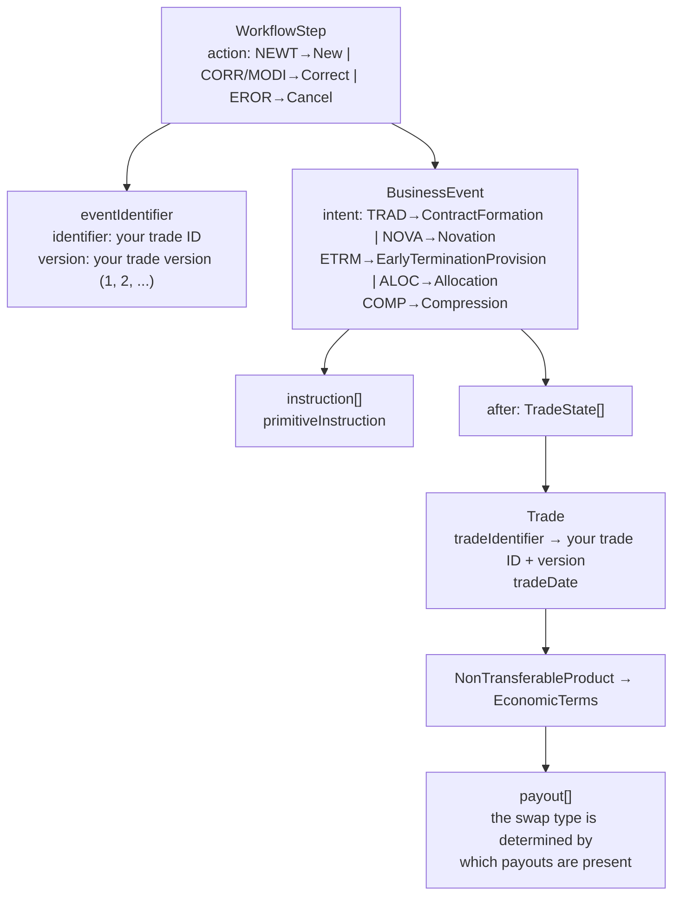

# Swap Data → CDM Mapping

How the user's swap domain concepts map onto CDM types, with concrete JSON examples.

For acronym definitions, action/event code glossaries, and regulatory body references,
see [`trading-terminology.md`](trading-terminology.md).

---

## 1. Product type mapping

CDM does not have a "swap type" enum. Instead, CDM uses **composable payouts** and
**qualification functions** that infer the product type from structure. Your swap types
map to CDM payout compositions:

| Your type | CDM payout composition | CDM qualification |
|---|---|---|
| vanilla swap | `InterestRatePayout[]` — one fixed, one float | `InterestRate_IRSwap_FixedFloat` |
| basic swap | `InterestRatePayout[]` — two float legs | `InterestRate_IRSwap_Basis` |
| ois | `InterestRatePayout[]` — fixed + OIS float index | `InterestRate_IRSwap_FixedFloat_OIS` |
| fra | `InterestRatePayout[]` — single period | `InterestRate_Fra` |
| cap floor | `InterestRatePayout` with `capRateSchedule` / `floorRateSchedule` | `InterestRate_CapFloor` |
| swaption | `OptionPayout` over `InterestRatePayout[]` | `InterestRate_Option_Swaption` |
| ois swaption | `OptionPayout` over OIS swap | `InterestRate_Option_Swaption` (OIS underlier) |
| cancelable swap | vanilla swap + `CancelableProvision` on `EconomicTerms` | `InterestRate_IRSwap_FixedFloat` + provision |
| bond option | `OptionPayout` over debt underlier | `InterestRate_Option_DebtOption` |
| inflation swap | `InterestRatePayout` with `InflationRateSpecification` (zero coupon) | `InterestRate_InflationSwap_FixedFloat_ZeroCoupon` |
| infl yoy swap | `InterestRatePayout` with `InflationRateSpecification` (year-on-year) | `InterestRate_InflationSwap_FixedFloat_YearOn_Year` |
| swap spread | `InterestRatePayout[]` — fixed + spread over index | `InterestRate_IRSwap_FixedFloat` (with spread) |
| ratelock | `InterestRatePayout[]` — forward-starting fixed/float | `InterestRate_IRSwap_FixedFloat` (forward effective date) |
| cmd rate lock | `FixedPricePayout` — commodity rate lock | `Commodity_Swap_FixedFloat` or custom |
| fee only | `SettlementPayout` — standalone fee/premium | No swap qualification — a transfer |
| rates fee only | `SettlementPayout` with rates context | No swap qualification — a transfer |
| credit fee only | `SettlementPayout` with credit context | No swap qualification — a transfer |
| fx leg | `SettlementPayout` — single FX exchange | `ForeignExchange_Spot_Forward` |
| fx swap | `SettlementPayout[]` — two FX exchanges (near + far) | `ForeignExchange_Swap` |
| fx simple option | `OptionPayout` over FX underlier | `ForeignExchange_VanillaOption` |
| fx reset | `InterestRatePayout[]` cross-currency with notional reset | `InterestRate_CrossCurrency_FixedFloat` + `NotionalReset` |
| di option | `OptionPayout` over Brazilian DI index | `InterestRate_Option_Swaption` (DI underlier) |
| idi option | `OptionPayout` over IDI index | `InterestRate_Option_Swaption` (IDI underlier) |

**Key principle:** there is no `SwapType` enum in CDM. The "type" is an emergent
property — qualification functions examine the payout structure and *infer* the
classification. A vanilla swap and an OIS are both arrays of `InterestRatePayout`;
they differ only in whether the floating rate index is an overnight rate.

---

## 2. Action type mapping

Your 4-letter action codes map to CDM `ActionEnum` on `WorkflowStep`:

| Your code | Full term | CDM `ActionEnum` | CDM semantics |
|---|---|---|---|
| NEWT | New Trade | `New` | First version of the event (version = 1) |
| MODI | Modification | `Correct` | Correction/amendment of a prior version (version > 1) |
| CORR | Correction | `Correct` | Same as MODI — CDM does not distinguish correction from modification at the action level |
| EROR | Error | `Cancel` | Cancel a prior erroneous submission (version > 1) |
| TERM | Termination | `New` | A **new** event whose `BusinessEvent` contains a termination (full unwind). The action is `New` because it is a new lifecycle event, not a correction of a prior one |
| REVI | Revision / Revival | `Correct` | Amendment to a previously reported event |

**Caveat:** MODI vs CORR and TERM vs EROR carry regulatory meaning (EMIR, CFTC)
that CDM's 3-value `ActionEnum` does not distinguish. DRR handles this in its
regulatory layer via reporting rules, not via `ActionEnum`.

---

## 3. Event type mapping

Your 4-letter event codes map to CDM `EventIntentEnum` on `BusinessEvent`:

| Your code | Full term | CDM `EventIntentEnum` | CDM primitive instructions |
|---|---|---|---|
| TRAD | Trade | `ContractFormation` | `ContractFormationInstruction` → creates initial `TradeState` |
| NOVA | Novation | `Novation` | `QuantityChangeInstruction` (decrease old) + `ContractFormationInstruction` (new counterparty) |
| ETRM | Early Termination | `EarlyTerminationProvision` | `QuantityChangeInstruction` (reduce to zero) |
| ALOC | Allocation | `Allocation` | `SplitInstruction` → splits block trade into allocated pieces |
| COMP | Compression | `Compression` | `QuantityChangeInstruction` on multiple trades, netting positions |

Additional event types CDM supports that you may encounter:

| Event | CDM `EventIntentEnum` | Primitives |
|---|---|---|
| Partial termination | `Decrease` | `QuantityChangeInstruction` (partial) |
| Increase | `Increase` | `QuantityChangeInstruction` (increase notional) |
| Amendment | `ContractTermsAmendment` | `TermsChangeInstruction` |
| Exercise (option) | `OptionExercise` | `ExerciseInstruction` |
| Clearing | `Clearing` | `ContractFormationInstruction` (with CCP) |
| Index transition | `IndexTransition` | `TermsChangeInstruction` + spread adjustment |

---

## 4. Trade identifier and version

Your trade ID (alphanumeric) and version (integer from 1) map directly to CDM's
`TradeIdentifier` → `AssignedIdentifier`:

```
TradeIdentifier (extends Identifier)
├── issuer: "YOUR_FIRM_LEI"          ← who assigned the ID
├── assignedIdentifier
│   ├── identifier: "ABC123XYZ"      ← your alphanumeric trade ID
│   └── version: 1                   ← your trade version (1, 2, 3, ...)
└── identifierType: UniqueTransactionIdentifier   ← or UniqueSwapIdentifier
```

CDM convention: `version: 1` + `ActionEnum.New` = original trade.
`version: 2` + `ActionEnum.Correct` = first amendment/correction.

---

## 5. Concrete CDM JSON examples

### 5.1 New vanilla swap (NEWT / TRAD)

```json
{
  "@type": "cdm.event.common.TradeState",
  "trade": {
    "product": {
      "taxonomy": [{ "source": "ISDA", "value": { "name": { "@data": "InterestRate:IRSwap:FixedFloat" } } }],
      "economicTerms": {
        "payout": [
          {
            "@type": "cdm.product.asset.InterestRatePayout",
            "payerReceiver": { "payer": "Party1", "receiver": "Party2" },
            "rateSpecification": {
              "@type": "cdm.product.asset.FixedRateSpecification",
              "rateSchedule": { "price": { "@ref:scoped": "price-1" } }
            },
            "dayCountFraction": { "@data": "30/360" },
            "calculationPeriodDates": {
              "effectiveDate": { "adjustableDate": { "unadjustedDate": "2026-09-01" } },
              "terminationDate": { "adjustableDate": { "unadjustedDate": "2031-09-01" } },
              "calculationPeriodFrequency": { "periodMultiplier": 6, "period": "M" }
            }
          },
          {
            "@type": "cdm.product.asset.InterestRatePayout",
            "payerReceiver": { "payer": "Party2", "receiver": "Party1" },
            "rateSpecification": {
              "@type": "cdm.product.asset.FloatingRateSpecification",
              "rateOption": { "@ref:scoped": "InterestRateIndex-1" }
            },
            "dayCountFraction": { "@data": "ACT/360" },
            "calculationPeriodDates": {
              "effectiveDate": { "adjustableDate": { "unadjustedDate": "2026-09-01" } },
              "terminationDate": { "adjustableDate": { "unadjustedDate": "2031-09-01" } },
              "calculationPeriodFrequency": { "periodMultiplier": 3, "period": "M" }
            },
            "resetDates": {
              "resetFrequency": { "periodMultiplier": 3, "period": "M" }
            }
          }
        ]
      }
    },
    "tradeLot": [{
      "priceQuantity": [
        {
          "price": [{ "@key:scoped": "price-1", "value": 0.0325, "priceType": "InterestRate" }],
          "quantity": { "value": 50000000, "unit": { "currency": { "@data": "USD" } } }
        },
        {
          "quantity": { "value": 50000000, "unit": { "currency": { "@data": "USD" } } },
          "observable": {
            "@data": {
              "@type": "cdm.observable.asset.FloatingRateIndex",
              "@key:scoped": "InterestRateIndex-1",
              "floatingRateIndex": { "@data": "USD-SOFR" },
              "indexTenor": { "periodMultiplier": 3, "period": "M" }
            }
          }
        }
      ]
    }],
    "counterparty": [
      { "role": "Party1", "partyReference": { "@ref:external": "party1" } },
      { "role": "Party2", "partyReference": { "@ref:external": "party2" } }
    ],
    "tradeIdentifier": [{
      "issuer": { "@data": "549300EXAMPLE0LEI00" },
      "assignedIdentifier": [{
        "identifier": { "@data": "TRD20260818ABC" },
        "version": 1
      }],
      "identifierType": "UniqueTransactionIdentifier"
    }],
    "tradeDate": { "@data": "2026-08-18" }
  }
}
```

### 5.2 Cancellable swap — same as vanilla + provision

The only structural difference is `EconomicTerms.terminationProvision.cancelableProvision`:

```json
{
  "economicTerms": {
    "payout": ["...same InterestRatePayout array as vanilla..."],
    "terminationProvision": {
      "cancelableProvision": {
        "buyer": "Party1",
        "seller": "Party2",
        "exerciseNotice": {
          "exerciseNoticeReceiver": "ExerciseNoticeReceiverPartyCancelableProvision"
        },
        "americanExercise": {
          "commencementDate": { "adjustableDate": { "unadjustedDate": "2028-09-01" } },
          "expirationDate": { "adjustableDate": { "unadjustedDate": "2031-09-01" } }
        }
      }
    }
  }
}
```

### 5.3 Swaption — OptionPayout wrapping a swap

```json
{
  "economicTerms": {
    "payout": [{
      "@type": "cdm.product.template.OptionPayout",
      "payerReceiver": { "payer": "Party1", "receiver": "Party2" },
      "buyerSeller": { "buyer": "Party1", "seller": "Party2" },
      "optionType": "Call",
      "exerciseTerms": {
        "europeanExercise": {
          "expirationDate": [{ "adjustableDate": { "unadjustedDate": "2027-03-15" } }]
        }
      },
      "underlier": {
        "@type": "cdm.product.template.Product",
        "economicTerms": {
          "payout": [
            { "@type": "cdm.product.asset.InterestRatePayout", "...fixed leg..." },
            { "@type": "cdm.product.asset.InterestRatePayout", "...float leg..." }
          ]
        }
      },
      "settlementTerms": { "settlementType": "Physical" }
    }]
  }
}
```

### 5.4 FX swap — two SettlementPayout legs

```json
{
  "economicTerms": {
    "payout": [
      {
        "@type": "cdm.product.template.SettlementPayout",
        "payerReceiver": { "payer": "Party1", "receiver": "Party2" },
        "underlier": {
          "@type": "cdm.observable.asset.ForeignExchange",
          "quotedCurrencyPair": {
            "currency1": { "@data": "EUR" },
            "currency2": { "@data": "USD" },
            "quoteBasis": "Currency2PerCurrency1"
          }
        },
        "settlementTerms": {
          "settlementDate": { "adjustableDate": { "unadjustedDate": "2026-08-20" } },
          "settlementAmount": { "value": 1000000, "unit": { "currency": { "@data": "EUR" } } }
        },
        "priceQuantity": { "price": [{ "value": 1.0850 }] }
      },
      {
        "@type": "cdm.product.template.SettlementPayout",
        "payerReceiver": { "payer": "Party2", "receiver": "Party1" },
        "underlier": { "...same currency pair..." },
        "settlementTerms": {
          "settlementDate": { "adjustableDate": { "unadjustedDate": "2026-11-20" } }
        },
        "priceQuantity": { "price": [{ "value": 1.0920 }] }
      }
    ]
  }
}
```

### 5.5 Novation event (NOVA / NEWT)

A novation is a `BusinessEvent` composed of two primitives — decrease the old trade
and form a new one with the new counterparty:

```json
{
  "@type": "cdm.event.workflow.WorkflowStep",
  "action": "New",
  "eventIdentifier": [{
    "assignedIdentifier": [{ "identifier": { "@data": "EVT20260818001" }, "version": 1 }]
  }],
  "businessEvent": {
    "intent": "Novation",
    "instruction": [
      {
        "primitiveInstruction": {
          "quantityChange": {
            "direction": "Decrease",
            "change": [{
              "quantity": { "value": 50000000, "unit": { "currency": { "@data": "USD" } } }
            }]
          }
        },
        "before": { "@ref": "original-trade-state" }
      },
      {
        "primitiveInstruction": {
          "contractFormation": {
            "legalAgreement": "...",
            "counterparty": [
              { "role": "Party1", "partyReference": { "@ref:external": "new-counterparty" } },
              { "role": "Party2", "partyReference": { "@ref:external": "party2" } }
            ]
          }
        }
      }
    ],
    "after": [
      { "@type": "cdm.event.common.TradeState", "state": { "closedState": { "state": "Novated" } }, "...original trade zeroed..." },
      { "@type": "cdm.event.common.TradeState", "...new trade with new counterparty..." }
    ]
  }
}
```

### 5.6 Correction of a prior trade (CORR / version 2)

```json
{
  "@type": "cdm.event.workflow.WorkflowStep",
  "action": "Correct",
  "eventIdentifier": [{
    "assignedIdentifier": [{
      "identifier": { "@data": "TRD20260818ABC" },
      "version": 2
    }]
  }],
  "businessEvent": { "...corrected terms..." }
}
```

---

## 6. Summary: your domain → CDM structure


