# DMR Synchronization Sub-System — Design Document

**Version:** 1.2
**Status:** Draft — Pending Review
**Language:** Go
**Paradigm:** Functional Programming

---

## Revision History

| Version | Change |
|---|---|
| 1.0 | Initial draft |
| 1.1 | Transport narrowed to AMQ + in-memory; co-located broker topology; full payload on ReconcileResponse; ClaimConflict audit to MongoDB; reconciliation via message bus only; bounded local event queue; no automatic failback |
| 1.2 | ClaimConflictRecord written by both owner and challenger (Role field); DeleteConflict event for unauthorised ModelDeleted, recorded by both owner and originator; no BrokerRoleEvent (broker topology stays out of sync bus); package path moved to internal/sync |

---

## Table of Contents

1. [Overview](#1-overview)
2. [Goals & Non-Goals](#2-goals--non-goals)
3. [Architecture](#3-architecture)
4. [Ownership Model](#4-ownership-model)
5. [Event Catalogue](#5-event-catalogue)
6. [Conflict Records](#6-conflict-records)
7. [Transport Layer](#7-transport-layer)
8. [Peer Registry](#8-peer-registry)
9. [Heartbeat](#9-heartbeat)
10. [Reconciliation & Remediation](#10-reconciliation--remediation)
11. [Degraded Mode](#11-degraded-mode)
12. [Package Structure](#12-package-structure)
13. [Interface Definitions](#13-interface-definitions)
14. [Configuration](#14-configuration)
15. [Testing Strategy](#15-testing-strategy)

---

## 1. Overview

A Data Model Registry (DMR) deployment consists of multiple instances, each responsible for a specific **domain** and **model type** (logical, physical, or both). Instances operate independently and must remain aware of:

- Which instance owns which domain/model-type scope
- Mutations (updates, deletions) on models that other instances may cache or reference
- The health and liveness of peer instances

This document describes the `sync` sub-system that enables DMR instances to self-coordinate through event-driven messaging over **Red Hat AMQ**, with deterministic ownership rules and a reconciliation mechanism to detect and correct state divergence.

Every DMR pod runs an **identical image** that includes both the DMR service and an AMQ broker. Broker roles (Primary, Standby, Dormant) are negotiated at runtime by the AMQ cluster — they are not baked into the image or the DMR configuration. The sync package has no awareness of which pod holds which broker role; that is purely broker-layer state.

The `sync` package lives at `internal/sync` within the DMR module. The internal boundary enforces the parent-package relationship now, while the design (pluggable transport, EventHandler interface) means it can be extracted to a standalone module later with only a path rename and `go.mod` split.

---

## 2. Goals & Non-Goals

### Goals

- Propagate scope ownership (domain + model type) across all instances at startup
- Detect and resolve conflicts when two instances claim the same scope
- Distribute model mutation events (update, delete) to all peers
- Reject and record unauthorised delete attempts from non-owners
- Maintain liveness awareness via heartbeat events over the shared transport
- Support reconciliation triggered exclusively via the message bus
- Persist `ClaimConflictRecord` to MongoDB on **both** owner and challenger
- Persist `DeleteConflictRecord` to MongoDB on **both** owner (rejector) and originator
- Provide an **in-memory transport** for local development and testing
- Survive broker failover transparently via AMQ client failover URLs
- Operate in **degraded mode** (local only) when no broker Primary is available

### Non-Goals

- Dynamic scope reassignment at runtime (ownership is static per instance lifecycle)
- Distributed locking or leader election
- Cross-instance write coordination (the owner is the single writer for its scope)
- HTTP endpoints for triggering reconciliation
- Kafka, RabbitMQ, or Redis transport adapters
- Automatic failback when a previously failed broker pod recovers
- Exposing AMQ broker role (Primary/Standby/Dormant) as a sync event — broker topology is infrastructure state, not application state

---

## 3. Architecture

### 3.1 System Context

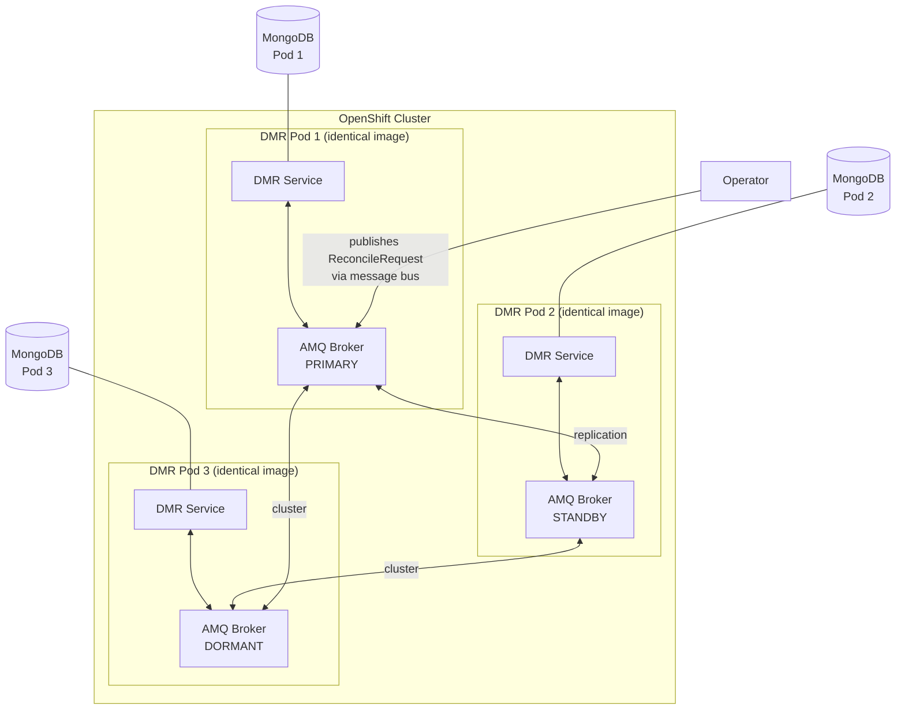
```mermaid
graph TB
    subgraph OpenShift Cluster
        subgraph Pod1["DMR Pod 1 (identical image)"]
            DMR1[DMR Service]
            AMQ1[AMQ Broker\nPRIMARY]
            DMR1 <--> AMQ1
        end

        subgraph Pod2["DMR Pod 2 (identical image)"]
            DMR2[DMR Service]
            AMQ2[AMQ Broker\nSTANDBY]
            DMR2 <--> AMQ2
        end

        subgraph Pod3["DMR Pod 3 (identical image)"]
            DMR3[DMR Service]
            AMQ3[AMQ Broker\nDORMANT]
            DMR3 <--> AMQ3
        end

        AMQ1 <-->|replication| AMQ2
        AMQ2 <-->|cluster| AMQ3
        AMQ1 <-->|cluster| AMQ3
    end

    OP[Operator] -->|publishes ReconcileRequest\nvia message bus| AMQ1
    MongoDB1[(MongoDB\nPod 1)] --- DMR1
    MongoDB2[(MongoDB\nPod 2)] --- DMR2
    MongoDB3[(MongoDB\nPod 3)] --- DMR3
```

### 3.2 Broker Role Lifecycle

Roles are negotiated by the AMQ cluster at runtime. The DMR sync package has no visibility into or dependency on these roles.

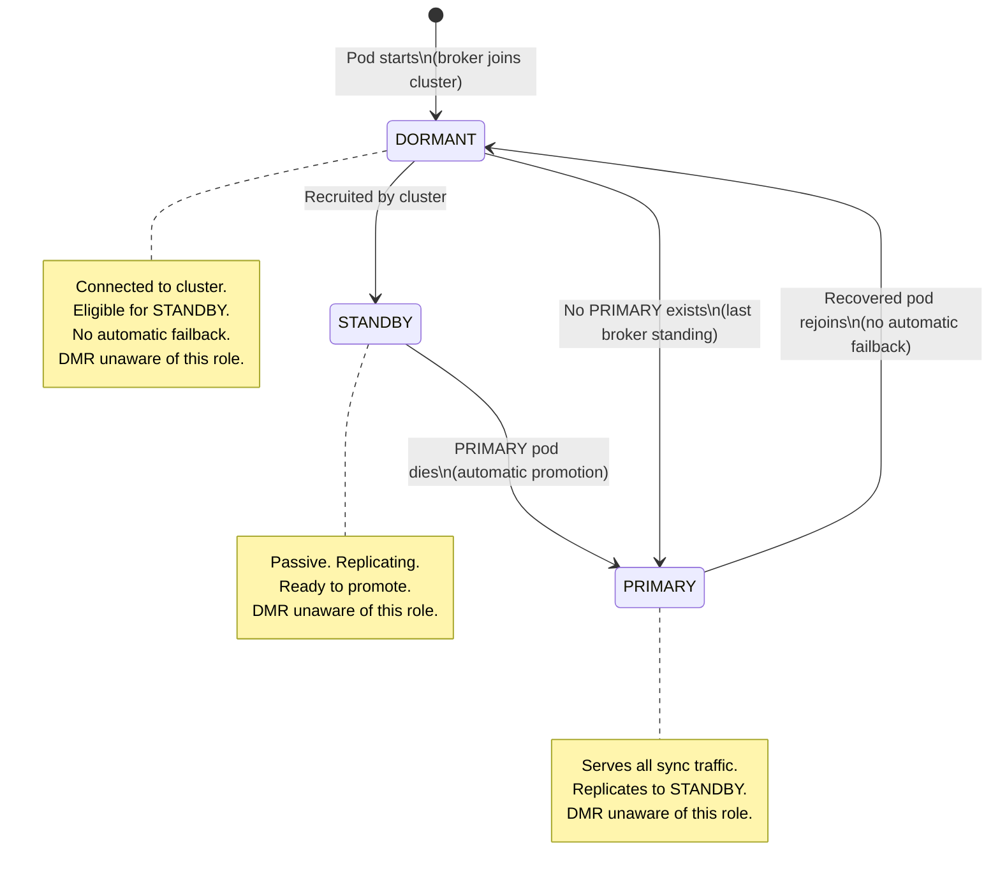
```mermaid
stateDiagram-v2
    [*] --> DORMANT : Pod starts\n(broker joins cluster)

    DORMANT --> STANDBY : Recruited by cluster
    STANDBY --> PRIMARY : PRIMARY pod dies\n(automatic promotion)
    PRIMARY --> DORMANT : Recovered pod rejoins\n(no automatic failback)
    DORMANT --> PRIMARY : No PRIMARY exists\n(last broker standing)

    note right of PRIMARY
        Serves all sync traffic.
        Replicates to STANDBY.
        DMR unaware of this role.
    end note

    note right of STANDBY
        Passive. Replicating.
        Ready to promote.
        DMR unaware of this role.
    end note

    note right of DORMANT
        Connected to cluster.
        Eligible for STANDBY.
        No automatic failback.
        DMR unaware of this role.
    end note
```

### 3.3 Failover Chain

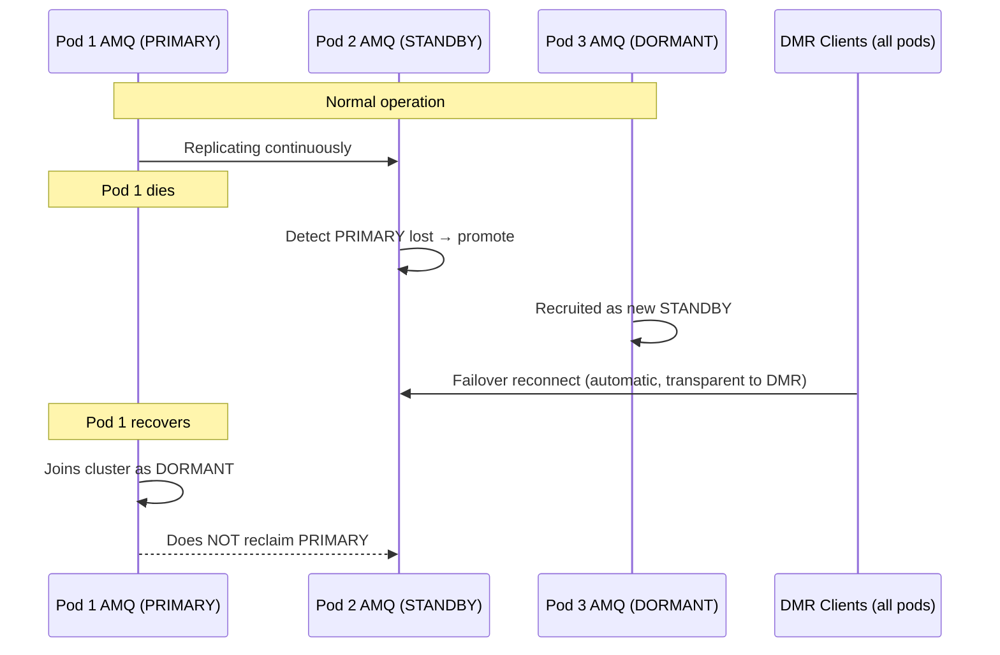
```mermaid
sequenceDiagram
    participant P1 as Pod 1 AMQ (PRIMARY)
    participant P2 as Pod 2 AMQ (STANDBY)
    participant P3 as Pod 3 AMQ (DORMANT)
    participant C as DMR Clients (all pods)

    Note over P1,P3: Normal operation
    P1->>P2: Replicating continuously

    Note over P1: Pod 1 dies
    P2->>P2: Detect PRIMARY lost → promote
    P3->>P3: Recruited as new STANDBY
    C->>P2: Failover reconnect (automatic, transparent to DMR)

    Note over P1: Pod 1 recovers
    P1->>P1: Joins cluster as DORMANT
    P1-->>P2: Does NOT reclaim PRIMARY
```

### 3.4 Component Diagram

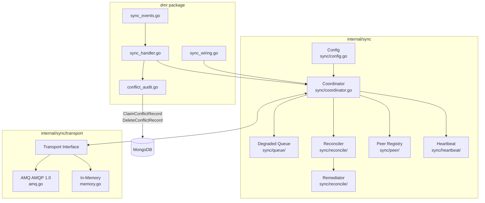
```mermaid
graph TB
    subgraph internal/sync
        CFG[Config\nsync/config.go]
        COORD[Coordinator\nsync/coordinator.go]
        HB[Heartbeat\nsync/heartbeat/]
        REG[Peer Registry\nsync/peer/]
        REC[Reconciler\nsync/reconcile/]
        REM[Remediator\nsync/reconcile/]
        DQ[Degraded Queue\nsync/queue/]

        CFG --> COORD
        COORD --> HB
        COORD --> REG
        COORD --> REC
        COORD --> DQ
        REC --> REM
    end

    subgraph internal/sync/transport
        TIF[Transport Interface]
        MEM[In-Memory\nmemory.go]
        AMQ[AMQ AMQP 1.0\namq.go]
        TIF --> MEM
        TIF --> AMQ
    end

    subgraph dmr package
        EV[sync_events.go]
        EH[sync_handler.go]
        WR[sync_wiring.go]
        AUDIT[conflict_audit.go]
    end

    COORD <--> TIF
    EH --> COORD
    EV --> EH
    WR --> COORD
    EH --> AUDIT
    AUDIT -->|ClaimConflictRecord\nDeleteConflictRecord| MongoDB[(MongoDB)]
```

---

## 4. Ownership Model

### 4.1 Claim-Based, Immutable Ownership

Scope ownership is **configured at startup** and never changes during an instance's lifetime. The rule is: **first claim wins**.

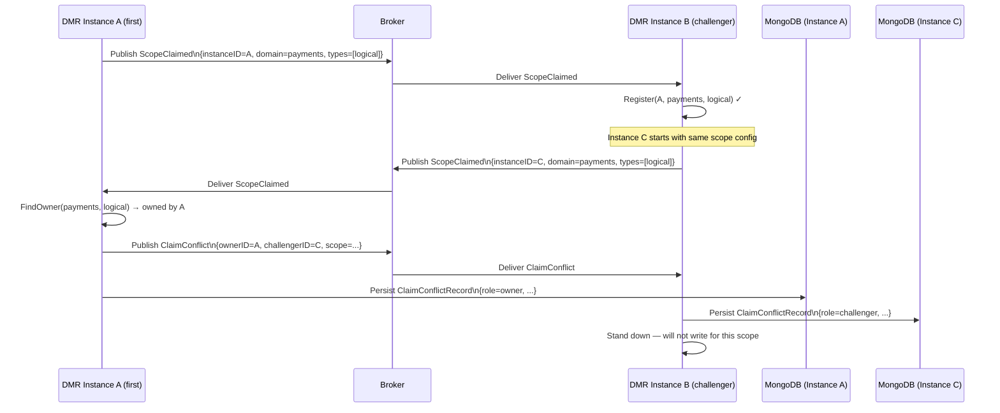
```mermaid
sequenceDiagram
    participant A as DMR Instance A (first)
    participant B as Broker
    participant C as DMR Instance B (challenger)
    participant MA as MongoDB (Instance A)
    participant MC as MongoDB (Instance C)

    A->>B: Publish ScopeClaimed\n{instanceID=A, domain=payments, types=[logical]}
    B->>C: Deliver ScopeClaimed
    C->>C: Register(A, payments, logical) ✓

    Note over C: Instance C starts with same scope config

    C->>B: Publish ScopeClaimed\n{instanceID=C, domain=payments, types=[logical]}
    B->>A: Deliver ScopeClaimed
    A->>A: FindOwner(payments, logical) → owned by A
    A->>B: Publish ClaimConflict\n{ownerID=A, challengerID=C, scope=...}
    B->>C: Deliver ClaimConflict

    A->>MA: Persist ClaimConflictRecord\n{role=owner, ...}
    C->>MC: Persist ClaimConflictRecord\n{role=challenger, ...}
    C->>C: Stand down — will not write for this scope
```

### 4.2 Unauthorised Delete — DeleteConflict

A `ModelDeleted` event originating from a non-owner is a protocol violation. The owner rejects it and both parties record the conflict.


```mermaid
sequenceDiagram
    participant X as DMR Instance X (non-owner)
    participant B as Broker
    participant O as DMR Instance O (owner)
    participant MX as MongoDB (Instance X)
    participant MO as MongoDB (Instance O)

    X->>B: Publish ModelDeleted\n{originID=X, modelID=m1, domain=payments}
    B->>O: Deliver ModelDeleted

    O->>O: FindOwner(payments, logical) → owner is O, not X
    O->>O: Reject — do not apply deletion
    O->>B: Publish DeleteConflict\n{ownerID=O, originID=X, modelID=m1, currentModel=FullModel}

    B->>X: Deliver DeleteConflict
    O->>MO: Persist DeleteConflictRecord\n{role=rejector, ...}
    X->>MX: Persist DeleteConflictRecord\n{role=originator, ...}
```

### 4.3 Peer State Machine

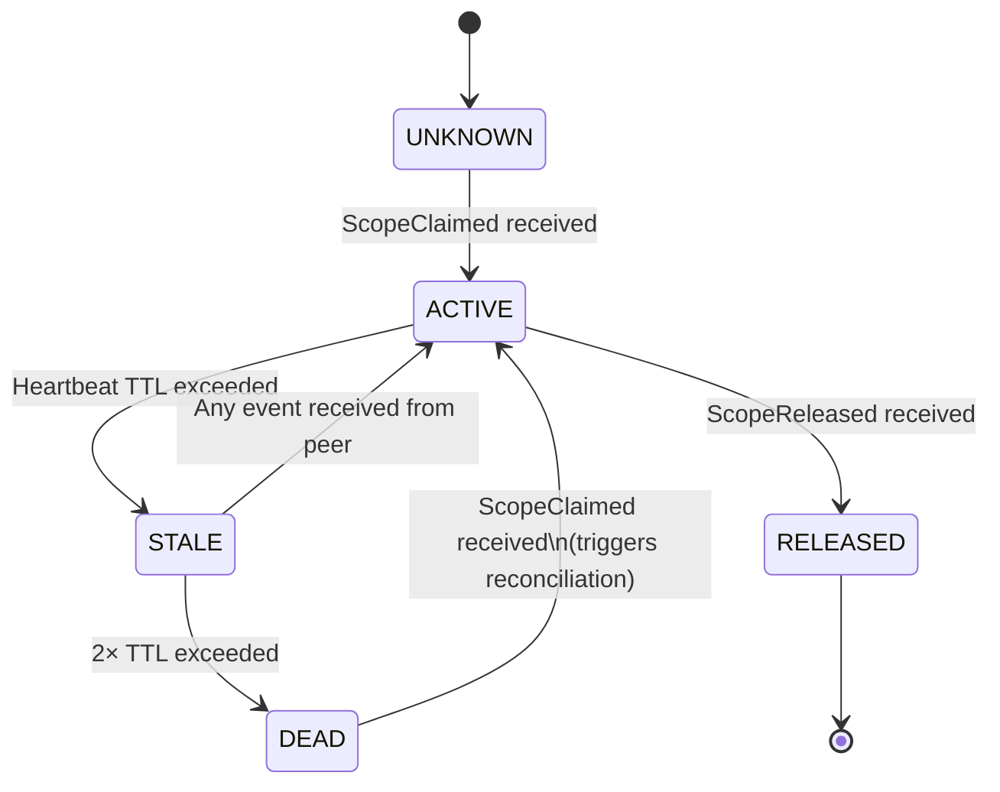
```mermaid
stateDiagram-v2
    [*] --> UNKNOWN

    UNKNOWN --> ACTIVE : ScopeClaimed received
    ACTIVE --> STALE : Heartbeat TTL exceeded
    STALE --> ACTIVE : Any event received from peer
    STALE --> DEAD : 2× TTL exceeded
    DEAD --> ACTIVE : ScopeClaimed received\n(triggers reconciliation)
    ACTIVE --> RELEASED : ScopeReleased received
    RELEASED --> [*]
```

| From | To | Trigger | Side Effect |
|---|---|---|---|
| UNKNOWN | ACTIVE | `ScopeClaimed` | Register in ledger |
| ACTIVE | STALE | Heartbeat TTL miss | Alert, flag for reconcile |
| STALE | ACTIVE | Any event from peer | Clear stale flag |
| STALE | DEAD | 2× TTL miss | Remove from active routing |
| DEAD | ACTIVE | `ScopeClaimed` | Re-register + trigger reconciliation |
| ACTIVE | RELEASED | `ScopeReleased` | Mark scope as available |

---

## 5. Event Catalogue

All event payloads are defined in the **DMR package** (`dmr/sync_events.go`). The sync package carries them in a generic `Envelope[T]`.

### 5.1 Topics, Address Types, and Events

| Topic | AMQ Address Type | Event Types | Publisher | Consumer |
|---|---|---|---|---|
| `dmr.sync.scope` | Multicast | `ScopeClaimed`, `ScopeReleased`, `ClaimConflict`, `DeleteConflict` | self / owner | all peers |
| `dmr.sync.heartbeat` | Multicast | `HeartbeatEvent` | self | all peers |
| `dmr.sync.model` | Multicast | `ModelUpdated`, `ModelDeleted` | scope owner | all peers |
| `dmr.sync.reconcile.request` | Multicast | `ReconcileRequest` | any instance | scope owner |
| `dmr.sync.reconcile.reply.{instanceID}` | **Anycast** | `ReconcileResponse` | scope owner | requesting instance only |

### 5.2 Envelope and Payload Types

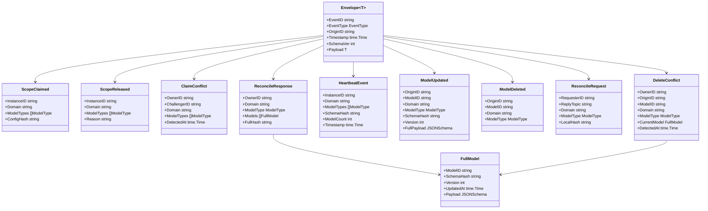
```mermaid
classDiagram
    class Envelope~T~ {
        +EventID    string
        +EventType  EventType
        +OriginID   string
        +Timestamp  time.Time
        +SchemaVer  int
        +Payload    T
    }

    class ScopeClaimed {
        +InstanceID  string
        +Domain      string
        +ModelTypes  []ModelType
        +ConfigHash  string
    }

    class ScopeReleased {
        +InstanceID  string
        +Domain      string
        +ModelTypes  []ModelType
        +Reason      string
    }

    class ClaimConflict {
        +OwnerID      string
        +ChallengerID string
        +Domain       string
        +ModelTypes   []ModelType
        +DetectedAt   time.Time
    }

    class DeleteConflict {
        +OwnerID      string
        +OriginID     string
        +ModelID      string
        +Domain       string
        +ModelType    ModelType
        +CurrentModel FullModel
        +DetectedAt   time.Time
    }

    class HeartbeatEvent {
        +InstanceID  string
        +Domain      string
        +ModelTypes  []ModelType
        +SchemaHash  string
        +ModelCount  int
        +Timestamp   time.Time
    }

    class ModelUpdated {
        +OriginID    string
        +ModelID     string
        +Domain      string
        +ModelType   ModelType
        +SchemaHash  string
        +Version     int
        +FullPayload JSONSchema
    }

    class ModelDeleted {
        +OriginID  string
        +ModelID   string
        +Domain    string
        +ModelType ModelType
    }

    class ReconcileRequest {
        +RequesterID string
        +ReplyTopic  string
        +Domain      string
        +ModelType   ModelType
        +LocalHash   string
    }

    class ReconcileResponse {
        +OwnerID   string
        +Domain    string
        +ModelType ModelType
        +Models    []FullModel
        +FullHash  string
    }

    class FullModel {
        +ModelID    string
        +SchemaHash string
        +Version    int
        +UpdatedAt  time.Time
        +Payload    JSONSchema
    }

    Envelope~T~ --> ScopeClaimed
    Envelope~T~ --> ScopeReleased
    Envelope~T~ --> ClaimConflict
    Envelope~T~ --> DeleteConflict
    Envelope~T~ --> HeartbeatEvent
    Envelope~T~ --> ModelUpdated
    Envelope~T~ --> ModelDeleted
    Envelope~T~ --> ReconcileRequest
    Envelope~T~ --> ReconcileResponse
    ReconcileResponse --> FullModel
    DeleteConflict --> FullModel
```

---

## 6. Conflict Records

Both conflict types are persisted to MongoDB by **both parties** involved. The `Role` field distinguishes perspective.

### 6.1 ClaimConflictRecord

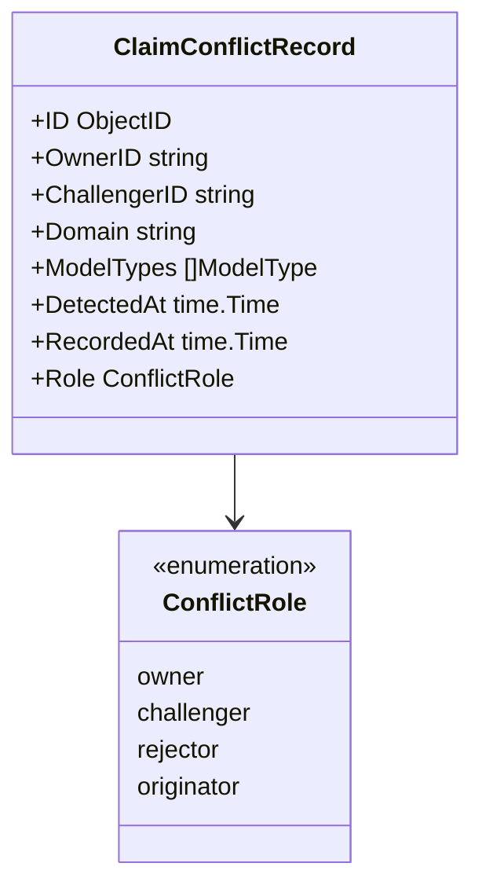
```mermaid
classDiagram
    class ClaimConflictRecord {
        +ID           ObjectID
        +OwnerID      string
        +ChallengerID string
        +Domain       string
        +ModelTypes   []ModelType
        +DetectedAt   time.Time
        +RecordedAt   time.Time
        +Role         ConflictRole
    }

    class ConflictRole {
        <<enumeration>>
        owner
        challenger
        rejector
        originator
    }

    ClaimConflictRecord --> ConflictRole
```

| Field | Owner record | Challenger record |
|---|---|---|
| `OwnerID` | self | the instance that rejected |
| `ChallengerID` | the instance that was rejected | self |
| `Role` | `owner` | `challenger` |

### 6.2 DeleteConflictRecord

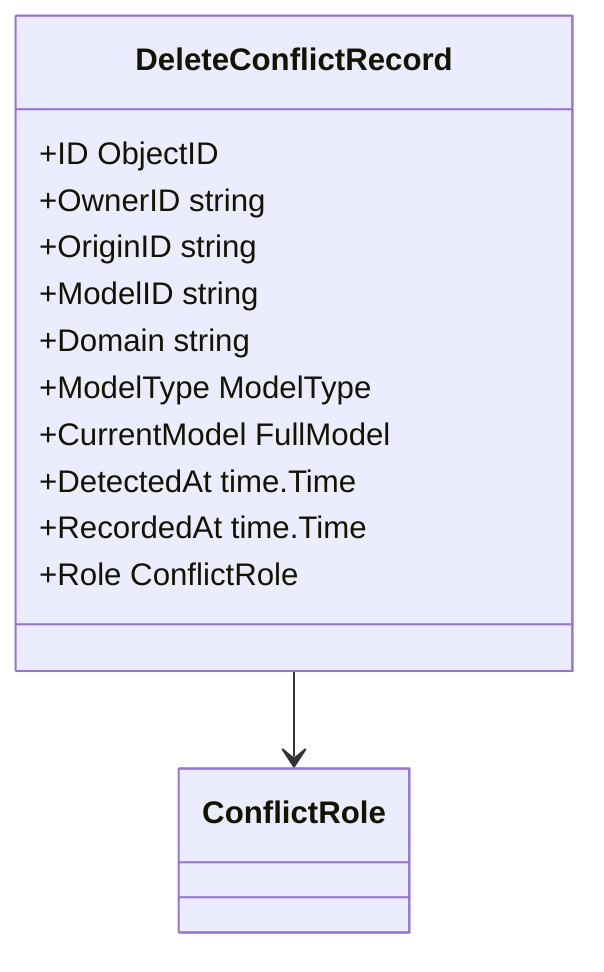
```mermaid
classDiagram
    class DeleteConflictRecord {
        +ID           ObjectID
        +OwnerID      string
        +OriginID     string
        +ModelID      string
        +Domain       string
        +ModelType    ModelType
        +CurrentModel FullModel
        +DetectedAt   time.Time
        +RecordedAt   time.Time
        +Role         ConflictRole
    }

    DeleteConflictRecord --> ConflictRole
```

| Field | Owner (rejector) record | Originator record |
|---|---|---|
| `OwnerID` | self | the instance that rejected |
| `OriginID` | the instance that attempted delete | self |
| `CurrentModel` | full model that was protected | full model received in `DeleteConflict` event |
| `Role` | `rejector` | `originator` |

### 6.3 MongoDB Collection

Both record types live in a dedicated `conflict_records` collection with a `type` discriminator field (`claim` or `delete`). This keeps conflict audit queries in one place.

```
conflict_records
  ├── type:  "claim" | "delete"
  ├── role:  "owner" | "challenger" | "rejector" | "originator"
  ├── domain, modelType, detectedAt   ← indexed for operator queries
  └── ...type-specific fields
```

---

## 7. Transport Layer

### 7.1 Interface

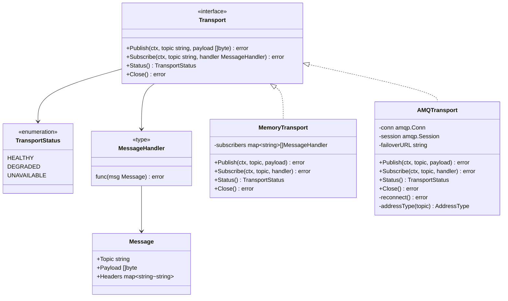
```mermaid
classDiagram
    class Transport {
        <<interface>>
        +Publish(ctx, topic string, payload []byte) error
        +Subscribe(ctx, topic string, handler MessageHandler) error
        +Status() TransportStatus
        +Close() error
    }

    class TransportStatus {
        <<enumeration>>
        HEALTHY
        DEGRADED
        UNAVAILABLE
    }

    class MessageHandler {
        <<type>>
        func(msg Message) error
    }

    class Message {
        +Topic   string
        +Payload []byte
        +Headers map~string~string~
    }

    class MemoryTransport {
        -subscribers map~string~[]MessageHandler
        +Publish(ctx, topic, payload) error
        +Subscribe(ctx, topic, handler) error
        +Status() TransportStatus
        +Close() error
    }

    class AMQTransport {
        -conn        amqp.Conn
        -session     amqp.Session
        -failoverURL string
        +Publish(ctx, topic, payload) error
        +Subscribe(ctx, topic, handler) error
        +Status() TransportStatus
        +Close() error
        -reconnect() error
        -addressType(topic) AddressType
    }

    Transport <|.. MemoryTransport
    Transport <|.. AMQTransport
    Transport --> TransportStatus
    Transport --> MessageHandler
    MessageHandler --> Message
```

### 7.2 AMQ Connection Strategy

Each DMR pod connects to its **local AMQ broker first**, falling back to peers. The sync package has no awareness of which pod is Primary — the failover URL handles that transparently.

```
failover:(amqp://localhost:5672,amqp://pod2:5672,amqp://pod3:5672)
  ?failover.randomize=false
  &failover.initialReconnectDelay=100
  &failover.maxReconnectDelay=5000
  &failover.maxReconnectAttempts=-1
```

`randomize=false` — localhost always tried first, keeps traffic local.  
`maxReconnectAttempts=-1` — retry indefinitely; Coordinator degraded mode handles service-level consequences.

### 7.3 Address Type Mapping

The `AMQTransport` adapter resolves address type from the topic name internally. Callers use the same `Publish`/`Subscribe` API regardless.

| Topic prefix | AMQ address type | Reason |
|---|---|---|
| `dmr.sync.scope` | Multicast | All peers must receive |
| `dmr.sync.heartbeat` | Multicast | All peers must receive |
| `dmr.sync.model` | Multicast | All peers must receive |
| `dmr.sync.reconcile.request` | Multicast | All potential owners must receive |
| `dmr.sync.reconcile.reply.*` | Anycast | Point-to-point — avoids durable subscription duplication in clustered AMQ |

---

## 8. Peer Registry

### 8.1 Structure

The peer registry is an **in-memory claim ledger**, rebuilt on startup via incoming `ScopeClaimed` events from live peers.

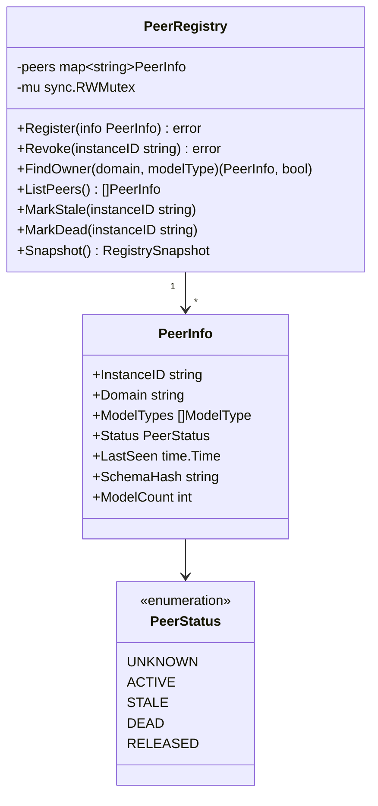
```mermaid
classDiagram
    class PeerRegistry {
        -peers map~string~PeerInfo
        -mu    sync.RWMutex
        +Register(info PeerInfo) error
        +Revoke(instanceID string) error
        +FindOwner(domain, modelType) (PeerInfo, bool)
        +ListPeers() []PeerInfo
        +MarkStale(instanceID string)
        +MarkDead(instanceID string)
        +Snapshot() RegistrySnapshot
    }

    class PeerInfo {
        +InstanceID  string
        +Domain      string
        +ModelTypes  []ModelType
        +Status      PeerStatus
        +LastSeen    time.Time
        +SchemaHash  string
        +ModelCount  int
    }

    class PeerStatus {
        <<enumeration>>
        UNKNOWN
        ACTIVE
        STALE
        DEAD
        RELEASED
    }

    PeerRegistry "1" --> "*" PeerInfo
    PeerInfo --> PeerStatus
```

### 8.2 Scope Lookup

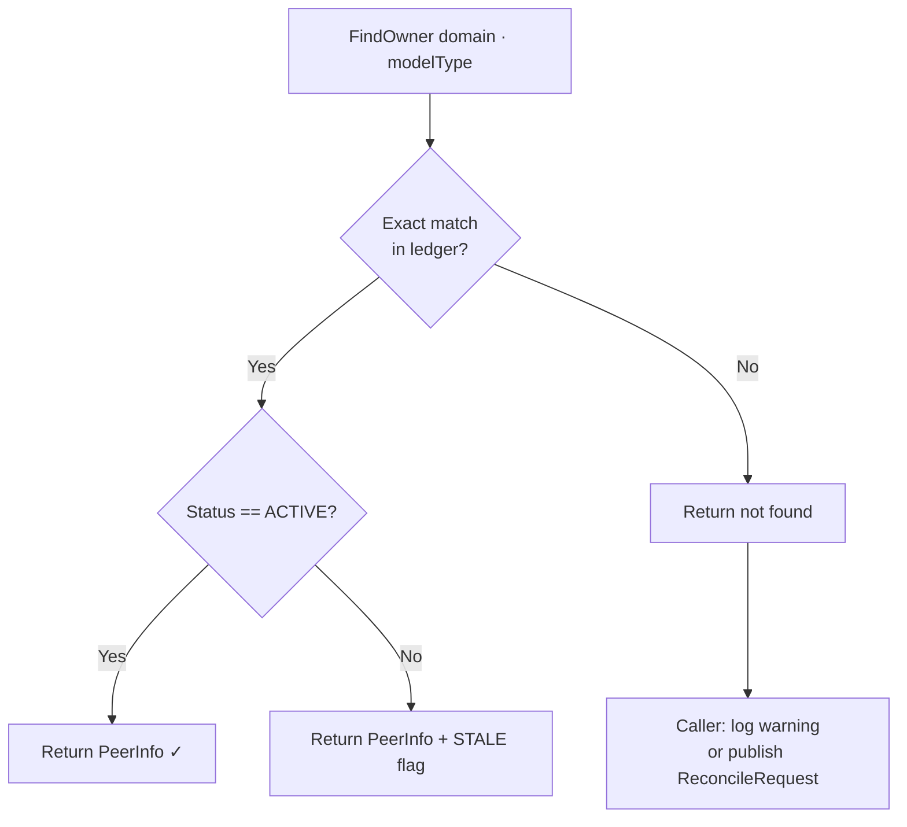
```mermaid
flowchart TD
    A[FindOwner domain · modelType] --> B{Exact match\nin ledger?}
    B -->|Yes| C{Status == ACTIVE?}
    C -->|Yes| D[Return PeerInfo ✓]
    C -->|No| E[Return PeerInfo + STALE flag]
    B -->|No| F[Return not found]
    F --> G[Caller: log warning\nor publish ReconcileRequest]
```

---

## 9. Heartbeat

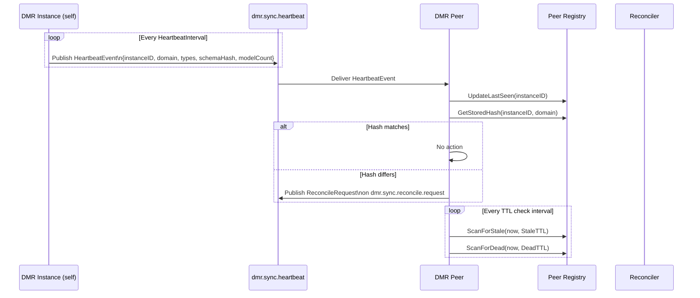
```mermaid
sequenceDiagram
    participant Self as DMR Instance (self)
    participant B as dmr.sync.heartbeat
    participant Peer as DMR Peer
    participant Reg as Peer Registry
    participant Rec as Reconciler

    loop Every HeartbeatInterval
        Self->>B: Publish HeartbeatEvent\n{instanceID, domain, types, schemaHash, modelCount}
    end

    B->>Peer: Deliver HeartbeatEvent
    Peer->>Reg: UpdateLastSeen(instanceID)
    Peer->>Reg: GetStoredHash(instanceID, domain)

    alt Hash matches
        Peer->>Peer: No action
    else Hash differs
        Peer->>B: Publish ReconcileRequest\non dmr.sync.reconcile.request
    end

    loop Every TTL check interval
        Peer->>Reg: ScanForStale(now, StaleTTL)
        Peer->>Reg: ScanForDead(now, DeadTTL)
    end
```

### Heartbeat TTL Parameters

| Parameter | Default | Description |
|---|---|---|
| `HeartbeatInterval` | 30s | How often self publishes |
| `StaleTTL` | 90s | No heartbeat → STALE |
| `DeadTTL` | 180s | No heartbeat → DEAD |
| `ReconcileInterval` | 5m | Scheduled full reconciliation pass |

---

## 10. Reconciliation & Remediation

Reconciliation is triggered **exclusively via the message bus**.

### 10.1 Trigger Points

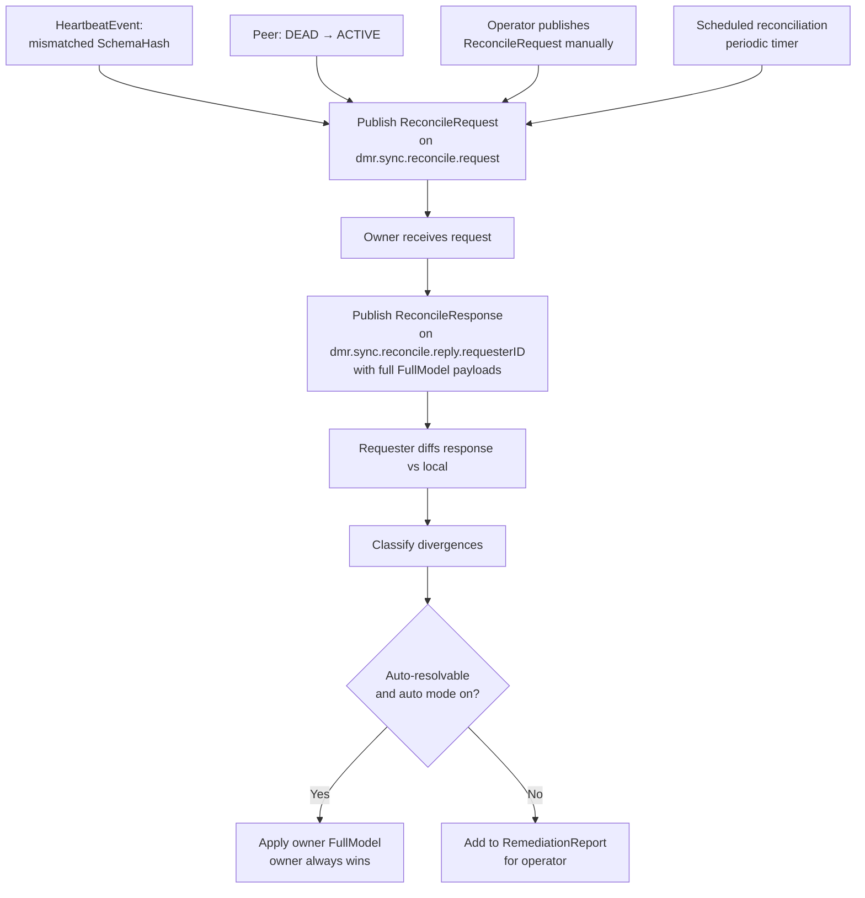
```mermaid
flowchart TD
    T1[HeartbeatEvent:\nmismatched SchemaHash]
    T2[Peer: DEAD → ACTIVE]
    T3[Operator publishes\nReconcileRequest manually]
    T4[Scheduled reconciliation\nperiodic timer]

    T1 & T2 & T3 & T4 --> RQ[Publish ReconcileRequest\non dmr.sync.reconcile.request]

    RQ --> OWN[Owner receives request]
    OWN --> RS[Publish ReconcileResponse\non dmr.sync.reconcile.reply.requesterID\nwith full FullModel payloads]
    RS --> DIFF[Requester diffs response vs local]
    DIFF --> CLASS[Classify divergences]

    CLASS --> AR{Auto-resolvable\nand auto mode on?}
    AR -->|Yes| APPLY[Apply owner FullModel\nowner always wins]
    AR -->|No| QUEUE[Add to RemediationReport\nfor operator]
```

### 10.2 Reconcile Flow

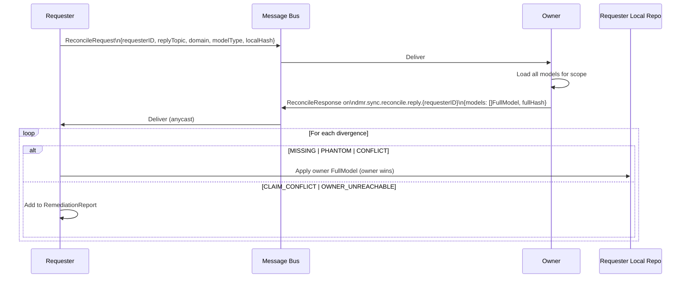
```mermaid
sequenceDiagram
    participant Req as Requester
    participant B as Message Bus
    participant Own as Owner
    participant Repo as Requester Local Repo

    Req->>B: ReconcileRequest\n{requesterID, replyTopic, domain, modelType, localHash}
    B->>Own: Deliver

    Own->>Own: Load all models for scope
    Own->>B: ReconcileResponse on\ndmr.sync.reconcile.reply.{requesterID}\n{models: []FullModel, fullHash}
    B->>Req: Deliver (anycast)

    loop For each divergence
        alt MISSING | PHANTOM | CONFLICT
            Req->>Repo: Apply owner FullModel (owner wins)
        else CLAIM_CONFLICT | OWNER_UNREACHABLE
            Req->>Req: Add to RemediationReport
        end
    end
```

### 10.3 Divergence Classification

| Kind | Description | Auto-Resolvable | Resolution |
|---|---|---|---|
| `MISSING` | Local lacks a model the owner has | Yes | Apply owner's `FullModel` |
| `PHANTOM` | Local has a model the owner doesn't | Yes | Evict from local cache |
| `CONFLICT` | Both have model, payloads differ | Yes — owner wins | Replace with owner's `FullModel` |
| `CLAIM_CONFLICT` | Two instances claimed same scope | No | Operator fixes config, restarts challenger |
| `OWNER_UNREACHABLE` | Owner is DEAD | No | Operator intervention |

### 10.4 RemediationReport

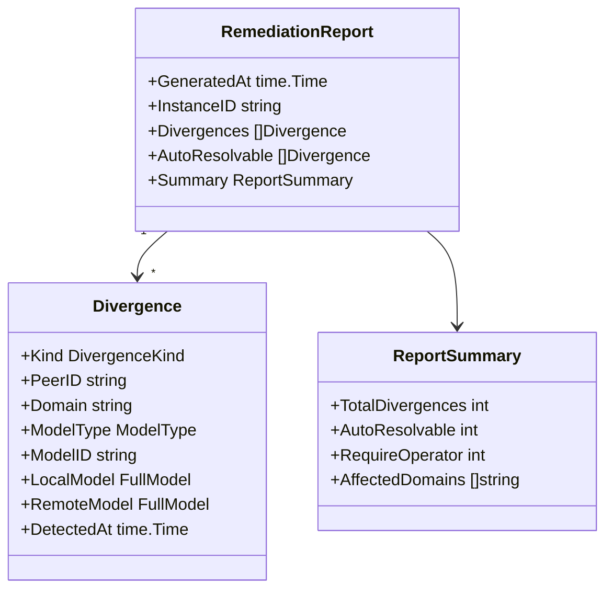
```mermaid
classDiagram
    class RemediationReport {
        +GeneratedAt    time.Time
        +InstanceID     string
        +Divergences    []Divergence
        +AutoResolvable []Divergence
        +Summary        ReportSummary
    }

    class Divergence {
        +Kind        DivergenceKind
        +PeerID      string
        +Domain      string
        +ModelType   ModelType
        +ModelID     string
        +LocalModel  FullModel
        +RemoteModel FullModel
        +DetectedAt  time.Time
    }

    class ReportSummary {
        +TotalDivergences int
        +AutoResolvable   int
        +RequireOperator  int
        +AffectedDomains  []string
    }

    RemediationReport "1" --> "*" Divergence
    RemediationReport --> ReportSummary
```

---

## 11. Degraded Mode

When no AMQ Primary is reachable the Coordinator enters **degraded mode**. DMR continues to serve local reads and writes normally — only cross-instance event propagation is affected.

### 11.1 State Machine

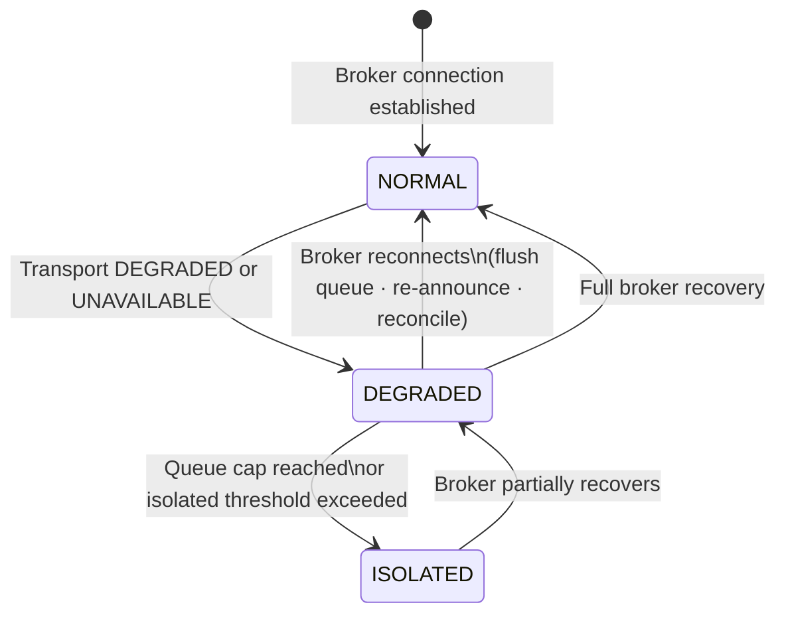
```mermaid
stateDiagram-v2
    [*] --> NORMAL : Broker connection established

    NORMAL --> DEGRADED : Transport DEGRADED or UNAVAILABLE
    DEGRADED --> NORMAL : Broker reconnects\n(flush queue · re-announce · reconcile)
    DEGRADED --> ISOLATED : Queue cap reached\nor isolated threshold exceeded
    ISOLATED --> DEGRADED : Broker partially recovers
    DEGRADED --> NORMAL : Full broker recovery
```

### 11.2 Behaviour Per State

| State | Event Publishing | Heartbeat | Local Reads | Local Writes |
|---|---|---|---|---|
| `NORMAL` | Immediate | Active | ✓ | ✓ |
| `DEGRADED` | Queued locally (bounded) | Paused | ✓ | ✓ |
| `ISOLATED` | Dropped (logged) | Paused | ✓ | ✓ |

### 11.3 Recovery Sequence

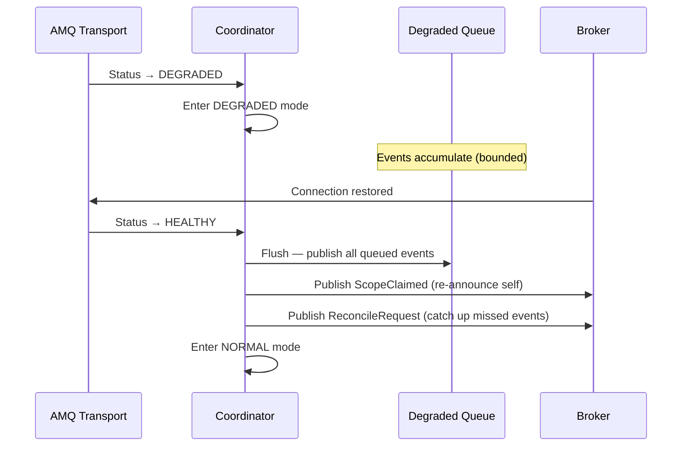
```mermaid
sequenceDiagram
    participant T as AMQ Transport
    participant C as Coordinator
    participant Q as Degraded Queue
    participant B as Broker

    T->>C: Status → DEGRADED
    C->>C: Enter DEGRADED mode
    Note over Q: Events accumulate (bounded)

    B->>T: Connection restored
    T->>C: Status → HEALTHY
    C->>Q: Flush — publish all queued events
    C->>B: Publish ScopeClaimed (re-announce self)
    C->>B: Publish ReconcileRequest (catch up missed events)
    C->>C: Enter NORMAL mode
```

### 11.4 Queue Parameters

| Parameter | Default | Description |
|---|---|---|
| `DegradedQueueCap` | 1000 events | Max queued before ISOLATED |
| `IsolatedThreshold` | 10m | Time in DEGRADED before ISOLATED warning |

Events dropped during ISOLATED are recovered via reconciliation on reconnect — no permanent data loss, only propagation delay.

---

## 12. Package Structure

```
internal/sync/                      ← sync sub-system (internal to DMR module for now)
│
├── config.go                       ← SyncConfig, Scope, TransportConfig, HAPolicy
├── coordinator.go                  ← Coordinator interface + implementation
├── coordinator_test.go
│
├── transport/
│   ├── transport.go                ← Transport interface, Message, MessageHandler, TransportStatus
│   ├── memory.go                   ← in-memory adapter (local dev / test)
│   ├── memory_test.go
│   ├── amq.go                      ← AMQ AMQP 1.0 adapter (go-amqp)
│   └── amq_test.go
│
├── event/
│   ├── envelope.go                 ← Envelope[T], EventType constants, topic constants
│   ├── handler.go                  ← EventHandler interface (DMR implements)
│   └── envelope_test.go
│
├── peer/
│   ├── peer.go                     ← PeerInfo, PeerStatus
│   ├── registry.go                 ← PeerRegistry (in-memory claim ledger)
│   └── registry_test.go
│
├── heartbeat/
│   ├── heartbeat.go                ← ticker publisher + TTL watcher
│   └── heartbeat_test.go
│
├── queue/
│   ├── queue.go                    ← bounded degraded-mode event queue
│   └── queue_test.go
│
└── reconcile/
    ├── reconciler.go               ← diff engine (owner always wins)
    ├── remediator.go               ← Apply, DryRun
    ├── report.go                   ← RemediationReport, Divergence, DivergenceKind
    ├── reconciler_test.go
    └── remediator_test.go

dmr/                                ← parent package
│
├── sync_events.go                  ← all event payload types + FullModel
├── sync_handler.go                 ← implements internal/sync/event.EventHandler
├── sync_wiring.go                  ← constructs sync.Coordinator, injects deps
└── conflict_audit.go               ← persists ClaimConflictRecord + DeleteConflictRecord
                                       to MongoDB conflict_records collection
                                       both parties write their own record with Role field
```

---

## 13. Interface Definitions

### Transport

```go
// internal/sync/transport/transport.go

type TransportStatus string

const (
    StatusHealthy     TransportStatus = "HEALTHY"
    StatusDegraded    TransportStatus = "DEGRADED"
    StatusUnavailable TransportStatus = "UNAVAILABLE"
)

type MessageHandler func(msg Message) error

type Message struct {
    Topic   string
    Payload []byte
    Headers map[string]string
}

type Transport interface {
    Publish(ctx context.Context, topic string, payload []byte) error
    Subscribe(ctx context.Context, topic string, handler MessageHandler) error
    Status() TransportStatus
    Close() error
}
```

### EventHandler

```go
// internal/sync/event/handler.go

type EventHandler interface {
    OnScopeClaimed(ctx context.Context, peerID string, scope Scope) error
    OnScopeReleased(ctx context.Context, peerID string, scope Scope) error
    OnClaimConflict(ctx context.Context, ownerID, challengerID string, scope Scope) error
    OnDeleteConflict(ctx context.Context, event DeleteConflictEvent) error
    OnModelMutated(ctx context.Context, event ModelMutationEvent) error
    OnModelDeleted(ctx context.Context, event ModelDeletionEvent) error
    OnReconcileRequested(ctx context.Context, requesterID, replyTopic string, scope Scope, localHash string) error
    OnReconcileResponse(ctx context.Context, response ReconcileResponse) error
}
```

### Coordinator

```go
// internal/sync/coordinator.go

type CoordinatorMode string

const (
    ModeNormal   CoordinatorMode = "NORMAL"
    ModeDegraded CoordinatorMode = "DEGRADED"
    ModeIsolated CoordinatorMode = "ISOLATED"
)

type Coordinator interface {
    Start(ctx context.Context) error
    Stop(ctx context.Context) error
    PublishModelUpdated(ctx context.Context, event ModelMutationEvent) error
    PublishModelDeleted(ctx context.Context, event ModelDeletionEvent) error
    Mode() CoordinatorMode
    PeerSnapshot() peer.RegistrySnapshot
}
```

---

## 14. Configuration

```go
// internal/sync/config.go

type SyncConfig struct {
    InstanceID        string
    Scope             Scope
    Transport         TransportConfig
    HeartbeatInterval time.Duration  // Default: 30s
    StaleTTL          time.Duration  // Default: 90s
    DeadTTL           time.Duration  // Default: 180s
    ReconcileInterval time.Duration  // Default: 5m
    AutoRemediate     bool           // Default: true
    DegradedQueueCap  int            // Default: 1000
    IsolatedThreshold time.Duration  // Default: 10m
}

type Scope struct {
    Domain     string
    ModelTypes []ModelType
}

type TransportConfig struct {
    Kind        TransportKind
    FailoverURL string         // e.g. failover:(amqp://localhost:5672,amqp://pod2:5672)
    HAPolicy    HAPolicy
    Options     map[string]any
}

type TransportKind string

const (
    TransportMemory TransportKind = "memory"
    TransportAMQ    TransportKind = "amq"
)

type HAPolicy string

const (
    HAReplication HAPolicy = "replication"
    HASharedStore HAPolicy = "shared-store"
)
```

---

## 15. Testing Strategy

| Layer | Scope | Transport | Gate |
|---|---|---|---|
| Unit | Pure functions: diff, digest, registry ops, queue bounds, conflict classification | None / mocks | Always run |
| Local integration | Coordinator wiring, event flow, heartbeat, degraded mode, conflict record writes | In-memory | Always run |
| External integration | AMQ adapter: publish, subscribe, failover, reconnect | Real AMQ broker | `AMQ_URL` env var present |

### Key Test Scenarios

| Scenario | Layer | Assertion |
|---|---|---|
| Two instances claim same scope | Unit | ClaimConflict published; both parties write ClaimConflictRecord with correct Role |
| Non-owner publishes ModelDeleted | Local integration | Owner rejects; DeleteConflict published; both parties write DeleteConflictRecord with correct Role |
| DeleteConflict carries CurrentModel payload | Unit | FullModel present and matches owner's stored model |
| Peer transitions ACTIVE → STALE → DEAD | Local integration | Status transitions fire on TTL |
| Hash mismatch on heartbeat triggers ReconcileRequest | Local integration | ReconcileRequest published on correct topic |
| Owner always wins on CONFLICT divergence | Unit | FullModel from owner applied |
| ReconcileResponse carries full model payloads | Local integration | FullModel.Payload present and correct |
| Reconcile reply delivered to requesting instance only | Local integration | Anycast — other instances do not receive |
| DEAD → ACTIVE triggers reconciliation | Local integration | ReconcileRequest emitted on re-announce |
| Graceful shutdown propagates ScopeReleased | Local integration | Peer marked RELEASED in registry |
| Degraded queue respects cap | Unit | Event 1001 dropped; ISOLATED entered |
| Recovery flushes queue then re-announces | Local integration | Queued events published; ScopeClaimed re-sent; ReconcileRequest published |
| Recovered PRIMARY broker pod stays DORMANT | Local integration | No failback promotion observed by DMR |
| AMQ adapter reconnects on broker restart | External integration | Failover URL used; messages delivered after reconnect |
| conflict_records collection contains both perspectives | Local integration | Two records per conflict with distinct Role values |

---

*End of document — v1.2*
