# DMR Synchronization Sub-System — Design Document

**Version:** 1.3
**Status:** Draft — Pending Review
**Language:** Go
**Paradigm:** Functional Programming

---

## Revision History

| Version | Change |
|---|---|
| 1.0 | Initial draft |
| 1.1 | Transport narrowed to AMQ + in-memory; co-located broker topology; full payload on ReconcileResponse; ClaimConflict audit to MongoDB; reconciliation via message bus only; bounded local event queue; no automatic failback |
| 1.2 | ClaimConflictRecord written by both owner and challenger (Role field); DeleteConflict event for unauthorised ModelDeleted, recorded by both owner and originator; no BrokerRoleEvent; package path moved to internal/sync |
| 1.3 | Organic growth topology (1→2→N pods); single-pod no-op sync; PeerDiscoveryRequest/Response for new pod bootstrap; BootstrapTimeout config; growth topology table; broker role table per pod count |

---

## Table of Contents

1. [Overview](#1-overview)
2. [Goals & Non-Goals](#2-goals--non-goals)
3. [Architecture](#3-architecture)
4. [Organic Growth Topology](#4-organic-growth-topology)
5. [Ownership Model](#5-ownership-model)
6. [Event Catalogue](#6-event-catalogue)
7. [Conflict Records](#7-conflict-records)
8. [Transport Layer](#8-transport-layer)
9. [Peer Registry](#9-peer-registry)
10. [Heartbeat](#10-heartbeat)
11. [Reconciliation & Remediation](#11-reconciliation--remediation)
12. [Degraded Mode](#12-degraded-mode)
13. [Package Structure](#13-package-structure)
14. [Interface Definitions](#14-interface-definitions)
15. [Configuration](#15-configuration)
16. [Testing Strategy](#16-testing-strategy)

---

## 1. Overview

A Data Model Registry (DMR) deployment consists of multiple instances, each responsible for a specific **domain** and **model type** (logical, physical, or both). Instances operate independently and must remain aware of:

- Which instance owns which domain/model-type scope
- Mutations (updates, deletions) on models that other instances may cache or reference
- The health and liveness of peer instances

This document describes the `sync` sub-system that enables DMR instances to self-coordinate through event-driven messaging over **Red Hat AMQ**, with deterministic ownership rules and a reconciliation mechanism to detect and correct state divergence.

Every DMR pod runs an **identical image** that includes both the DMR service and an AMQ broker. Broker roles (Primary, Standby, Dormant) are negotiated at runtime by the AMQ cluster. The sync package has no awareness of which pod holds which broker role — that is purely broker-layer state.

The deployment grows organically: starting from a single pod, adding pods one at a time. The first two pods form the active HA broker pair; all subsequent pods carry dormant brokers ready to be recruited if the standby is lost.

The `sync` package lives at `internal/sync` within the DMR module. The internal boundary enforces the parent-package relationship now, while the design (pluggable transport, EventHandler interface) means it can be extracted to a standalone module later with only a path rename and `go.mod` split.

---

## 2. Goals & Non-Goals

### Goals

- Support organic growth from 1 pod upward with no reconfiguration of existing pods
- Bootstrap peer awareness on startup via `PeerDiscoveryRequest` broadcast
- Propagate scope ownership (domain + model type) across all instances at startup
- Detect and resolve conflicts when two instances claim the same scope
- Distribute model mutation events (update, delete) to all peers
- Reject and record unauthorised delete attempts from non-owners
- Maintain liveness awareness via heartbeat events over the shared transport
- Support reconciliation triggered exclusively via the message bus
- Persist `ClaimConflictRecord` to MongoDB on **both** owner and challenger
- Persist `DeleteConflictRecord` to MongoDB on **both** owner (rejector) and originator
- Provide an **in-memory transport** for local development and testing
- Survive broker failover transparently via AMQ client failover URLs
- Operate in **degraded mode** (local only) when no broker Primary is available
- Operate correctly as a single pod with no peers (no-op sync, no errors)

### Non-Goals

- Dynamic scope reassignment at runtime
- Distributed locking or leader election
- Cross-instance write coordination
- HTTP endpoints for triggering reconciliation
- Kafka, RabbitMQ, or Redis transport adapters
- Automatic failback when a previously failed broker pod recovers
- Exposing AMQ broker role as a sync event
- High-scale broker topology (AMQ cluster with redistribution) — deferred to future

---

## 3. Architecture

### 3.1 System Context

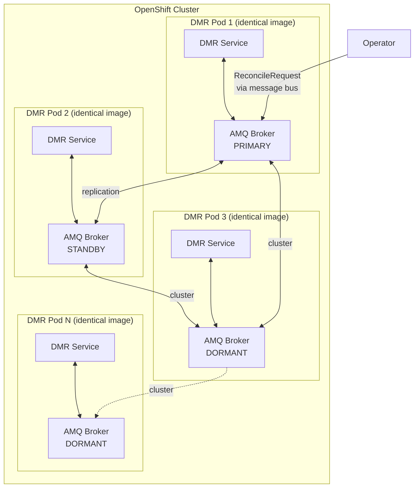

### 3.2 Component Diagram

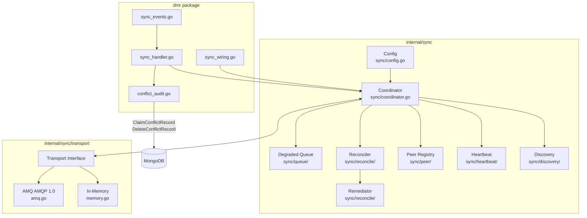

---

## 4. Organic Growth Topology

### 4.1 Broker Role by Pod Count

The deployment grows one pod at a time. No existing pod requires reconfiguration when a new pod is added. The `FailoverURL` in each pod's config lists all known peer broker addresses — new pods are added to the config of future pods only.

| Pod Count | Pod 1 Broker | Pod 2 Broker | Pod 3+ Broker | Sync Behaviour |
|---|---|---|---|---|
| 1 | PRIMARY | — | — | No-op: no peers, ScopeClaimed published to empty bus |
| 2 | PRIMARY | STANDBY | — | Full HA pair, sync active |
| 3 | PRIMARY | STANDBY | DORMANT | Full HA, Pod 3 participates in sync as DMR peer |
| N | PRIMARY | STANDBY | DORMANT (all) | Full HA, all pods participate in sync |

### 4.2 Failover and Recovery at Any N

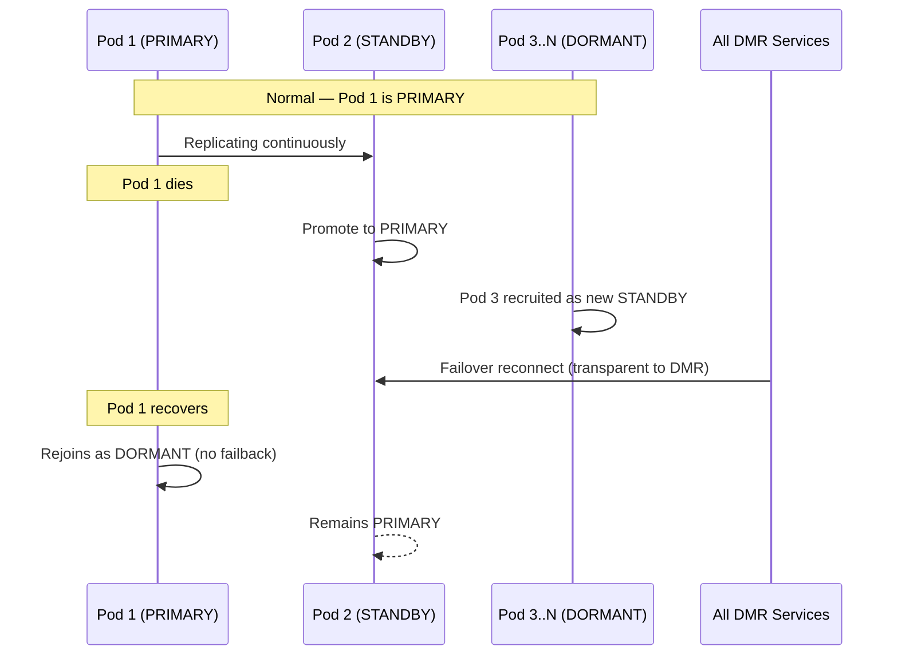

### 4.3 Single-Pod Behaviour

A single-pod deployment is a fully valid starting state. The sync sub-system starts cleanly with zero peers:

- `PeerDiscoveryRequest` is published on startup and times out after `BootstrapTimeout` with no responses — this is not an error
- `ScopeClaimed` is published to the bus with no consumers — discarded, not an error
- Heartbeat ticker runs normally — no peers update, no TTL watches fire
- Reconciler has nothing to diff — no-op
- All local DMR operations (read, write, delete) function normally

When a second pod is added later, it discovers Pod 1 via `PeerDiscoveryRequest` and the sync relationship is established without any change to Pod 1.

### 4.4 New Pod Bootstrap — PeerDiscoveryRequest

When a new pod starts it does not know about existing peers. Existing peers will not re-broadcast their `ScopeClaimed` unprompted. The bootstrap sequence resolves this:

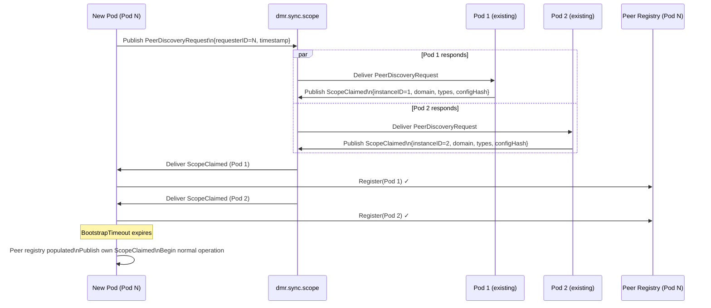

**Key points:**
- `PeerDiscoveryRequest` is published on `dmr.sync.scope` (multicast) — all existing peers receive it
- Existing peers respond by re-publishing their own `ScopeClaimed` — no new response event type needed
- New pod waits `BootstrapTimeout` for responses, then publishes its own `ScopeClaimed` and begins normal operation
- If no responses arrive within `BootstrapTimeout`, pod assumes it is first in the cluster — valid, not an error
- Existing peers also receive the new pod's `ScopeClaimed` and register it in their own peer registries

---

## 5. Ownership Model

### 5.1 Claim-Based, Immutable Ownership

Scope ownership is **configured at startup** and never changes during an instance's lifetime. The rule is: **first claim wins**.

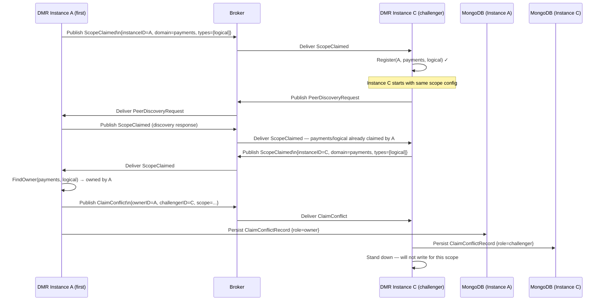

### 5.2 Unauthorised Delete — DeleteConflict

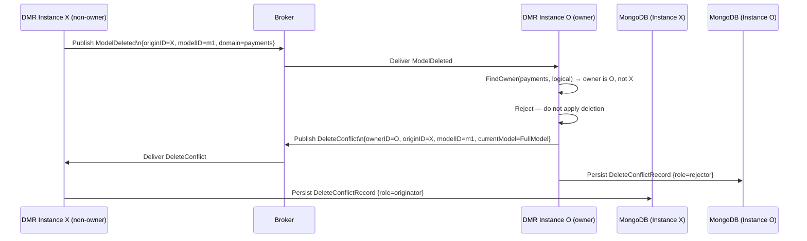

### 5.3 Peer State Machine

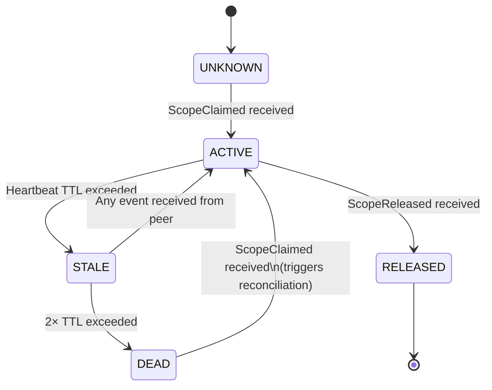

| From | To | Trigger | Side Effect |
|---|---|---|---|
| UNKNOWN | ACTIVE | `ScopeClaimed` | Register in ledger |
| ACTIVE | STALE | Heartbeat TTL miss | Alert, flag for reconcile |
| STALE | ACTIVE | Any event from peer | Clear stale flag |
| STALE | DEAD | 2× TTL miss | Remove from active routing |
| DEAD | ACTIVE | `ScopeClaimed` | Re-register + trigger reconciliation |
| ACTIVE | RELEASED | `ScopeReleased` | Mark scope as available |

---

## 6. Event Catalogue

All event payloads are defined in the **DMR package** (`dmr/sync_events.go`). The sync package carries them in a generic `Envelope[T]`.

### 6.1 Topics, Address Types, and Events

| Topic | AMQ Address Type | Event Types | Publisher | Consumer |
|---|---|---|---|---|
| `dmr.sync.scope` | Multicast | `PeerDiscoveryRequest`, `ScopeClaimed`, `ScopeReleased`, `ClaimConflict`, `DeleteConflict` | self / owner | all peers |
| `dmr.sync.heartbeat` | Multicast | `HeartbeatEvent` | self | all peers |
| `dmr.sync.model` | Multicast | `ModelUpdated`, `ModelDeleted` | scope owner | all peers |
| `dmr.sync.reconcile.request` | Multicast | `ReconcileRequest` | any instance | scope owner |
| `dmr.sync.reconcile.reply.{instanceID}` | **Anycast** | `ReconcileResponse` | scope owner | requesting instance only |

### 6.2 Startup Sequence — Full Event Flow

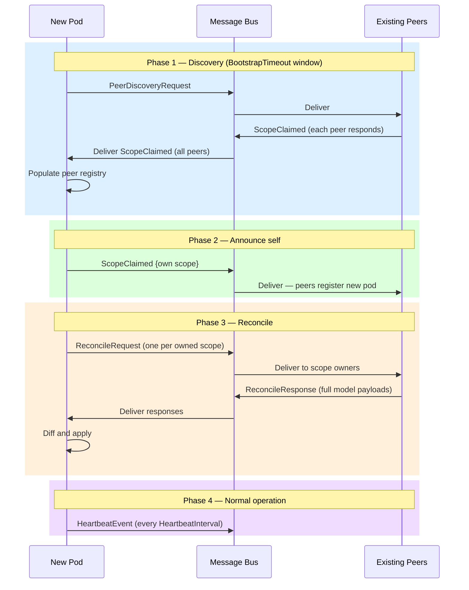

### 6.3 Envelope and Payload Types

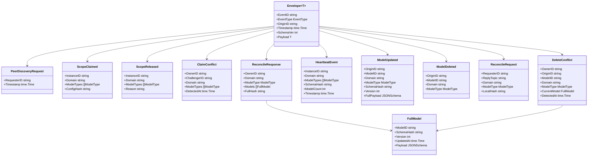

---

## 7. Conflict Records

Both conflict types are persisted to MongoDB by **both parties** involved. The `Role` field distinguishes perspective. Both record types live in a single `conflict_records` collection with a `type` discriminator field.

### 7.1 ClaimConflictRecord

| Field | Owner record | Challenger record |
|---|---|---|
| `OwnerID` | self | the instance that rejected |
| `ChallengerID` | the instance that was rejected | self |
| `Role` | `owner` | `challenger` |

### 7.2 DeleteConflictRecord

| Field | Owner (rejector) record | Originator record |
|---|---|---|
| `OwnerID` | self | the instance that rejected |
| `OriginID` | the instance that attempted delete | self |
| `CurrentModel` | full model that was protected | full model received in `DeleteConflict` event |
| `Role` | `rejector` | `originator` |

### 7.3 MongoDB Collection Schema

```
conflict_records
  ├── type        "claim" | "delete"         ← discriminator, indexed
  ├── role        "owner" | "challenger"
  │               "rejector" | "originator"
  ├── domain                                  ← indexed
  ├── model_type                              ← indexed
  ├── detected_at                             ← indexed
  ├── recorded_at
  └── ...type-specific fields
```

---

## 8. Transport Layer

### 8.1 Interface

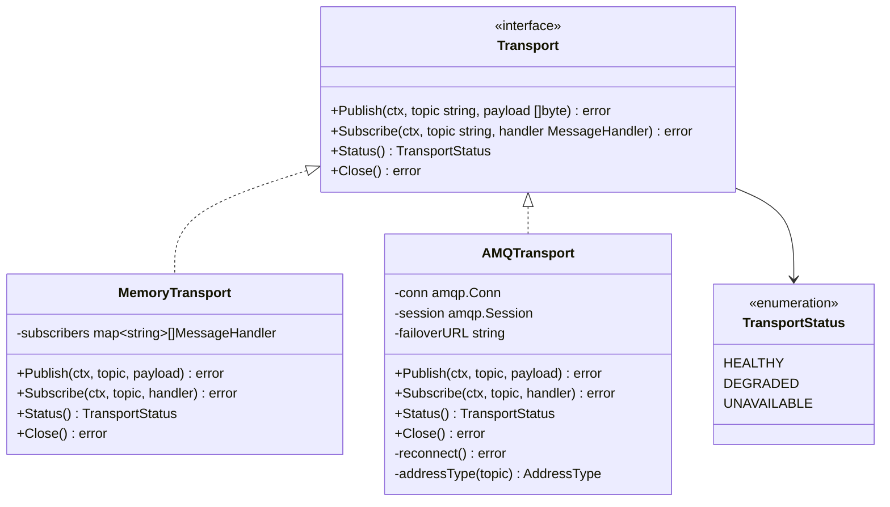

### 8.2 AMQ Connection Strategy

Each DMR pod connects to its **local AMQ broker first**, falling back to cluster peers. The sync package has no awareness of which pod is Primary.

```
failover:(amqp://localhost:5672,amqp://pod2:5672,amqp://pod3:5672)
  ?failover.randomize=false
  &failover.initialReconnectDelay=100
  &failover.maxReconnectDelay=5000
  &failover.maxReconnectAttempts=-1
```

As new pods are added, their addresses are included in the `FailoverURL` of subsequently deployed pods. Existing pods do not need their failover URL updated — the cluster handles message routing internally.

### 8.3 Address Type Mapping

| Topic prefix | AMQ address type | Reason |
|---|---|---|
| `dmr.sync.scope` | Multicast | All peers must receive |
| `dmr.sync.heartbeat` | Multicast | All peers must receive |
| `dmr.sync.model` | Multicast | All peers must receive |
| `dmr.sync.reconcile.request` | Multicast | All potential owners must receive |
| `dmr.sync.reconcile.reply.*` | Anycast | Point-to-point reply per instance |

---

## 9. Peer Registry

### 9.1 Structure

The peer registry is an **in-memory claim ledger**, populated at startup via `PeerDiscoveryRequest` and maintained via incoming events thereafter.

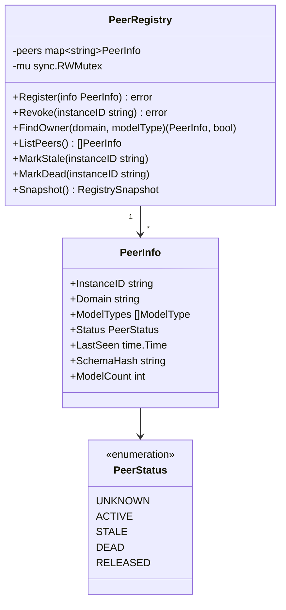

### 9.2 Scope Lookup

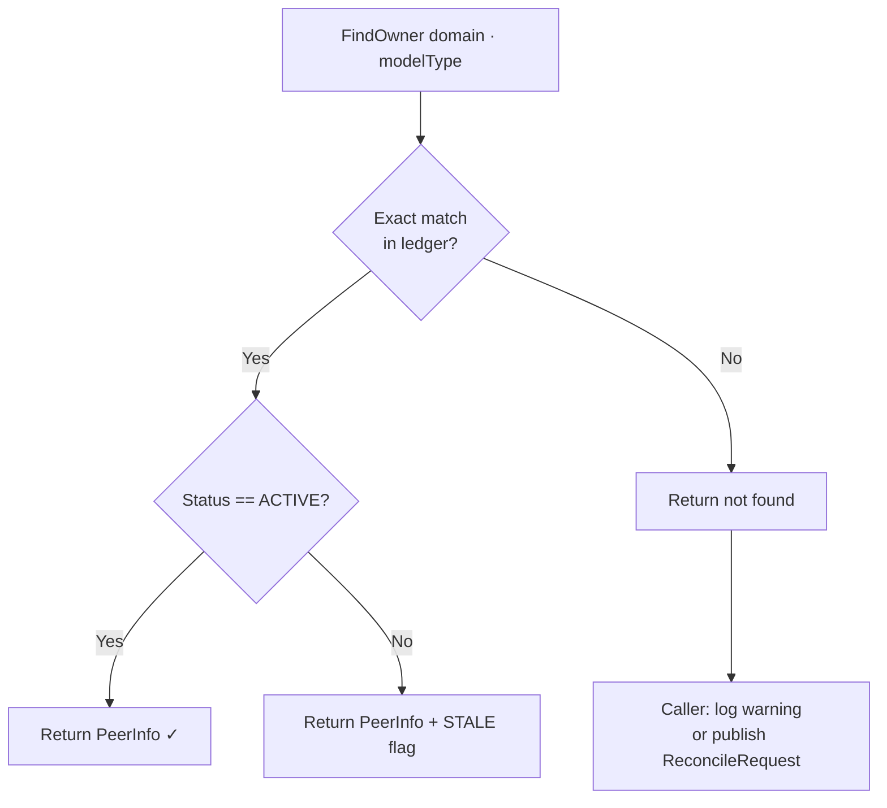

---

## 10. Heartbeat

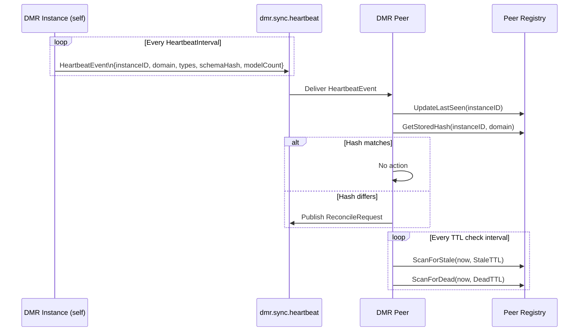

### Heartbeat TTL Parameters

| Parameter | Default | Description |
|---|---|---|
| `HeartbeatInterval` | 30s | How often self publishes |
| `StaleTTL` | 90s | No heartbeat → STALE |
| `DeadTTL` | 180s | No heartbeat → DEAD |
| `ReconcileInterval` | 5m | Scheduled full reconciliation pass |

---

## 11. Reconciliation & Remediation

Reconciliation is triggered **exclusively via the message bus**.

### 11.1 Trigger Points

| Trigger | Who publishes ReconcileRequest |
|---|---|
| HeartbeatEvent with mismatched SchemaHash | Receiver |
| Peer transitions DEAD → ACTIVE | All peers |
| New pod completes bootstrap (Phase 3) | New pod |
| Scheduled reconciliation timer | Self |
| Operator publishes ReconcileRequest manually | Operator |

### 11.2 Reconcile Flow


### 11.3 Divergence Classification

| Kind | Description | Auto-Resolvable | Resolution |
|---|---|---|---|
| `MISSING` | Local lacks a model the owner has | Yes | Apply owner's `FullModel` |
| `PHANTOM` | Local has a model the owner doesn't | Yes | Evict from local cache |
| `CONFLICT` | Both have model, payloads differ | Yes — owner wins | Replace with owner's `FullModel` |
| `CLAIM_CONFLICT` | Two instances claimed same scope | No | Operator fixes config, restarts challenger |
| `OWNER_UNREACHABLE` | Owner is DEAD | No | Operator intervention |

### 11.4 RemediationReport

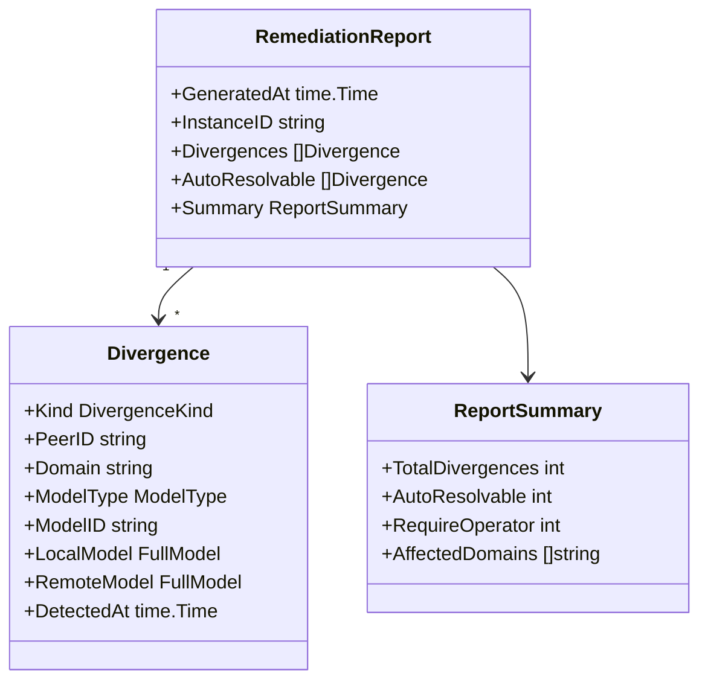

---

## 12. Degraded Mode

When no AMQ Primary is reachable the Coordinator enters **degraded mode**. DMR continues to serve local reads and writes normally.

### 12.1 State Machine

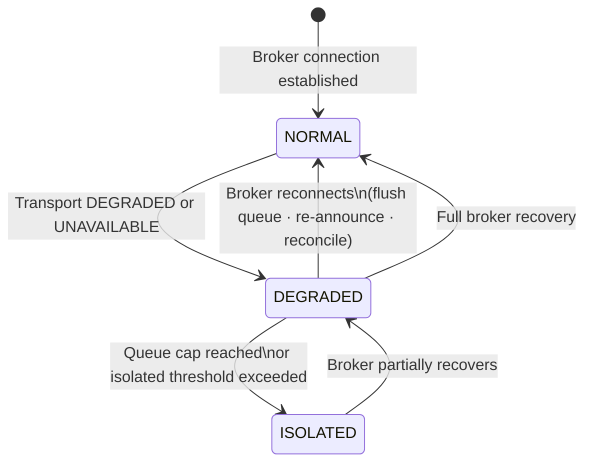

### 12.2 Behaviour Per State

| State | Event Publishing | Heartbeat | Local Reads | Local Writes |
|---|---|---|---|---|
| `NORMAL` | Immediate | Active | ✓ | ✓ |
| `DEGRADED` | Queued locally (bounded) | Paused | ✓ | ✓ |
| `ISOLATED` | Dropped (logged) | Paused | ✓ | ✓ |

### 12.3 Recovery Sequence

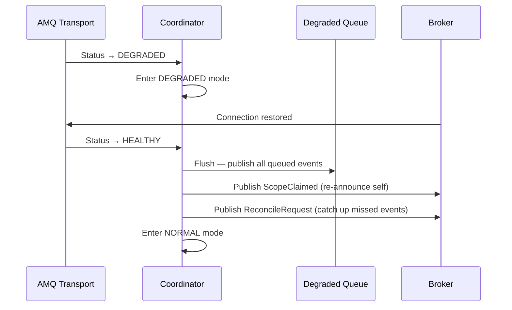

### 12.4 Queue Parameters

| Parameter | Default | Description |
|---|---|---|
| `DegradedQueueCap` | 1000 events | Max queued before ISOLATED |
| `IsolatedThreshold` | 10m | Time in DEGRADED before ISOLATED warning |

---

## 13. Package Structure

```
internal/sync/                      ← sync sub-system (internal to DMR module)
│
├── config.go                       ← SyncConfig, Scope, TransportConfig, HAPolicy
├── coordinator.go                  ← Coordinator interface + implementation
├── coordinator_test.go
│
├── transport/
│   ├── transport.go                ← Transport interface, Message, MessageHandler, TransportStatus
│   ├── memory.go                   ← in-memory adapter (local dev / test)
│   ├── memory_test.go
│   ├── amq.go                      ← AMQ AMQP 1.0 adapter (go-amqp)
│   └── amq_test.go
│
├── event/
│   ├── envelope.go                 ← Envelope[T], EventType constants, topic constants
│   ├── handler.go                  ← EventHandler interface (DMR implements)
│   └── envelope_test.go
│
├── peer/
│   ├── peer.go                     ← PeerInfo, PeerStatus
│   ├── registry.go                 ← PeerRegistry (in-memory claim ledger)
│   └── registry_test.go
│
├── discovery/
│   ├── discovery.go                ← PeerDiscoveryRequest publisher + response handler
│   └── discovery_test.go
│
├── heartbeat/
│   ├── heartbeat.go                ← ticker publisher + TTL watcher
│   └── heartbeat_test.go
│
├── queue/
│   ├── queue.go                    ← bounded degraded-mode event queue
│   └── queue_test.go
│
└── reconcile/
    ├── reconciler.go               ← diff engine (owner always wins)
    ├── remediator.go               ← Apply, DryRun
    ├── report.go                   ← RemediationReport, Divergence, DivergenceKind
    ├── reconciler_test.go
    └── remediator_test.go

dmr/
│
├── sync_events.go                  ← all event payload types including PeerDiscoveryRequest
├── sync_handler.go                 ← implements internal/sync/event.EventHandler
├── sync_wiring.go                  ← constructs sync.Coordinator, injects deps
└── conflict_audit.go               ← persists ClaimConflictRecord + DeleteConflictRecord
```

---

## 14. Interface Definitions

### Transport

```go
// internal/sync/transport/transport.go

type TransportStatus string

const (
    StatusHealthy     TransportStatus = "HEALTHY"
    StatusDegraded    TransportStatus = "DEGRADED"
    StatusUnavailable TransportStatus = "UNAVAILABLE"
)

type MessageHandler func(msg Message) error

type Message struct {
    Topic   string
    Payload []byte
    Headers map[string]string
}

type Transport interface {
    Publish(ctx context.Context, topic string, payload []byte) error
    Subscribe(ctx context.Context, topic string, handler MessageHandler) error
    Status() TransportStatus
    Close() error
}
```

### EventHandler

```go
// internal/sync/event/handler.go

type EventHandler interface {
    OnPeerDiscoveryRequest(ctx context.Context, requesterID string) error
    OnScopeClaimed(ctx context.Context, peerID string, scope Scope) error
    OnScopeReleased(ctx context.Context, peerID string, scope Scope) error
    OnClaimConflict(ctx context.Context, ownerID, challengerID string, scope Scope) error
    OnDeleteConflict(ctx context.Context, event DeleteConflictEvent) error
    OnModelMutated(ctx context.Context, event ModelMutationEvent) error
    OnModelDeleted(ctx context.Context, event ModelDeletionEvent) error
    OnReconcileRequested(ctx context.Context, requesterID, replyTopic string, scope Scope, localHash string) error
    OnReconcileResponse(ctx context.Context, response ReconcileResponse) error
}
```

### Coordinator

```go
// internal/sync/coordinator.go

type CoordinatorMode string

const (
    ModeNormal   CoordinatorMode = "NORMAL"
    ModeDegraded CoordinatorMode = "DEGRADED"
    ModeIsolated CoordinatorMode = "ISOLATED"
)

type Coordinator interface {
    Start(ctx context.Context) error        // runs discovery → announce → reconcile → heartbeat
    Stop(ctx context.Context) error         // publishes ScopeReleased, drains queue
    PublishModelUpdated(ctx context.Context, event ModelMutationEvent) error
    PublishModelDeleted(ctx context.Context, event ModelDeletionEvent) error
    Mode() CoordinatorMode
    PeerSnapshot() peer.RegistrySnapshot
}
```

---

## 15. Configuration

```go
// internal/sync/config.go

type SyncConfig struct {
    InstanceID        string
    Scope             Scope
    Transport         TransportConfig
    BootstrapTimeout  time.Duration  // Default: 5s  — wait for PeerDiscoveryRequest responses
    HeartbeatInterval time.Duration  // Default: 30s
    StaleTTL          time.Duration  // Default: 90s
    DeadTTL           time.Duration  // Default: 180s
    ReconcileInterval time.Duration  // Default: 5m
    AutoRemediate     bool           // Default: true
    DegradedQueueCap  int            // Default: 1000
    IsolatedThreshold time.Duration  // Default: 10m
}

type Scope struct {
    Domain     string
    ModelTypes []ModelType
}

type TransportConfig struct {
    Kind        TransportKind
    FailoverURL string         // failover:(amqp://localhost:5672,amqp://pod2:5672,...)
    HAPolicy    HAPolicy
    Options     map[string]any
}

type TransportKind string

const (
    TransportMemory TransportKind = "memory"
    TransportAMQ    TransportKind = "amq"
)

type HAPolicy string

const (
    HAReplication HAPolicy = "replication"
    HASharedStore HAPolicy = "shared-store"
)
```

---

## 16. Testing Strategy

| Layer | Scope | Transport | Gate |
|---|---|---|---|
| Unit | Pure functions: diff, digest, registry ops, queue bounds, conflict classification | None / mocks | Always run |
| Local integration | Full coordinator lifecycle, discovery, event flow, heartbeat, degraded mode, conflict records | In-memory | Always run |
| External integration | AMQ adapter: publish, subscribe, failover, reconnect | Real AMQ broker | `AMQ_URL` env var present |

### Key Test Scenarios

| Scenario | Layer | Assertion |
|---|---|---|
| Single pod starts — no peers, no errors | Local integration | Discovery times out cleanly; ScopeClaimed published; normal operation begins |
| New pod discovers existing peers via PeerDiscoveryRequest | Local integration | Existing peers respond with ScopeClaimed; new pod registry populated before BootstrapTimeout |
| Pod joins after BootstrapTimeout with no peers | Unit | No error; pod assumes it is first in cluster |
| Two instances claim same scope | Unit | ClaimConflict published; both parties write ClaimConflictRecord with correct Role |
| Non-owner publishes ModelDeleted | Local integration | Owner rejects; DeleteConflict published; both parties write DeleteConflictRecord with correct Role |
| DeleteConflict carries CurrentModel payload | Unit | FullModel present and matches owner's stored model |
| Peer transitions ACTIVE → STALE → DEAD | Local integration | Status transitions fire on TTL |
| Hash mismatch on heartbeat triggers ReconcileRequest | Local integration | ReconcileRequest published on correct topic |
| Owner always wins on CONFLICT divergence | Unit | Owner FullModel applied |
| ReconcileResponse carries full model payloads | Local integration | FullModel.Payload present and correct |
| Reconcile reply delivered only to requesting instance | Local integration | Anycast — other instances do not receive |
| DEAD → ACTIVE triggers reconciliation | Local integration | ReconcileRequest emitted on re-announce |
| Graceful shutdown publishes ScopeReleased | Local integration | Peer marked RELEASED in registry |
| Degraded queue respects cap → ISOLATED | Unit | Event 1001 dropped; ISOLATED entered |
| Recovery flushes queue, re-announces, reconciles | Local integration | Queued events published; ScopeClaimed re-sent; ReconcileRequest published |
| Recovered broker pod stays DORMANT | Local integration | No failback promotion observed by DMR |
| AMQ adapter reconnects after broker restart | External integration | Failover URL used; messages delivered after reconnect |
| conflict_records contains both perspectives per conflict | Local integration | Two records per conflict with distinct Role values |
| 1→2→3 pod growth sequence | Local integration | Each new pod discovers predecessors; all registries consistent after bootstrap |

---

*End of document — v1.3*
