# DMR Synchronization Sub-System — Design Document

**Version:** 1.0  
**Status:** Draft — Pending Review  
**Language:** Go  
**Paradigm:** Functional Programming  

---

## Table of Contents

1. [Overview](#1-overview)
2. [Goals & Non-Goals](#2-goals--non-goals)
3. [Architecture](#3-architecture)
4. [Ownership Model](#4-ownership-model)
5. [Event Catalogue](#5-event-catalogue)
6. [Transport Layer](#6-transport-layer)
7. [Peer Registry](#7-peer-registry)
8. [Heartbeat](#8-heartbeat)
9. [Reconciliation & Remediation](#9-reconciliation--remediation)
10. [Package Structure](#10-package-structure)
11. [Interface Definitions](#11-interface-definitions)
12. [Configuration](#12-configuration)
13. [Testing Strategy](#13-testing-strategy)
14. [Open Questions](#14-open-questions)

---

## 1. Overview

A Data Model Registry (DMR) deployment consists of multiple instances, each responsible for a specific **domain** and **model type** (logical, physical, or both). As instances operate independently, they must remain aware of:

- Which instance owns which domain/model-type scope
- Mutations (updates, deletions) on models that other instances may cache or reference
- The health and liveness of peer instances

This document describes the `sync` sub-system that enables DMR instances to self-coordinate through event-driven messaging, with deterministic ownership rules and a reconciliation mechanism to detect and correct state divergence.

The `sync` package is designed to be **independently shippable** — it has no compile-time dependency on the DMR parent package. DMR wires into `sync` via interfaces defined within the sync package itself.

---

## 2. Goals & Non-Goals

### Goals

- Propagate scope ownership (domain + model type) across all instances at startup
- Detect and resolve conflicts when two instances claim the same scope
- Distribute model mutation events (update, delete) to all peers
- Maintain liveness awareness via heartbeat events over the shared transport
- Support reconciliation: both automatic (hash-drift detection) and manual (operator-driven)
- Support three production transports: **Kafka**, **RabbitMQ**, **Redis Pub/Sub**
- Provide an **in-memory transport** for local development and testing

### Non-Goals

- Dynamic scope reassignment at runtime (ownership is static per instance lifecycle)
- Distributed locking or leader election
- Cross-instance write coordination (the owner is the single writer for its scope)
- Transport-level message durability guarantees (this is delegated to the broker)

---

## 3. Architecture

### 3.1 System Context

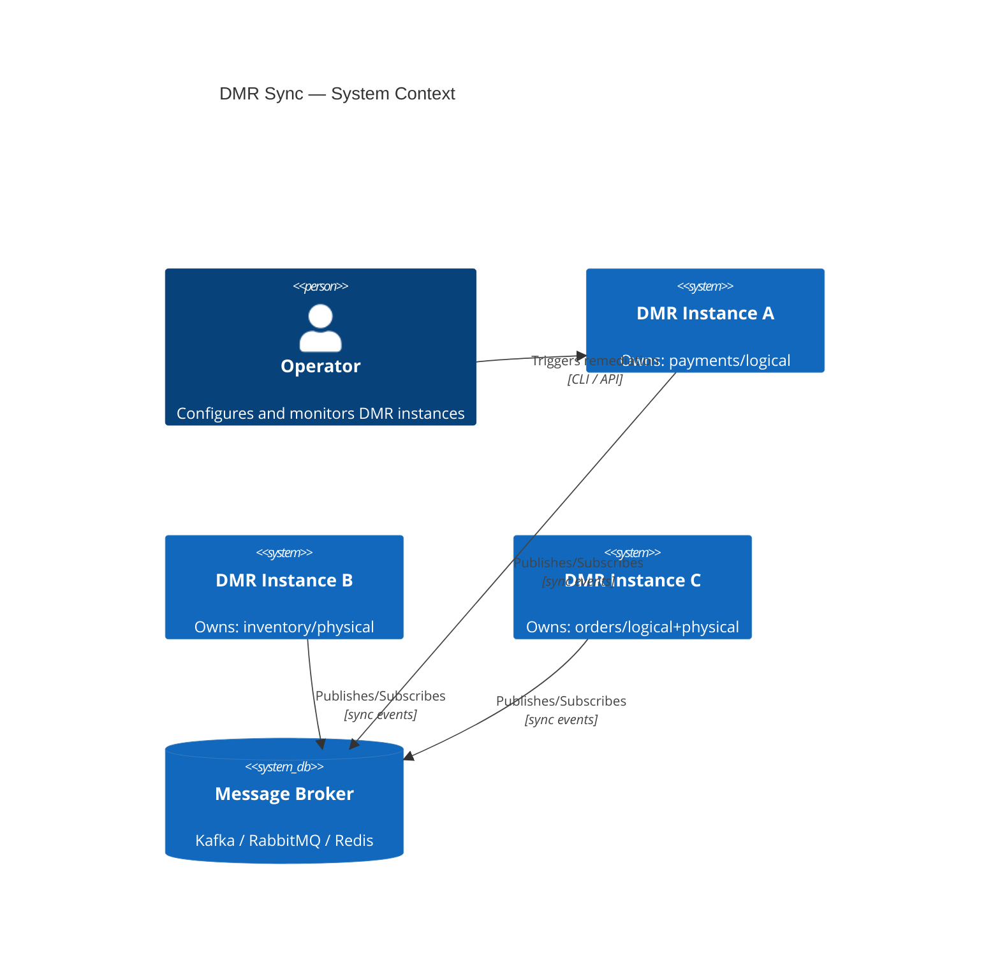

### 3.2 Component Diagram

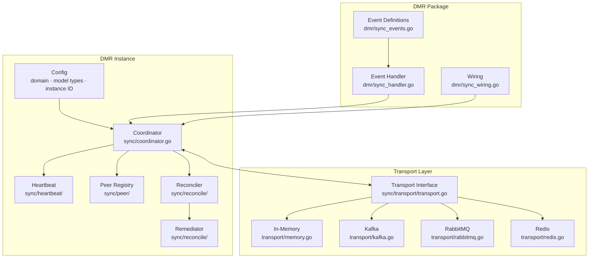

---

## 4. Ownership Model

### 4.1 Claim-Based, Immutable Ownership

Scope ownership is **configured at startup** and never changes during an instance's lifetime. The rule is simple: **first claim wins**.

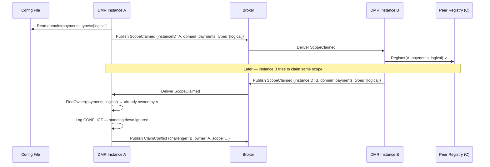

### 4.2 Peer State Machine

Each peer in the registry moves through the following states:

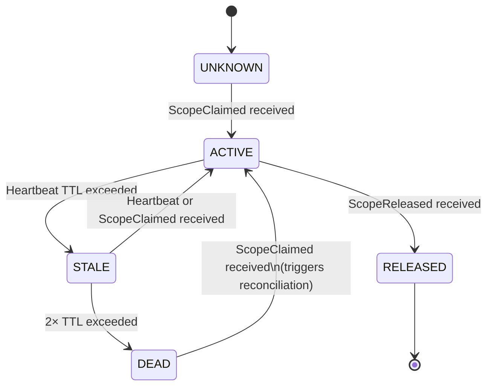

**Transitions:**

| From | To | Trigger | Side Effect |
|---|---|---|---|
| UNKNOWN | ACTIVE | `ScopeClaimed` | Register in ledger |
| ACTIVE | STALE | Heartbeat TTL miss | Alert, flag for reconcile |
| STALE | ACTIVE | Any event from peer | Clear stale flag |
| STALE | DEAD | 2× TTL miss | Remove from active routing |
| DEAD | ACTIVE | `ScopeClaimed` | Re-register + trigger reconciliation |
| ACTIVE | RELEASED | `ScopeReleased` | Mark scope as available |

### 4.3 Conflict Resolution

When a scope conflict is detected:

1. The **existing owner** publishes a `ClaimConflict` event
2. The **challenger** receives it and **stands down** (logs WARN, does not write for that scope)
3. A `RemediationReport` entry of kind `CLAIM_CONFLICT` is generated
4. **No automatic resolution** — operator must fix the misconfiguration

---

## 5. Event Catalogue

All event payloads are defined in the **DMR package** (`dmr/sync_events.go`). The sync package carries them in a generic `Envelope[T]`.

### 5.1 Topics and Event Types

| Topic | Event Type | Publisher | Consumer | Purpose |
|---|---|---|---|---|
| `dmr.sync.scope` | `ScopeClaimed` | self | all peers | Announce ownership on startup |
| `dmr.sync.scope` | `ScopeReleased` | self | all peers | Graceful shutdown |
| `dmr.sync.scope` | `ClaimConflict` | existing owner | all peers | Reject duplicate claim |
| `dmr.sync.heartbeat` | `HeartbeatEvent` | self | all peers | Liveness + hash check |
| `dmr.sync.model` | `ModelUpdated` | scope owner | all peers | Model write propagation |
| `dmr.sync.model` | `ModelDeleted` | scope owner | all peers | Model delete propagation |
| `dmr.sync.reconcile` | `ReconcileRequest` | any instance | scope owner | Request canonical state |
| `dmr.sync.reconcile` | `ReconcileResponse` | scope owner | requester | Return canonical state |

### 5.2 Envelope Structure

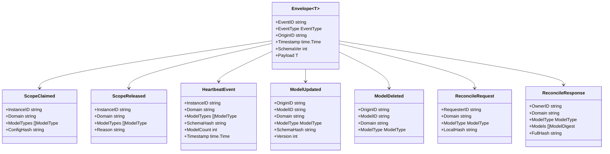

---

## 6. Transport Layer

### 6.1 Interface

The sync package defines a single `Transport` interface. All broker-specific logic is encapsulated in adapters. DMR selects the adapter via configuration — no code change required to switch brokers.

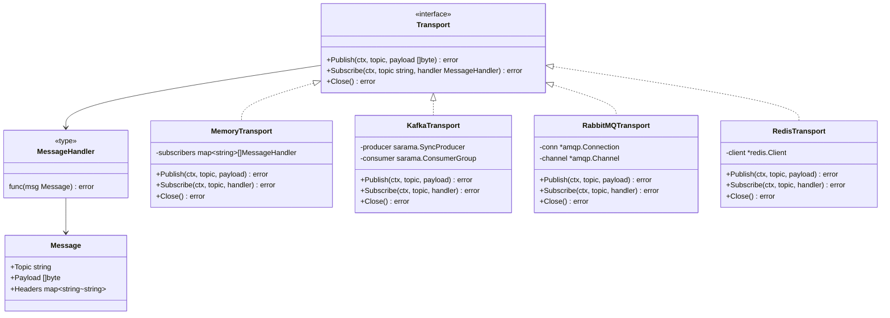

### 6.2 Topic Naming Convention

Each event type maps to a fixed topic. The sync package declares topic constants:

```
dmr.sync.scope        → ScopeClaimed, ScopeReleased, ClaimConflict
dmr.sync.heartbeat    → HeartbeatEvent
dmr.sync.model        → ModelUpdated, ModelDeleted
dmr.sync.reconcile    → ReconcileRequest, ReconcileResponse
```

Broker-specific mapping:

| Concept | Kafka | RabbitMQ | Redis |
|---|---|---|---|
| Topic | Kafka topic | Exchange + routing key | Channel name |
| Consumer group | `dmr-sync-{instanceID}` | Exclusive queue per instance | N/A (broadcast) |
| Ordering | Per-partition | Per-queue | Best-effort |

---

## 7. Peer Registry

### 7.1 Structure

The peer registry is an **in-memory claim ledger**, rebuilt on startup via incoming `ScopeClaimed` events from live peers. It is never persisted independently — MongoDB holds the source of truth for model data; the registry reflects the live sync topology.

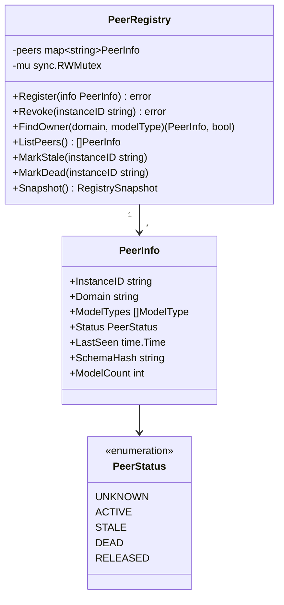

### 7.2 Scope Lookup

`FindOwner(domain, modelType)` is the critical read path — called when routing `ModelUpdated`/`ModelDeleted` events or determining reconciliation authority.

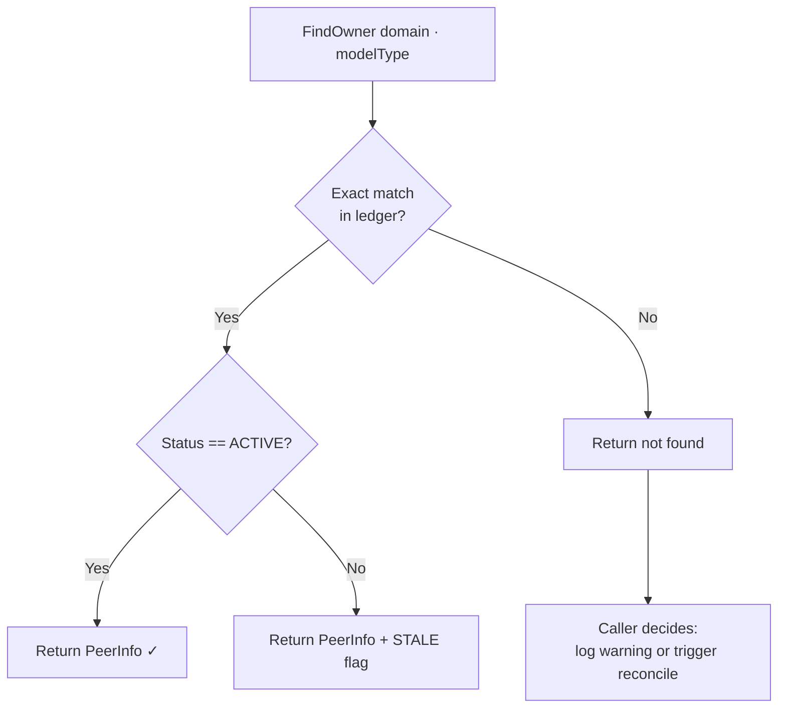

---

## 8. Heartbeat

### 8.1 Flow

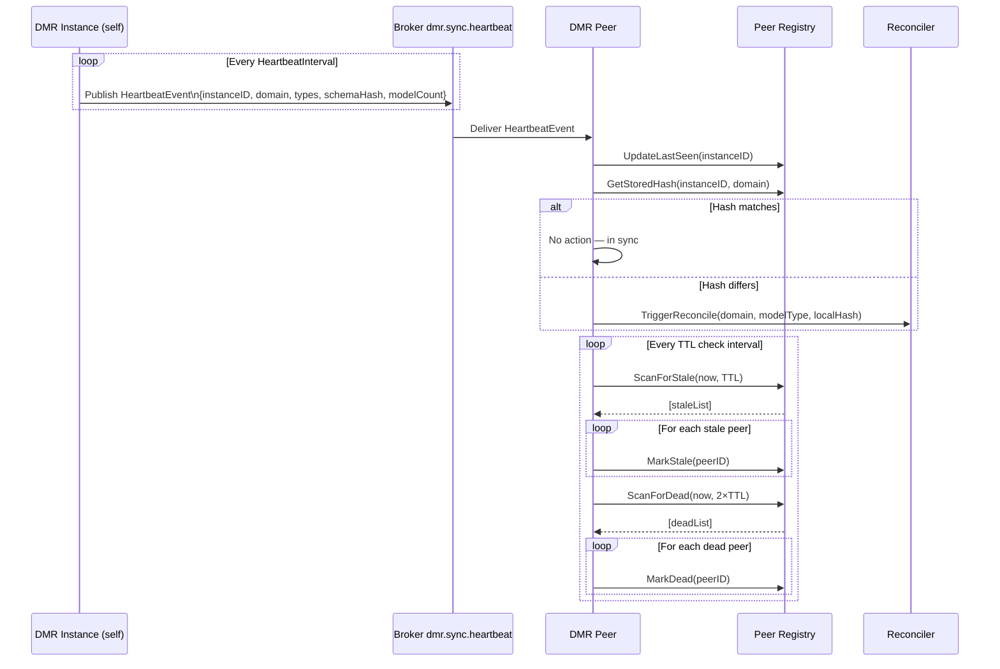

### 8.2 TTL Configuration

| Parameter | Default | Description |
|---|---|---|
| `HeartbeatInterval` | 30s | How often self publishes a heartbeat |
| `StaleTTL` | 90s | No heartbeat received → STALE |
| `DeadTTL` | 180s | No heartbeat received → DEAD |

---

## 9. Reconciliation & Remediation

### 9.1 Trigger Points

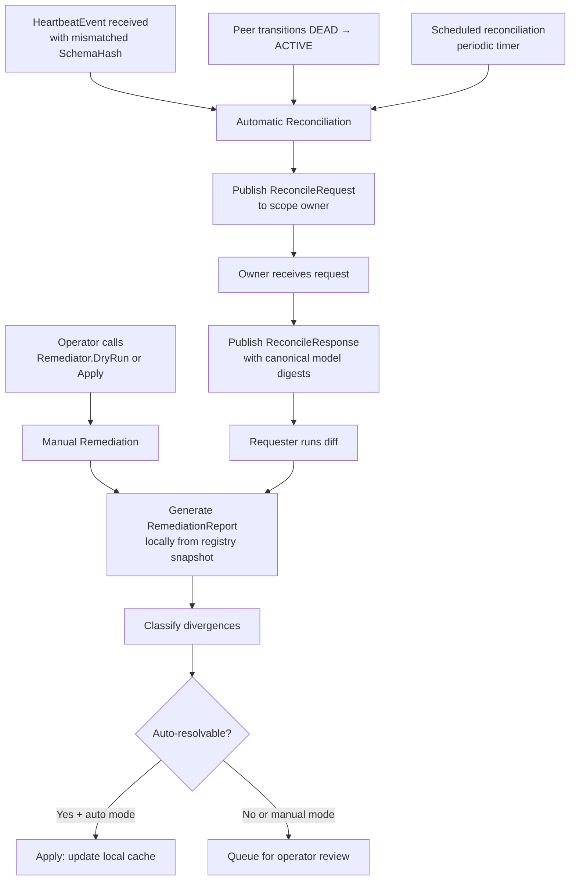

### 9.2 Reconciliation Algorithm

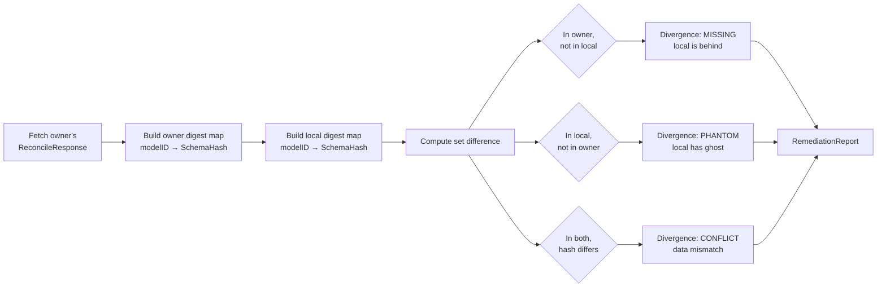

### 9.3 Divergence Classification

| Kind | Description | Auto-Resolvable | Resolution |
|---|---|---|---|
| `MISSING` | Local cache lacks a model the owner has | Yes | Fetch from owner |
| `PHANTOM` | Local cache has a model the owner doesn't | Yes | Evict from local cache |
| `CONFLICT` | Both have the model but hashes differ | Yes (owner wins) | Replace with owner's version |
| `CLAIM_CONFLICT` | Two instances claimed the same scope | No | Operator must fix config |
| `OWNER_UNREACHABLE` | Owner is DEAD, scope unresolvable | No | Operator intervention |

### 9.4 Remediation Report Structure

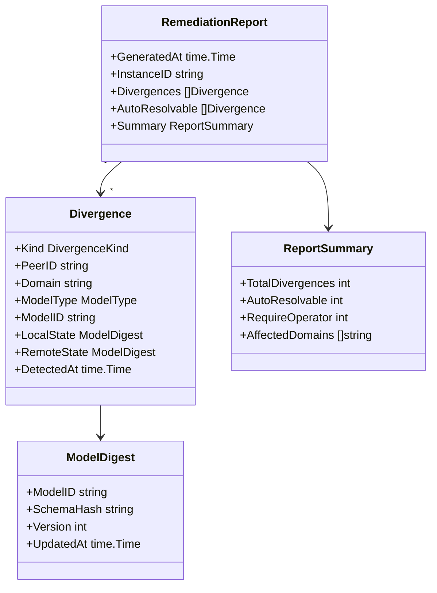

### 9.5 Remediator Operations

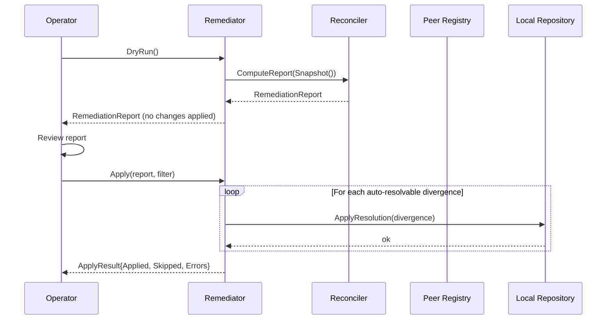

---

## 10. Package Structure

```
sync/                               ← independently shippable package
│
├── config.go                       ← SyncConfig struct
├── coordinator.go                  ← entry point: wires all sub-packages
├── coordinator_test.go
│
├── transport/
│   ├── transport.go                ← Transport interface, Message, MessageHandler
│   ├── memory.go                   ← in-memory adapter (dev/test)
│   ├── memory_test.go
│   ├── kafka.go                    ← Kafka adapter (sarama)
│   ├── kafka_test.go
│   ├── rabbitmq.go                 ← RabbitMQ adapter (amqp091-go)
│   ├── rabbitmq_test.go
│   ├── redis.go                    ← Redis Pub/Sub adapter (go-redis)
│   └── redis_test.go
│
├── event/
│   ├── envelope.go                 ← Envelope[T], EventType, topics constants
│   ├── handler.go                  ← EventHandler interface (DMR implements)
│   └── envelope_test.go
│
├── peer/
│   ├── peer.go                     ← PeerInfo, PeerStatus
│   ├── registry.go                 ← PeerRegistry (claim ledger)
│   └── registry_test.go
│
├── heartbeat/
│   ├── heartbeat.go                ← publisher (ticker) + TTL watcher
│   └── heartbeat_test.go
│
└── reconcile/
    ├── reconciler.go               ← diff engine
    ├── remediator.go               ← Apply, DryRun, Schedule
    ├── report.go                   ← RemediationReport, Divergence, DivergenceKind
    ├── reconciler_test.go
    └── remediator_test.go

dmr/                                ← parent package (owns event definitions)
│
├── sync_events.go                  ← concrete payloads: ScopeClaimed, ModelUpdated, etc.
├── sync_handler.go                 ← implements sync/event.EventHandler
└── sync_wiring.go                  ← constructs sync.Coordinator, injects dependencies
```

---

## 11. Interface Definitions

The following interfaces form the contract boundary between the `sync` package and its consumers.

### Transport

```go
// sync/transport/transport.go

type MessageHandler func(msg Message) error

type Message struct {
    Topic   string
    Payload []byte
    Headers map[string]string
}

type Transport interface {
    Publish(ctx context.Context, topic string, payload []byte) error
    Subscribe(ctx context.Context, topic string, handler MessageHandler) error
    Close() error
}
```

### EventHandler

```go
// sync/event/handler.go
// DMR implements this interface so the sync package stays event-agnostic.

type EventHandler interface {
    OnScopeClaimed(ctx context.Context, peerID string, scope Scope) error
    OnScopeReleased(ctx context.Context, peerID string, scope Scope) error
    OnClaimConflict(ctx context.Context, ownerID, challengerID string, scope Scope) error
    OnModelMutated(ctx context.Context, event ModelMutationEvent) error
    OnModelDeleted(ctx context.Context, event ModelDeletionEvent) error
    OnReconcileRequested(ctx context.Context, requesterID string, scope Scope, localHash string) error
    OnReconcileResponse(ctx context.Context, response ReconcileResponse) error
}
```

### Coordinator

```go
// sync/coordinator.go

type Coordinator interface {
    Start(ctx context.Context) error
    Stop(ctx context.Context) error
    PublishModelUpdated(ctx context.Context, event ModelMutationEvent) error
    PublishModelDeleted(ctx context.Context, event ModelDeletionEvent) error
    RequestReconcile(ctx context.Context, scope Scope) error
    DryRun(ctx context.Context) (reconcile.RemediationReport, error)
    Apply(ctx context.Context, report reconcile.RemediationReport) (reconcile.ApplyResult, error)
    PeerSnapshot() peer.RegistrySnapshot
}
```

---

## 12. Configuration

```go
// sync/config.go

type SyncConfig struct {
    InstanceID        string
    Scope             Scope             // Domain + ModelTypes — read from config at startup
    Transport         TransportConfig   // Which adapter + connection params
    HeartbeatInterval time.Duration     // Default: 30s
    StaleTTL          time.Duration     // Default: 90s
    DeadTTL           time.Duration     // Default: 180s
    ReconcileInterval time.Duration     // Default: 5m (scheduled reconciliation)
    AutoRemediate     bool              // Default: true (MISSING, PHANTOM, CONFLICT)
}

type Scope struct {
    Domain     string
    ModelTypes []ModelType
}

type TransportConfig struct {
    Kind    TransportKind   // memory | kafka | rabbitmq | redis
    Brokers []string        // broker addresses
    Options map[string]any  // adapter-specific options
}

type TransportKind string

const (
    TransportMemory   TransportKind = "memory"
    TransportKafka    TransportKind = "kafka"
    TransportRabbitMQ TransportKind = "rabbitmq"
    TransportRedis    TransportKind = "redis"
)
```

---

## 13. Testing Strategy

Tests follow the project's established layered approach.

| Layer | Scope | Transport | Gate |
|---|---|---|---|
| Unit | Pure functions (diff, digest, registry ops) | None / mocks | Always run |
| Local integration | Coordinator wiring, event flow, heartbeat | In-memory | Always run |
| External integration | Kafka / RabbitMQ / Redis adapters | Real broker | `BROKER_URI` env var present |

### Key test scenarios

| Scenario | Layer | What is asserted |
|---|---|---|
| Two instances claim same scope | Unit | Second claim returns conflict error |
| Peer transitions ACTIVE → STALE → DEAD | Local integration | Status transitions and TTL firing |
| Hash mismatch on heartbeat triggers reconcile | Local integration | ReconcileRequest published |
| Owner always wins on CONFLICT divergence | Unit | RemediationReport applies owner's hash |
| DryRun produces report without mutations | Local integration | Repository unchanged after DryRun |
| DEAD → ACTIVE triggers reconciliation | Local integration | ReconcileRequest emitted on re-announce |
| Graceful shutdown propagates ScopeReleased | Local integration | Peer marked RELEASED in registry |
| Kafka adapter publishes and receives | External integration | Round-trip envelope integrity |

---

## 14. Open Questions

| # | Question | Status |
|---|---|---|
| 1 | Should `ReconcileResponse` include full model payloads or digests only? Digests keep the message small but require a follow-up fetch. | **To decide** |
| 2 | Should `ClaimConflict` events be persisted to MongoDB for audit? | **To decide** |
| 3 | Is a scheduled reconciliation interval sufficient, or should operators be able to trigger ad-hoc reconciliation via an HTTP endpoint on the DMR? | **To decide** |
| 4 | For RabbitMQ, should the exchange type be `fanout` (broadcast to all) or `topic` (selective routing by binding key)? | **Recommend: topic exchange** |

---

*End of document*
